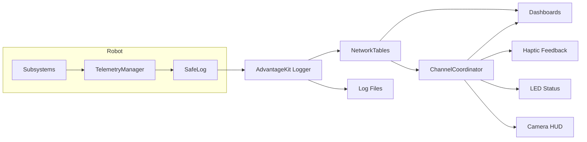

  

# Team 5962 perSEVERE | Control System Documentation

> *The robot assesses. The copilot fires. The driver flies.*

Welcome to our control system docs for the 2026 FRC season (game: REBUILT). This covers everything from our telemetry and fire control pipeline to the feedback systems that keep our drivers informed without ever needing to glance at a screen.

## Site Map

```mermaid
graph TD
    HOME[Documentation Home] --> ARCH[Architecture]
    HOME --> FB[Driver Feedback]
    HOME --> DASH[Dashboards]
    HOME --> OPS[Operations]
    HOME --> ENG[Engineering]
    ARCH --> A1[System Overview]
    ARCH --> A2[Telemetry System]
    ARCH --> A3[Fire Control Pipeline]
    ARCH --> A4[Vision System]
    ARCH --> A5[Safety Architecture]
    FB --> F1[AMDA Feedback System]
    FB --> F2[Alliance Strategy]
    FB --> F3[Universal Design]
    DASH --> D1[Elastic Guide]
    DASH --> D2[AdvantageScope Guide]
    DASH --> D3[Quick Reference]
    OPS --> O1[Competition Playbook]
    OPS --> O2[Tuning Reference]
    OPS --> O3[Troubleshooting]
    ENG --> E1[Testing & Quality]
    ENG --> E2[Engineering Process]
    ENG --> E3[FMEA Log]
    ENG --> E4[Ball Physics Simulation]
    ENG --> E5[What We Learned]
```

## By the Numbers

| Metric | Value |
|--------|-------|
| Telemetry signals monitored in real time | ~500 |
| Mutation testing kill rate | 53% across 10 classes |
| FMEA failure entries tracked | 34 |
| Feedback channels (haptic, LED, HUD, dashboard) | 4 |
| Conditions for automated scoring readiness | 6 |
| Neural network ensemble models for shot prediction | 10 |
| Collision elements in physics simulation | 43 |
| Custom code linter rules | 108 |

## Quick Start by Role

**Drivers & Copilots** \
[Driver Feedback](feedback/driver-feedback.md) | [Competition Playbook](operations/competition-playbook.md) | [Alliance Strategy](feedback/alliance-strategy.md)

**Programmers** \
[System Overview](architecture/system-overview.md) | [Telemetry System](architecture/telemetry-system.md) | [Testing & Quality](engineering/testing-and-quality.md) | [Ball Physics](engineering/fuel-simulation.md)

**Coaches** \
[Competition Playbook](operations/competition-playbook.md) | [Alliance Strategy](feedback/alliance-strategy.md) | [Quick Reference](dashboards/quick-reference.md)

**Judges & Mentors** \
[System Overview](architecture/system-overview.md) | [Fire Control](architecture/fire-control-pipeline.md) | [FMEA Log](engineering/fmea-log.md) | [Engineering Process](engineering/engineering-process.md) | [Universal Design](feedback/universal-design.md) | [What We Learned](engineering/what-we-learned.md)

**Debugging** \
[Troubleshooting](operations/troubleshooting.md) | [Elastic Guide](dashboards/elastic-guide.md) | [AdvantageScope Guide](dashboards/advantagescope-guide.md)

## System Architecture

---

FRC Team 5962 perSEVERE, 2026 Season
