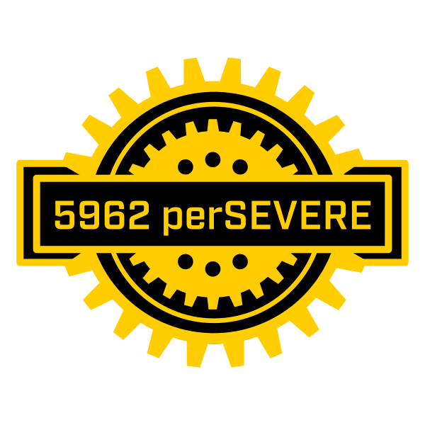
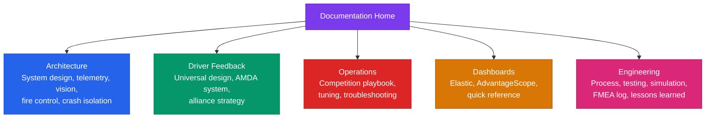
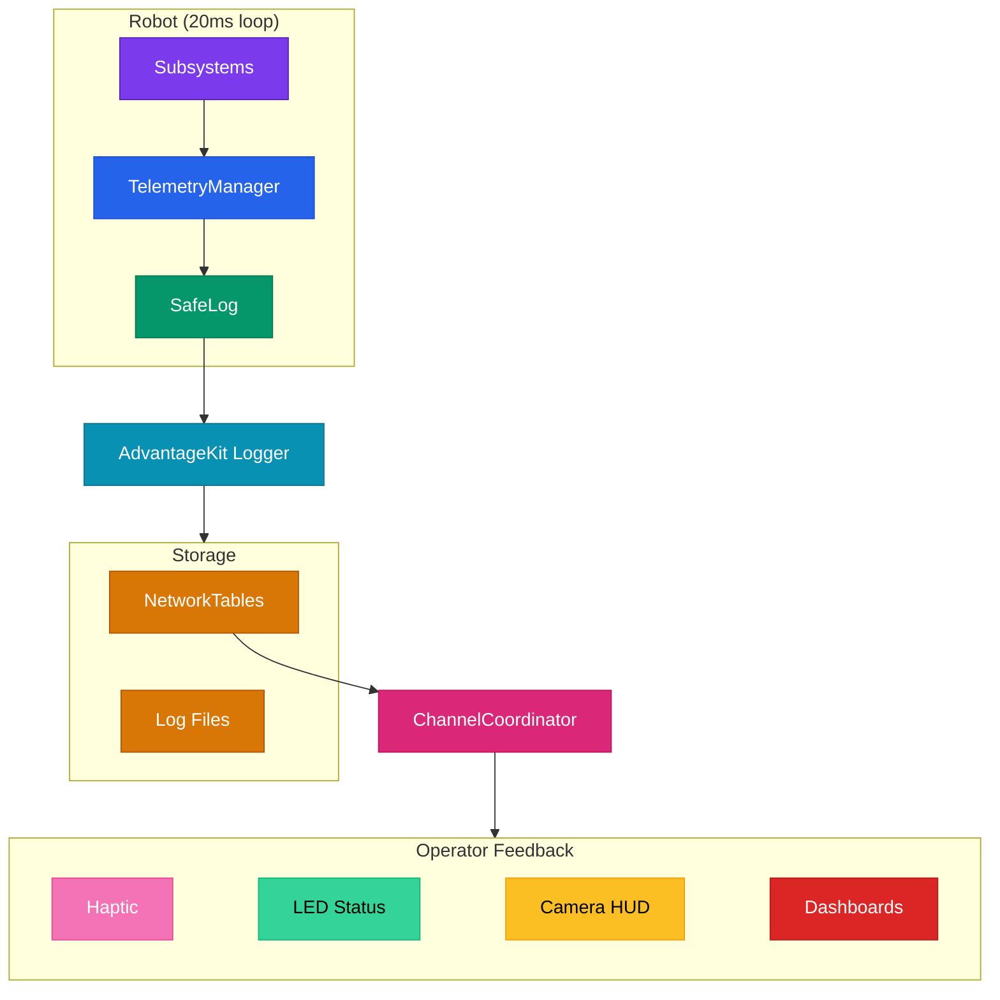

  

# Control System Documentation

> *The robot assesses. The copilot fires. The driver flies.*

This is our control system reference for the 2026 FRC season and REBUILT. It covers the robot's telemetry, fire control, feedback systems, dashboards, and the process we used to build and test everything.

## Site Map

```mermaid
flowchart TB
    HOME[Documentation Home]

    ARCH["Architecture<br/>System design, telemetry, vision,<br/>fire control, crash isolation"]
    FB["Driver Feedback<br/>Universal design, AMDA system,<br/>alliance strategy"]
    OPS["Operations<br/>Competition playbook,<br/>tuning, troubleshooting"]
    DASH["Dashboards<br/>Elastic, AdvantageScope,<br/>quick reference"]
    ENG["Engineering<br/>Process, testing, simulation,<br/>FMEA log, lessons learned"]

    HOME --> ARCH & FB & OPS & DASH & ENG

    style HOME fill:#7c3aed,stroke:#5b21b6,color:#fff
    style ARCH fill:#2563eb,stroke:#1d4ed8,color:#fff
    style FB fill:#059669,stroke:#047857,color:#fff
    style OPS fill:#dc2626,stroke:#b91c1c,color:#fff
    style DASH fill:#d97706,stroke:#b45309,color:#fff
    style ENG fill:#db2777,stroke:#be185d,color:#fff
```

## By the Numbers

| Metric | Value |
|--------|-------|
| Telemetry signals monitored in real time | 745+ |
| Core logic code coverage (Jacoco) | 76% |
| Mutation testing kill rate | 53% across 10 classes |
| FMEA failure entries tracked | 40 |
| Feedback channels (haptic, LED, HUD, dashboard) | 4 |
| Conditions for automated scoring readiness | 8 |
| Neural network ensemble models for shot prediction | 10 |
| Collision elements in physics simulation | 43 |
| Custom code linter rules | 111 |
| Verified teams running our open-source fire control | 9 verified (16 total) |
| Awards won by teams using our code (2026) | 5 across 4 categories |

## Quick Start by Role

**Drivers & Copilots** \
[Driver Feedback](feedback/driver-feedback.md) | [Competition Playbook](operations/competition-playbook.md) | [Alliance Strategy](feedback/alliance-strategy.md)

**Programmers** \
[System Overview](architecture/system-overview.md) | [Telemetry System](architecture/telemetry-system.md) | [Testing & Quality](engineering/testing-and-quality.md) | [Ball Physics](engineering/fuel-simulation.md)

**Coaches** \
[Competition Playbook](operations/competition-playbook.md) | [Alliance Strategy](feedback/alliance-strategy.md) | [Quick Reference](dashboards/quick-reference.md)

**Judges & Mentors** \
[System Overview](architecture/system-overview.md) | [Fire Control](architecture/fire-control-pipeline.md) | [Community Impact](engineering/community-impact.md) | [FMEA Log](engineering/fmea-log.md) | [Engineering Process](engineering/engineering-process.md) | [Universal Design](feedback/universal-design.md) | [What We Learned](engineering/what-we-learned.md)

**Debugging** \
[Troubleshooting](operations/troubleshooting.md) | [Elastic Guide](dashboards/elastic-guide.md) | [AdvantageScope Guide](dashboards/advantagescope-guide.md)

## System Architecture

```mermaid
flowchart TB
    subgraph Robot ["Robot (20ms loop)"]
        SUB[Subsystems] --> TM[TelemetryManager] --> SL[SafeLog]
    end

    SL --> AK[AdvantageKit Logger]

    subgraph Storage ["Storage"]
        direction LR
        NT[NetworkTables] ~~~ LOG[Log Files]
    end

    AK --> Storage

    NT --> CC[ChannelCoordinator]

    subgraph Feedback ["Operator Feedback"]
        direction LR
        HAP[Haptic] ~~~ LED_OUT[LED Status] ~~~ HUD[Camera HUD] ~~~ DASH[Dashboards]
    end

    CC --> Feedback

    style SUB fill:#7c3aed,stroke:#5b21b6,color:#fff
    style TM fill:#2563eb,stroke:#1d4ed8,color:#fff
    style SL fill:#059669,stroke:#047857,color:#fff
    style AK fill:#0891b2,stroke:#0e7490,color:#fff
    style NT fill:#d97706,stroke:#b45309,color:#fff
    style LOG fill:#d97706,stroke:#b45309,color:#fff
    style DASH fill:#dc2626,stroke:#b91c1c,color:#fff
    style CC fill:#db2777,stroke:#be185d,color:#fff
    style HAP fill:#f472b6,stroke:#ec4899,color:#fff
    style LED_OUT fill:#34d399,stroke:#10b981,color:#000
    style HUD fill:#fbbf24,stroke:#f59e0b,color:#000
```

---

FRC Team 5962 perSEVERE, 2026 Season
