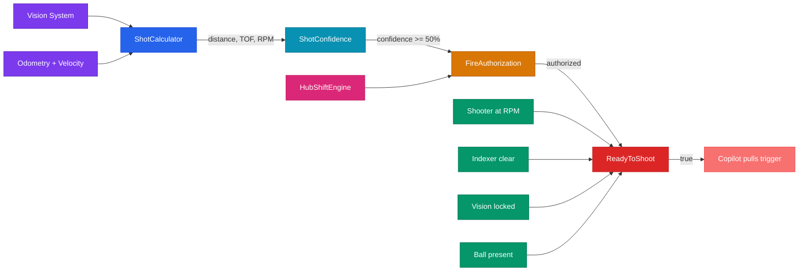
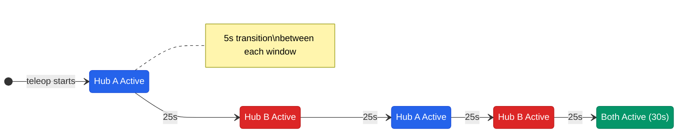

# Fire Control Pipeline

## The Problem

In REBUILT, scoring means launching balls into a hub from varying distances while the robot is moving. The hub shifts position mid-match based on who won autonomous. The question the robot has to answer every 20ms is: should the copilot shoot right now?

Getting this wrong means wasting balls or missing scoring windows. Getting it right means the copilot presses the trigger with confidence, knowing the robot has already verified everything.

## ReadyToShoot: 6 Conditions at Once

`Scoring/ReadyToShoot` is the single boolean that tells the copilot "you can fire." It only goes true when ALL six of these conditions are met simultaneously:

| Condition | What it checks | Source |
|-----------|---------------|--------|
| `shooterReady` | Flywheel is at target RPM (within tolerance) | ShooterTelemetry |
| `indexerClear` | No jam detected in the indexer | IndexerTelemetry |
| `visionLocked` | Camera has a solid lock on the target | VisionTelemetry |
| `hasBall` | Ball is present in the chamber | Sensor (stubbed true until hopper sensor wired) |
| `hubActive` | Hub is in our scoring window (not shifted away) | ScoringTelemetry hub shift logic |
| `shotConfident` | Physics says the shot will land (>= 50% confidence) | ShotConfidence |

There's a debounce on the falling edge so ReadyToShoot doesn't flicker during sustained rapid fire when the flywheel dips briefly between shots.

When ReadyToShoot drops, `ScoringTelemetry` logs which condition failed via `Scoring/ReadyLostReason` (e.g., "Shooter+Vision"), so we can diagnose scoring problems in post-match review.

## The Full Pipeline

## ShotCalculator: Newton's Method Solver

ShotCalculator figures out where to aim and how fast to spin the flywheel for any given distance to the hub. It uses Newton's method to solve for time-of-flight, running 5 iterations with warm start (reusing last cycle's solution as the starting guess, since the robot doesn't move much in 20ms).

Key features:
- **Velocity compensation**: Accounts for the robot's current velocity so shots land correctly while driving (Shoot On The Move)
- **Launcher offset geometry**: The shooter isn't at the center of the robot, so it corrects for the physical offset
- **Alliance-aware targeting**: Picks the correct hub based on alliance color

The solver outputs three things: the target RPM for the flywheel, the heading the robot should face, and the time of flight for the ball.

## ShotConfidence: Is This Shot Actually Going to Land?

ShotConfidence produces a 0-100% score using a 5-component weighted geometric mean. Each component contributes independently:

| Component | What it measures | Why it matters |
|-----------|-----------------|----------------|
| Distance | How far from the hub | Shots get less accurate at range |
| Vision quality | Tag count, ambiguity, confidence | Bad vision data means bad aim |
| Robot stability | Angular velocity, translational speed | A spinning robot can't aim |
| Flywheel readiness | How close to target RPM | Underspun shots fall short |
| Solver convergence | Did Newton's method converge? | Non-convergent solutions are unreliable |

The geometric mean means one really bad component drags the whole score down. You can't compensate for terrible vision with a perfect flywheel. The threshold for ReadyToShoot is 50%.

## 4-Tier Shot Calculation Fallback

The system has four sources for shot parameters (RPM, heading), and it falls through them in order:

1. **Mode B (Live NN Inference)**: An Orange Pi coprocessor runs a 10-model ensemble neural network at 50Hz. It takes 8 inputs (distance x/y, velocity x/y, battery voltage, RPM ratio, motor temperature, wheel slip) and outputs RPM and heading corrections. This is the most accurate because it accounts for real-world factors like battery sag and motor wear. Domain-randomized training on 800K physics configurations means it handles real-world variation well (battery sag, motor wear, different ball conditions).

2. **Mode A (NN-Generated LUT)**: A lookup table pre-generated by the same neural network. Less adaptive than live inference, but doesn't need the coprocessor to be running. A 5-state fallback FSM manages receiving and validating the LUT over NetworkTables.

3. **Sim LUT**: Generated by `ProjectileSimulator`, which runs full drag+Magnus flight physics (RK4 integration) offline to build a 90-point dense lookup table. This is pure physics with no learning.

4. **Baseline LUT**: A simple distance-to-RPM table tuned by hand during practice. The last resort.

The system automatically falls through to the next tier if the current one is unavailable or returns low-confidence results.

## Hub Shift Timing

REBUILT has a game mechanic where the hub shifts position during teleop based on who won autonomous. The match splits into four 25-second scoring windows with 5-second transitions, plus a 30-second endgame where both hubs are active.

`HubShiftEngine` tracks this using match time from the Driver Station:
- Shifts happen at 130s, 105s, 80s, 55s (match time counts down from ~135)
- Odd shifts (1, 3): the auto winner's hub is INACTIVE
- Even shifts (2, 4): the auto winner's hub is ACTIVE
- Endgame (below 30s): both hubs active

The system parses the FMS game-specific message ('R' or 'B') to determine who won auto. In practice mode without FMS, it falls back to a SmartDashboard toggle.

`Scoring/TimeToNextShiftSec` counts down to the next shift so the driver feedback system can warn operators before it happens.

## FireAuthorization: The Gate

FireAuthorization is the final gate before ReadyToShoot. It checks:
- Is the hub currently in our active scoring window? (from hub shift timing)
- Is the robot physically in the correct zone? (a zone gate on the copilot's RT trigger prevents shooting outside the alliance zone)

It defaults to FIRE_AUTHORIZED (fail-open) to prevent suppressing shots before the first update cycle runs. This is intentional: it's better to allow a questionable shot than to lock out the copilot at match start.

## The Pilot and Weapons Officer

The two-controller setup maps directly to the pipeline. The copilot is the weapons officer: they handle targeting. The progressive aim haptic pattern on the copilot's controller intensifies as ShotConfidence climbs, and ReadyToShoot triggers a distinct "fire now" rumble. The copilot pulls the trigger knowing the robot has verified the shot.

The driver is the pilot: they handle positioning. They feel spin-up vibrations when the flywheel is coming to speed and hub shift warnings when the scoring window is about to change. Their job is to get the robot into range and keep it stable.

The robot assesses. The copilot fires. The driver flies.

## Zone Gate: 4th Layer of Fire Control

On top of hub timing, shot confidence, and scoring readiness, there's a zone legality check. The copilot's RT trigger binding includes an AND condition that checks whether the robot is inside the alliance zone (or if we're in feeder role, where zone restrictions don't apply). This prevents wasting shots from illegal positions.

So the full pipeline is four layers:
1. **Hub timing** (is the hub active right now?)
2. **Zone legality** (are we in the right part of the field?)
3. **Shot confidence** (does physics say this shot lands?)
4. **Scoring readiness** (are all 6 subsystem conditions met?)

All four must pass before a ball leaves the robot.

---
**Related:** [Vision System](vision-system.md) | [Driver Feedback](../feedback/driver-feedback.md) | [Alliance Strategy](../feedback/alliance-strategy.md)

[Back to Documentation Home](../README.md)
