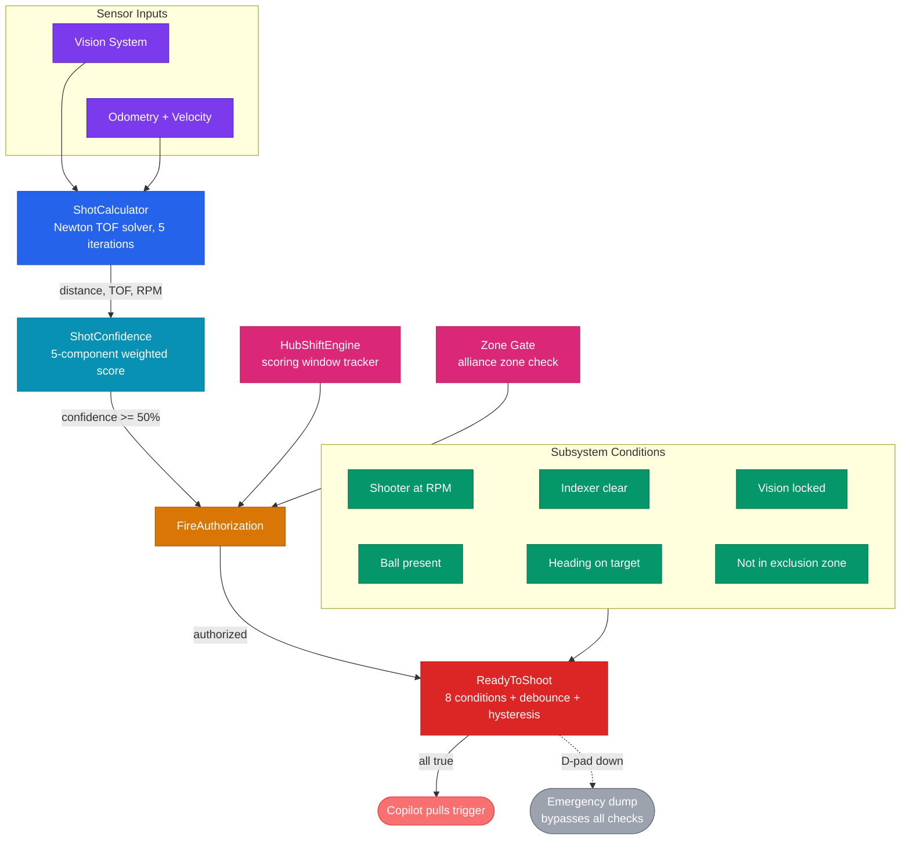
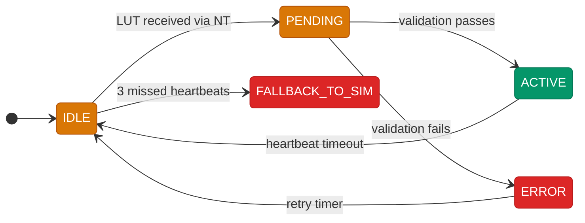

# Fire Control Pipeline

## What This System Has To Answer

In REBUILT, scoring means launching balls into a hub from varying distances while the robot is moving. The hub shifts position mid-match based on who won autonomous. The question the robot has to answer every 20ms is: should the copilot shoot right now?

If we get that wrong, we waste balls or miss scoring windows. If we get it right, the copilot can trust the trigger timing instead of guessing.

## ReadyToShoot: 8 Conditions at Once

`Scoring/ReadyToShoot` is the single boolean that tells the copilot "you can fire." It only goes true when ALL eight of these conditions are met simultaneously:

| Condition | What it checks | Source |
|-----------|---------------|--------|
| `shooterReady` | Flywheel is at target RPM (within tolerance), debounced 150ms | ShooterTelemetry |
| `indexerClear` | No jam detected in the indexer, debounced 200ms | IndexerTelemetry |
| `visionLocked` | Camera has a solid lock on the target, debounced 200ms | VisionTelemetry |
| `hasBall` | Ball is present in the chamber (always true right now, we don't have a sensor for this) | Stubbed true |
| `fireAuthorized` | Hub is in our scoring window AND we're in the legal zone (instant, no debounce) | FireAuthorization |
| `shotConfident` | Physics says the shot will land (>= 50% confidence), debounced 300ms | ShotConfidence |
| `headingOnTarget` | Robot is pointed at the hub within tolerance (4x hysteresis band) | ScoringReadiness heading logic |
| `!inExclusionZone` | Robot is NOT under a trench ceiling (instant, no debounce) | SpatialLaunchValidator |

The heading gate uses hysteresis to keep things stable: once the heading locks on within tolerance, the robot has to drift 4x past that tolerance before it counts as "off target." That keeps it from flickering while we are moving and the heading is wobbling near the threshold.

Each condition has its own falling-edge debounce (except hasBall and fireAuthorized, which pass through raw). If the flywheel dips for 100ms during rapid fire, the debounce holds ReadyToShoot true so we don't lose the firing window over a brief RPM drop.

When ReadyToShoot drops, `ScoringReadiness` builds a diagnostic string via `buildNotReadyReason()` (e.g., "Shooter+Vision"), so we can pull up the log after a match and see exactly why each shot didn't go.

**Emergency dump:** Copilot D-pad down bypasses all 8 conditions and fires immediately. If something breaks or the match is about to end, the copilot can just dump the ball without waiting for readiness.

## The Full Pipeline

The fire control system has four layers, and they all have to agree before a shot is authorized:

```mermaid
flowchart TB
    subgraph Inputs ["Sensor Inputs"]
        direction LR
        V[Vision System] ~~~ O[Odometry + Velocity]
    end

    V & O --> SC[ShotCalculator<br/>Newton TOF solver, 5 iterations]
    SC -->|distance, TOF, RPM| CF[ShotConfidence<br/>5-component weighted score]
    CF -->|confidence >= 50%| FA[FireAuthorization]

    HS[HubShiftEngine<br/>scoring window tracker] --> FA
    ZG[Zone Gate<br/>alliance zone check] --> FA

    FA -->|authorized| RT[ReadyToShoot<br/>8 conditions + debounce + hysteresis]

    subgraph Conditions ["Subsystem Conditions"]
        direction LR
        SH[Shooter at RPM] ~~~ IX[Indexer clear] ~~~ VL[Vision locked]
        BL[Ball present] ~~~ HD[Heading on target] ~~~ EZ[Not in exclusion zone]
    end

    Conditions --> RT
    RT -->|all true| CP([Copilot pulls trigger])
    RT -.->|D-pad down| DUMP([Emergency dump<br/>bypasses all checks])

    style V fill:#7c3aed,stroke:#5b21b6,color:#fff
    style O fill:#7c3aed,stroke:#5b21b6,color:#fff
    style SC fill:#2563eb,stroke:#1d4ed8,color:#fff
    style CF fill:#0891b2,stroke:#0e7490,color:#fff
    style HS fill:#db2777,stroke:#be185d,color:#fff
    style ZG fill:#db2777,stroke:#be185d,color:#fff
    style FA fill:#d97706,stroke:#b45309,color:#fff
    style SH fill:#059669,stroke:#047857,color:#fff
    style IX fill:#059669,stroke:#047857,color:#fff
    style VL fill:#059669,stroke:#047857,color:#fff
    style BL fill:#059669,stroke:#047857,color:#fff
    style HD fill:#059669,stroke:#047857,color:#fff
    style EZ fill:#059669,stroke:#047857,color:#fff
    style RT fill:#dc2626,stroke:#b91c1c,color:#fff
    style CP fill:#f87171,stroke:#ef4444,color:#fff
    style DUMP fill:#9ca3af,stroke:#6b7280,color:#fff
```

1. **Hub timing** (is the hub active right now?)
2. **Zone legality** (are we in the right part of the field?)
3. **Shot confidence** (does physics say this shot lands?)
4. **Scoring readiness** (are all 8 subsystem/sensor conditions met?)

All four must pass before a ball leaves the robot.

## ShotCalculator: Newton's Method Solver

ShotCalculator figures out where to aim and how fast to spin the flywheel for any given distance to the hub. It uses Newton's method to solve for time-of-flight, running 5 iterations with warm start (reusing last cycle's solution as the starting guess, since the robot doesn't move much in 20ms).

What it does:
- **Velocity compensation**: Accounts for the robot's current velocity so shots land correctly while driving (shoot-on-the-move). Uses drift recursion to converge on the right lead angle.
- **Direction-aware polar velocity limiting**: Uses triangle geometry with the law of sines to figure out how fast the robot can drive in any given direction without ruining the shot. The speed limit depends on which way you're driving relative to the hub.
- **Launcher offset geometry**: The shooter isn't at the center of the robot, so it corrects for the physical offset between the robot's origin and where the ball actually exits.
- **Alliance-aware targeting**: Picks the correct hub based on alliance color.
- **Copilot aim bias**: The copilot's right stick X axis adds up to +/-5 degrees of manual aim offset, so they can nudge the aim if something feels off.

The solver outputs a `LaunchParameters` record with RPM, heading, time of flight, drive angle, angular velocity, validity flag, confidence score, and whether we're in passing mode.

## ShotConfidence: Is This Shot Actually Going to Land?

ShotConfidence gives a 0-100% score using a 5-component weighted geometric mean:

| Component | What it measures | Why it matters |
|-----------|-----------------|----------------|
| Distance | How far from the hub | Shots get less accurate at range |
| Vision quality | Tag count, ambiguity, confidence | Bad vision data means bad aim |
| Robot stability | Angular velocity, translational speed | A spinning robot can't aim |
| Flywheel readiness | How close to target RPM | Underspun shots fall short |
| Solver convergence | Did Newton's method converge? | Non-convergent solutions are unreliable |

The geometric mean means one really bad component drags the whole score down. Great flywheel speed does not cancel out terrible vision. The ReadyToShoot threshold is 50%.

## ShotLUT: Distance-Keyed Lookup Table

`ShotLUT` wraps WPILib's `InterpolatingTreeMap<Double, ShotParameters>` to give us piecewise-linear interpolation between known distance-to-shot-parameter pairs. Each entry maps a distance (meters) to a `ShotParameters` record containing RPM, angle, and time of flight.

The starting values come from `ProjectileSimulator`, which runs RK4 integration with drag and Magnus to generate ~90 dense entries at 0.05m spacing. These are physics-based estimates, so the robot isn't shooting blind on day one. Real field tuning replaces or corrects entries over time.

## 4-Tier Shot Calculation Fallback

The system has four sources for shot parameters, and it falls through them in order:

| Tier | Source | How It Works |
|------|--------|-------------|
| 1 (best) | **Mode B Live NN** | 10-model ensemble on Orange Pi, 50Hz live inference. Takes 8 inputs: distance x/y, velocity x/y, battery voltage, RPM ratio, motor temperature, wheel slip. Accounts for real-world factors like battery sag and motor wear. |
| 2 | **Mode A NN LUT** | Pre-generated lookup table from the same neural network. A 5-state fallback FSM (IDLE, PENDING, FALLBACK_TO_SIM, ACTIVE, ERROR) manages receiving and validating the LUT over NetworkTables. |
| 3 | **Sim LUT** | Generated by `ProjectileSimulator` (RK4 + drag + Magnus physics), ~90 dense entries. Pure physics, no learning. |
| 4 (baseline) | **Baseline LUT** | Hand-tuned table from practice. Always available. |

We trained the neural network on 800K physics-simulated shots with domain randomization. That variety teaches it to handle real-world differences in drag, Magnus, battery voltage, and motor wear. If the current tier goes down or gives bad results, it drops to the next one. Fallback kicks in after 3 missed heartbeats (150 ms at 50 Hz), and it needs 3 good heartbeats in a row before trusting the coprocessor again.

## Hub Shift Timing

REBUILT has a game mechanic where the hub shifts position during teleop based on who won autonomous. The match splits into four 25-second scoring windows with transitions between them, plus endgame where both hubs are active.

`HubShiftEngine` tracks this using match time from the Driver Station:
- Transition period: 10 seconds after teleop starts
- Shifts happen at defined intervals (shift boundaries at 35s, 60s, 85s, 110s elapsed)
- Odd shifts (1, 3): the auto winner's hub is INACTIVE
- Even shifts (2, 4): the auto winner's hub is ACTIVE
- Endgame (last ~30s): both hubs active

The system parses the FMS game-specific message ('R' or 'B') to determine who won auto. In practice mode without FMS, it falls back to a SmartDashboard toggle. If neither is available, it uses a FALLBACK confidence level so we know the schedule might not be accurate.

Hub shift timing feeds into FireAuthorization, which also compensates for time of flight. If a ball takes 0.8 seconds to reach the hub, FireAuthorization checks whether the hub will still be active when the ball arrives, not just when it leaves the robot.

```mermaid
stateDiagram-v2
    direction LR
    [*] --> Transition : teleop starts
    Transition --> Shift1 : 10s
    Shift1 --> Shift2 : 25s
    Shift2 --> Shift3 : 25s
    Shift3 --> Shift4 : 25s
    Shift4 --> Endgame : remaining

    state "Transition (10s)" as Transition
    state "Hub A Active" as Shift1
    state "Hub B Active" as Shift2
    state "Hub A Active" as Shift3
    state "Hub B Active" as Shift4
    state "Both Active" as Endgame

    classDef hubA fill:#2563eb,stroke:#1d4ed8,color:#fff
    classDef hubB fill:#dc2626,stroke:#b91c1c,color:#fff
    classDef both fill:#059669,stroke:#047857,color:#fff
    classDef trans fill:#d97706,stroke:#b45309,color:#fff

    class Shift1,Shift3 hubA
    class Shift2,Shift4 hubB
    class Endgame both
    class Transition trans
```

`Scoring/TimeToNextShiftSec` counts down to the next shift so the driver feedback system can warn operators before it happens.

## FireAuthorization: The Gate

FireAuthorization sits between hub timing and ReadyToShoot. It has 5 authorization levels:

| Level | What it means |
|-------|--------------|
| `FIRE_AUTHORIZED` | Good margin before hub deactivates, go for it |
| `FIRE_MARGINAL` | Cutting it close but the ball should land in time |
| `PRE_SPIN` | Hub is inactive but about to activate, start spinning up |
| `HOLD_TIMING` | Hub is active but the ball would land after the window closes |
| `HOLD_INACTIVE` | Hub isn't active and won't be soon |

It computes `ballLandingTime = shotTOF + fuelCountDelay` and checks whether the ball will arrive while the hub is still active, with configurable safety margins. A fallback margin adds extra buffer when confidence is LOW.

It defaults to FIRE_AUTHORIZED (fail-open) so the copilot isn't locked out at match start before the first update runs. It's better to allow a questionable shot than to silently suppress the trigger.

## AimAndShootCommand: Unified Scoring

`AimAndShootCommand` is the main command the copilot triggers with RT. It handles everything: aiming the robot at the hub, spinning up the flywheel, and feeding the ball when all conditions pass.

How it works:
- **Rotation takeover**: Takes over the robot's rotation to aim at the hub, but the driver can still translate. The driver keeps driving, just can't rotate.
- **COR blending**: Between 2 and 15 degrees of aim error, the center of rotation blends between the launcher's physical offset and the robot's geometric center. This stops the robot from snapping hard when it's far off target.
- **O-Lock**: When the driver isn't moving, wheels snap to an X-pattern so the robot doesn't drift while shooting.
- **Feeding**: Once the shooter reaches target RPM (`isAtSpeed()` with sticky latch), the indexer and agitator start feeding. The indexer matches the shooter's surface speed. ReadyToShoot does NOT gate this, it's purely informational.
- **Drive speed limiting**: While the shooter is spinning, drive speed drops to 40% so the robot stays stable for the shot.

It also works in auto through EventTriggers. PathPlanner path markers fire the same command with the same logic, so auto scoring works the same as teleop.

## Driver And Copilot Split

The two-controller setup maps directly to the pipeline. The copilot handles targeting. The progressive aim haptic pattern on the copilot controller gets stronger as aim error decreases, and ReadyToShoot gives a distinct "fire now" rumble.

The driver handles positioning. They feel spin-up vibrations when the flywheel is coming to speed and hub shift warnings when the scoring window is about to change. Their job is to get the robot into range and keep it stable.

The robot assesses. The copilot fires. The driver flies.

## ProjectileSimulator: How We Generate the LUT

The ShotLUT doesn't come from guessing or from a spreadsheet. We wrote a physics simulator that generates it from CAD measurements.

`ProjectileSimulator` uses 4th-order Runge-Kutta integration to trace a ball's trajectory from the moment it leaves the shooter to the moment it hits hub height. The physics model includes:

- **Gravity** (obviously)
- **Aerodynamic drag**: Cd = 0.47 for a smooth sphere, air density 1.225 kg/m^3 at sea level. The drag force scales with the square of velocity, so fast shots slow down more than slow ones.
- **Magnus lift**: Spinning balls curve. Topspin gives upward lift (extends range), backspin pushes the ball down. We use Cm = 0.2, which is a conservative estimate. Magnus is about 8x less sensitive than slip factor, so even if we're off by 2x on the coefficient, it only shifts RPM by 50-100.

For each distance from 0.50m to 5.00m (at 0.05m steps), the simulator binary-searches for the RPM that lands the ball at hub height. That gives us ~90 entries, each with the exact RPM and time of flight for that distance. The whole table generates in about 200ms at startup.

The key insight: you don't need a real robot to get a usable LUT on day one. Plug in your exit height, launch angle, wheel diameter, and a rough slip factor from the ProjectileSimulator, and you have physics-based shot parameters before the robot ever fires a ball. Then you tune from there.

## Hardware Analysis Tools

Before we wrote robot code, we wanted to understand the hardware constraints. We built three analysis tools:

**FlywheelMassSweep**: Given a motor (NEO, stall torque, KV), a gear ratio, and a wheel diameter, this sweeps flywheel inertia to find the minimum mass that meets our performance targets. It models RPM drop on impact (Brettle impulse-momentum), battery voltage sag during recovery (open circuit voltage minus internal resistance times current), motor thermal rise (copper winding resistance goes up ~0.39% per degree), and SparkMax current limiting. It also simulates rapid-fire cadence (multiple shots in a row) to check if the motor can recover fast enough.

We used this to tell our mechanical team: "for a 4-inch wheel at 60 degrees with a 1:1 ratio, the flywheel needs at least X moment of inertia to recover within 0.8 seconds per shot." That let them design the flywheel before the shooter was built.

**AngleSweep**: Compares launch angles (45-70 degrees) across different shooter configurations. Shows RPM and time-of-flight at 10 key distances for each angle. We ran this when the team was deciding between the front flywheel (68 degrees) and the rear drum shooter (60 degrees). It showed the mechanical team exactly how RPM requirements change with angle.

**SlipFactorSweep**: The ball doesn't leave the wheel at wheel speed. It slips. The slip factor (typically 0.5 to 0.85) depends on the wheel material, ball compression, and contact geometry. This tool sweeps across slip factor values and shows the RPM range you need at each distance. It answers the question: "if our slip factor is somewhere between 0.6 and 0.8, how much does that change the RPM we need?" The answer is a lot. Being off on slip factor by 0.1 shifts RPM by 400+. That's why field calibration matters more than getting the physics model perfect.

All of these tools are in our open-source fire control repo alongside the three core files.

## NN Coprocessor: How It Actually Works

The neural network runs on an Orange Pi 5 Plus sitting on the robot. It's not a black box. We know exactly what it does because we trained it on data from our own ProjectileSimulator.

**Training**: We generated 800K simulated trajectories using the RK4 physics model with domain randomization. Each trajectory used slightly different drag, Magnus, launch geometry, and ball mass to simulate real-world variation. The data was split into 10 training sets, and we trained 10 separate models. The ensemble averages their predictions, which smooths out any one model's mistakes.

**Input**: 8 values every cycle: target distance X, target distance Y, robot velocity X, robot velocity Y, battery voltage, RPM ratio (current/target), motor temperature, and wheel slip estimate.

**Output**: RPM, hood angle, and time of flight. At 50 Hz, the robot gets fresh shot parameters that account for battery sag and motor heating in ways a static LUT can't.

**The 5-state fallback FSM** (for Mode A, the cached LUT path):

```mermaid
stateDiagram-v2
    direction LR
    [*] --> IDLE
    IDLE --> PENDING : LUT received via NT
    PENDING --> ACTIVE : validation passes
    PENDING --> ERROR : validation fails
    ACTIVE --> IDLE : heartbeat timeout
    ERROR --> IDLE : retry timer
    IDLE --> FALLBACK_TO_SIM : 3 missed heartbeats

    classDef good fill:#059669,stroke:#047857,color:#fff
    classDef wait fill:#d97706,stroke:#b45309,color:#fff
    classDef bad fill:#dc2626,stroke:#b91c1c,color:#fff

    class ACTIVE good
    class PENDING,IDLE wait
    class ERROR,FALLBACK_TO_SIM bad
```

If the coprocessor loses connection (3 missed heartbeats at 50 Hz = 150ms), the system falls back to the sim-generated LUT automatically. If the coprocessor comes back and sends 3 consecutive good heartbeats, the system trusts it again. The robot always has shot data. The NN just makes it better.

The NN adapts to things a static LUT can't. Battery voltage drops from 12.5V to 11.8V over a match. Motor windings heat up and the torque curve shifts. Wheel surface wears down and slip factor changes. A static LUT ignores all of that. The NN sees it in real time and adjusts.

We exported the models to ONNX format so they run efficiently on ARM64 (the Orange Pi's architecture). The Python service uses ONNX Runtime for inference and publishes results over NetworkTables 4. The whole pipeline from camera frame to updated shot parameters is under 5ms.

---

**Related:** [Vision System](vision-system.md) | [Ball Physics Simulation](../engineering/fuel-simulation.md) | [Community Impact](../engineering/community-impact.md) | [Driver Feedback](../feedback/driver-feedback.md)
