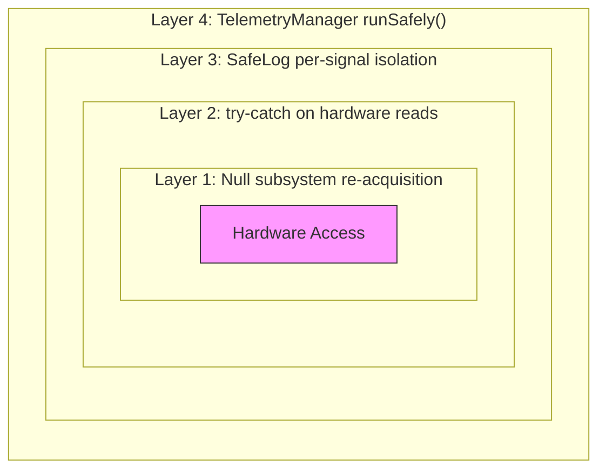

# Safety & Crash Isolation Architecture

## The Problem

An FRC match is 2.5 minutes. If a sensor disconnects or returns garbage data at the wrong moment, the robot can't just stop everything and reboot. A single uncaught exception in one motor's temperature reading could cascade through the logging pipeline, kill all 500 signals, and leave us blind for the rest of the match. We needed a system where any individual failure stays contained, the rest of the robot keeps working, and we can still diagnose what went wrong from the logs afterward.

## 4-Layer Crash Protection

The system uses four nested layers of defense. Each layer catches failures that slip past the one above it, so a problem has to break through all four before it actually affects the robot.

### Layer 1: Null Subsystem Re-acquisition

Every telemetry class holds a reference to its subsystem (e.g., `ShooterTelemetry` holds a reference to `Shooter`). If that reference is ever null, maybe because the subsystem failed to initialize or got garbage collected, the telemetry class tries to re-acquire it at the start of `update()`. If re-acquisition still returns null, the class sets all its fields to safe defaults (zeros and false) and returns without touching any hardware. This way, a subsystem that never initializes just produces zeroed-out signals instead of throwing NullPointerExceptions everywhere.

### Layer 2: Try-Catch Around All Hardware Reads

Inside each telemetry class's `update()` method, all hardware reads (encoder velocity, motor temperature, output current, bus voltage, fault registers) happen inside a try-catch block. If any CAN bus glitch, sensor disconnect, or driver error throws an exception, the catch block sets `deviceConnected = false`, zeros out the readings, and returns. The telemetry class keeps running next cycle. One flaky motor doesn't take down the monitoring for the other six.

### Layer 3: SafeLog Per-Signal Isolation

`SafeLog` is our wrapper around AdvantageKit's `Logger.recordOutput()`. Every single log call in the codebase goes through `SafeLog.put()` instead of calling the logger directly. Each `put()` call has its own try-catch. If writing one signal throws (bad data type, null value, internal serialization error), SafeLog increments a failure counter and moves on. The other ~499 signals log normally. At the end of each cycle, `SafeLog.logAndReset()` writes the failure count and the last failed key to the log, then resets.

SafeLog covers every data type we use: `double`, `boolean`, `int`, `long`, `String`, arrays of those types, `Pose2d`, `Pose3d`, `Pose3d[]`, and `SwerveModuleState[]`. Each overload is its own isolated try-catch. There's also `SafeLog.run(Runnable)` for wrapping non-logging actions (like EventMarker calls or CycleTracker updates) with the same isolation.

### Layer 4: TelemetryManager Class-Level Isolation

`TelemetryManager.updateAll()` iterates through all 21 telemetry classes and calls `update()` then `log()` on each one. Both calls go through `runSafely()`, which wraps the action in a try-catch for `Throwable`. If an entire telemetry class throws an uncaught exception that slipped past layers 1 through 3, only that class fails. The other 20 classes still update and log normally. The failure gets recorded under `Health/Telemetry/Failures` and `Health/Telemetry/LastFailed` so we can find it in the log.

## Zone Isolation in Telemetry Classes

Each telemetry class organizes its `update()` method into four zones, ordered by risk:

| Zone | What goes here | Protection |
|------|---------------|------------|
| **Zone 1** | Null check and re-acquisition of subsystem reference | If null, set defaults and return early |
| **Zone 2** | Hardware reads (velocity, temperature, current, faults) | Wrapped in try-catch, sets deviceConnected=false on failure |
| **Zone 3** | Derived logic (stall detection, jam detection, edge detection) | Runs outside the try-catch since it only uses local fields |
| **Zone 4** | External calls (EventMarker, CycleTracker, cross-class reads) | Wrapped in `SafeLog.run()` for isolation from the telemetry class |

Zone 3 intentionally runs outside the hardware try-catch. By that point, the data is either valid (captured in Zone 2) or zeroed out (from the catch block), so derived logic always has consistent inputs. Zone 4 calls are things like marking a shot event or updating a cycle timer, where the external system might throw. Wrapping them in `SafeLog.run()` means a crash in EventMarker can't kill the telemetry class.

## Health Monitoring Signals

The crash isolation layers don't just swallow errors silently. They report what happened so you can find problems in the logs:

| Signal | What it tells you |
|--------|------------------|
| `Health/SafeLog/CycleFailures` | How many individual log calls failed this cycle |
| `Health/SafeLog/LastFailedKey` | Which signal key caused the most recent failure |
| `Health/Telemetry/Failures` | How many telemetry classes threw exceptions this cycle |
| `Health/Telemetry/LastFailed` | Which telemetry class failed (e.g., "Shooter/update") |
| `{Subsystem}/Device/Connected` | Whether the hardware device responded to reads this cycle |
| `Health/Staleness/{Signal}` | True if a detection flag has been stuck for too long |

If you see `Health/SafeLog/CycleFailures` spike in AdvantageScope, that means something is producing bad data but the rest of the system is still running fine. That's the whole point: you get a signal that something is wrong instead of a crash that hides everything.

## Safe External Access

Commands, driver feedback, and fire control all need telemetry values, but they shouldn't crash if a telemetry class is broken. TelemetryManager exposes accessor methods like `isReadyToShoot()`, `getShooterVelocityRPM()`, and `isAnyJamIntervening()`. Each accessor uses a `getSafely()` wrapper that catches any Throwable and returns a safe default (false for booleans, 0.0 for doubles). A dead telemetry class can never propagate an exception into the command scheduler.

## Why This Matters

During development and sim testing, we've had individual subsystem telemetry classes throw exceptions from bad sensor reads, null references, and CAN bus glitches. Each time, the crash stayed contained in the layer that caught it and the rest of the system kept running. At our Week-0 event, we used AdvantageScope to diagnose a shooter clicking issue by looking at the command and torque signals. We traced it to orphaned commands holding a PID target through gear backlash. That kind of detective work is only possible because the logging pipeline never crashed, even when individual things went wrong.

That's the point. The robot keeps working. The data keeps flowing. And when something does break, you can see exactly what, when, and where.

---
**Related:** [Telemetry System](telemetry-system.md) | [System Overview](system-overview.md)

[Back to Documentation Home](../README.md)
