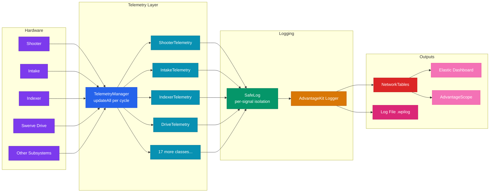
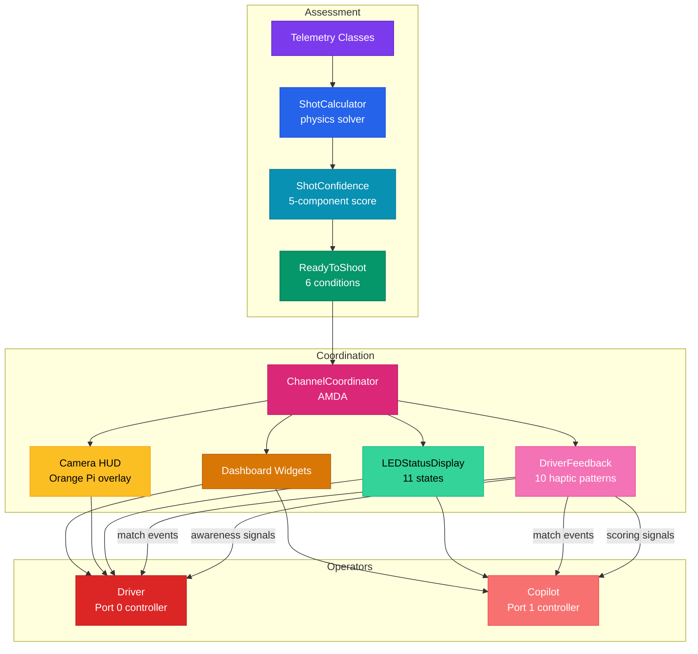

# System Architecture Overview

Our control system does three things: it watches every subsystem on the robot in real time, it figures out when conditions are right for scoring, and it tells the right operator at the right time through the right channel. The tagline is "the robot assesses, the copilot fires, the driver flies." That's not marketing. It's literally how the data flows.

We run 21 telemetry classes that monitor ~500 signals every loop cycle, a fire control pipeline that calculates shot parameters using physics solvers and neural networks, and a 4-channel feedback system that routes information to whichever operator needs it. All of this sits on top of WPILib's AdvantageKit logging framework, with crash isolation at every layer so one broken sensor can't take down the whole system.

## Data Flow: Subsystems to Dashboards

This is the core pipeline. Subsystems own the hardware. Telemetry reads from subsystems and does all the analysis. Everything gets logged through SafeLog into AdvantageKit's logger, which publishes to NetworkTables for live dashboards and writes to disk for post-match review.

## Feedback Loop: Sensors to Operators

The second major flow is how assessed information reaches the humans. Telemetry classes produce status signals. The ChannelCoordinator (our AMDA system) decides what to show and where. Feedback routes differently depending on whether you're the driver or copilot.

## Key Architectural Decisions

### Telemetry is separate from subsystems

Subsystems only do motor control. They expose getters like `getVelocityRPM()` and `getTemperature()`, but they never log anything or run detection logic. All of that lives in the matching telemetry class (e.g., `ShooterTelemetry` reads from `Shooter`).

Why? Crash isolation. If a sensor returns garbage or throws an exception, the telemetry class catches it and keeps going. The subsystem never knows, and it keeps controlling the motor just fine. This also means we can disable or swap out telemetry without touching any subsystem code.

### SafeLog wraps every log call

Every single `Logger.recordOutput()` call goes through `SafeLog.put()` instead of being called directly. SafeLog wraps each call in its own try-catch so that if one signal crashes (bad data type, null pointer, whatever), only that one signal dies. The other ~499 signals keep logging normally.

We learned this the hard way. One bad signal used to crash the entire logging pipeline and we'd lose all data for the rest of the match. Now the worst case is one blank signal in the log file.

### TelemetryManager runs everything in one place

`TelemetryManager.updateAll()` gets called once per `robotPeriodic()` cycle. It loops through all 21 telemetry classes and calls `update()` then `log()` on each one, in a consistent order, every single cycle.

This means there's exactly one place to look when you want to know what runs when. It also means telemetry classes can safely read from each other (through TelemetryManager's accessors) because the update order is deterministic.

### Two controllers with role-based routing

We use two Xbox controllers. Port 0 is the driver (movement, positioning). Port 1 is the copilot (shooting, intake, strategy toggles). The feedback system routes information based on who needs it:

- **Copilot gets scoring signals:** progressive aim guidance, ReadyToShoot confirmation, hub state changes, jam alerts. These are the things you need to know to decide when to pull the trigger.
- **Driver gets awareness signals:** flywheel spin-up rumble, so the driver knows the copilot is preparing to shoot and can hold position.
- **Both get match events:** teleop start, endgame warning, hub shift, role switch confirmation.

If the copilot controller is unplugged, everything falls back gracefully to the driver controller. Nothing crashes.

## Ball Physics Simulation (FuelSim)

We built a full-field ball physics simulator called FuelSim. It models projectile flight with drag and Magnus spin effects, 43 collision elements (floor bumps, trench pillars, trench ceilings, tower structure, outposts, hub ramps, guardrails), hub scoring detection, intake pickup, robot bumper collisions, and ball-to-ball collisions using spatial hashing. It runs at 4ms subticks inside the sim loop. This matters because we can test shooting from any position on the field, verify that balls behave realistically off walls and obstacles, and validate fire control solutions without a physical robot. FuelSim is MIT licensed and designed to be shareable with other teams.

## Safety and Crash Isolation

The system has four layers of crash protection so one broken sensor never takes down the whole robot. First, every telemetry class re-acquires its subsystem reference if it's null, so a subsystem that fails to initialize doesn't crash the telemetry layer. Second, all hardware reads (encoder values, temperatures, currents) happen inside a try-catch, so a CAN bus glitch just zeros out that reading instead of propagating. Third, SafeLog wraps every individual log call in its own try-catch, so one bad signal can't kill the other ~499. Fourth, TelemetryManager wraps each telemetry class's update/log cycle, so even if an entire telemetry class throws an uncaught exception, the other 20 classes still run normally.

For more details, see the [Safety Architecture](safety-architecture.md) document.

## Fire Control Pipeline

Shooting isn't just "spin up and launch." Our fire control pipeline has four layers that all have to agree before a shot is authorized:

```mermaid
flowchart LR
    subgraph "Layer 1: Hub Timing"
        HS[HubShiftEngine<br/>tracks scoring windows]
    end

    subgraph "Layer 2: Zone Legality"
        ZG[Zone Gate<br/>alliance zone check]
    end

    subgraph "Layer 3: Shot Quality"
        SC2[ShotCalculator<br/>Newton TOF solver]
        CONF2[ShotConfidence<br/>5 components, 0-100%]
    end

    subgraph "Layer 4: Scoring Readiness"
        RTS2[ReadyToShoot<br/>6 conditions + debounce]
    end

    HS -->|window open| ZG
    ZG -->|in alliance zone| SC2
    SC2 --> CONF2
    CONF2 -->|>= 50%| RTS2
    RTS2 -->|all 6 true| FIRE[Shot Authorized]

    style HS fill:#7c3aed,stroke:#5b21b6,color:#fff
    style ZG fill:#2563eb,stroke:#1d4ed8,color:#fff
    style SC2 fill:#0891b2,stroke:#0e7490,color:#fff
    style CONF2 fill:#059669,stroke:#047857,color:#fff
    style RTS2 fill:#d97706,stroke:#b45309,color:#fff
    style FIRE fill:#dc2626,stroke:#b91c1c,color:#fff
```

**Layer 1, Hub Timing:** The REBUILT game has shifting hubs. HubShiftEngine tracks which hub is active and when shifts happen, so we don't shoot into a deactivated hub.

**Layer 2, Zone Legality:** A zone gate on the copilot's trigger prevents shooting when the robot is outside our alliance zone. This is a game rule thing, not a safety thing.

**Layer 3, Shot Quality:** ShotCalculator uses a Newton iteration time-of-flight solver (5 iterations, warm start, velocity compensation) to compute the RPM and angle for the current distance. ShotConfidence produces a 0-100% weighted geometric mean from 5 components: distance quality, vision lock strength, robot stability, shooter readiness, and solver convergence.

**Layer 4, Scoring Readiness:** ReadyToShoot is the final gate. All six conditions must be true: shooter at target RPM, indexer clear, vision locked, ball present, fire authorized by hub timing, and shot confidence at or above 50%. There's also debounce to prevent flickering.

## Shot Calculation Fallback

The robot computes shot parameters (RPM and trajectory) using a 4-tier fallback system. If the best option isn't available, it drops to the next one automatically:

| Tier | Source | How It Works |
|------|--------|-------------|
| 1 (best) | Mode B Live NN | 10-model ensemble on Orange Pi, 50Hz live inference, 8D input (distance, velocity, battery, motor temp, etc.) |
| 2 | Mode A NN LUT | Pre-generated lookup table from the same neural network, loaded at boot |
| 3 | Sim LUT | Lookup table generated by ProjectileSimulator (RK4 + drag + Magnus physics) |
| 4 (baseline) | Baseline LUT | Hand-tuned table from practice, always available |

The neural network was trained on 800K physics-simulated shots with domain randomization (varied drag, Magnus, battery voltage, motor wear) so it generalizes well to real-world conditions. Mode B sends live telemetry to the Orange Pi and gets back RPM predictions in real time. Mode A is the same model but pre-baked into a table so it works even if the coprocessor is down.

## What's Next

The rest of this documentation goes deeper into each piece:
- [Telemetry System](telemetry-system.md) for the 21-class architecture and signal conventions
- [Fire Control Pipeline](fire-control-pipeline.md) for the full solver, confidence, and NN details
- [Safety Architecture](safety-architecture.md) for the 4-layer crash isolation design
- [Vision System](vision-system.md) for the 6-gate filtering pipeline
- [Driver Feedback & AMDA](../feedback/driver-feedback.md) for the 4 feedback channels and role-based routing

---
[Back to Documentation Home](../README.md)
