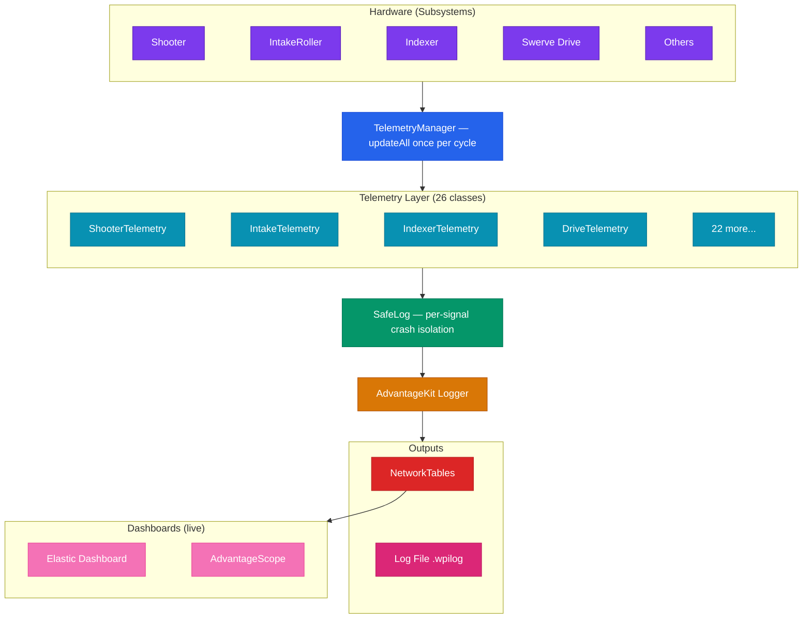
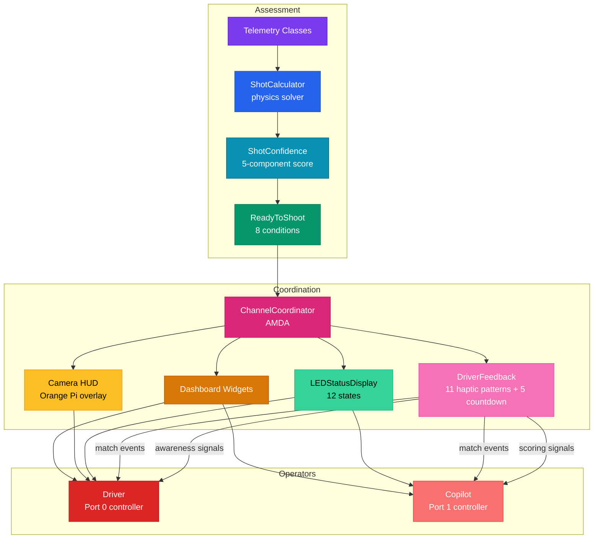
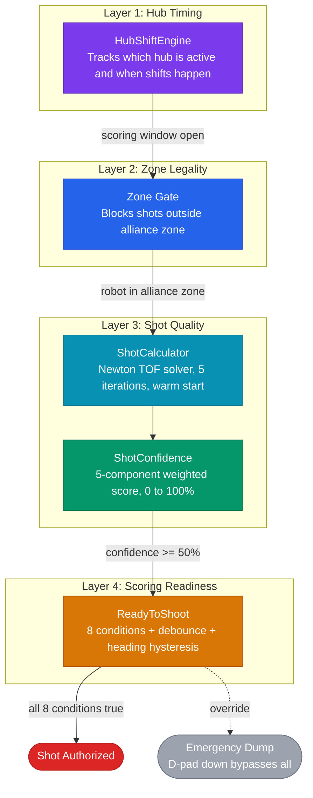

# System Architecture Overview

Our control system watches the robot in real time, figures out when it's safe to score, and tells the operators what's going on. "The robot assesses, the copilot fires, the driver flies" is the short version of that flow.

We have 26 telemetry classes watching 745+ signals every loop cycle, a fire control pipeline that figures out shot parameters using physics solvers and neural networks, and a 4-channel feedback system that sends the right info to the right operator. Everything runs on WPILib's AdvantageKit logging framework, with crash isolation at every layer so one broken sensor can't take down the whole system.

## Data Flow: Subsystems to Dashboards

This is the core pipeline. Subsystems own hardware access. Telemetry reads from the subsystems and does the analysis. SafeLog sends everything into AdvantageKit, which then feeds the live dashboards and the match logs.

```mermaid
flowchart TB
    subgraph HW ["Hardware (Subsystems)"]
        direction LR
        S1[Shooter] ~~~ S2[IntakeRoller] ~~~ S3[Indexer] ~~~ S4[Swerve Drive] ~~~ S5[Others]
    end

    TM[TelemetryManager — updateAll once per cycle]

    subgraph TEL ["Telemetry Layer (26 classes)"]
        direction LR
        T1[ShooterTelemetry] ~~~ T2[IntakeTelemetry] ~~~ T3[IndexerTelemetry] ~~~ T4[DriveTelemetry] ~~~ T5[22 more...]
    end

    SL[SafeLog — per-signal crash isolation]
    AK[AdvantageKit Logger]

    subgraph OUT ["Outputs"]
        direction LR
        NT[NetworkTables] ~~~ LOG[Log File .wpilog]
    end

    subgraph DASH ["Dashboards (live)"]
        direction LR
        EL[Elastic Dashboard] ~~~ AS[AdvantageScope]
    end

    HW --> TM --> TEL --> SL --> AK --> OUT
    NT --> DASH

    style S1 fill:#7c3aed,stroke:#5b21b6,color:#fff
    style S2 fill:#7c3aed,stroke:#5b21b6,color:#fff
    style S3 fill:#7c3aed,stroke:#5b21b6,color:#fff
    style S4 fill:#7c3aed,stroke:#5b21b6,color:#fff
    style S5 fill:#7c3aed,stroke:#5b21b6,color:#fff
    style TM fill:#2563eb,stroke:#1d4ed8,color:#fff
    style T1 fill:#0891b2,stroke:#0e7490,color:#fff
    style T2 fill:#0891b2,stroke:#0e7490,color:#fff
    style T3 fill:#0891b2,stroke:#0e7490,color:#fff
    style T4 fill:#0891b2,stroke:#0e7490,color:#fff
    style T5 fill:#0891b2,stroke:#0e7490,color:#fff
    style SL fill:#059669,stroke:#047857,color:#fff
    style AK fill:#d97706,stroke:#b45309,color:#fff
    style NT fill:#dc2626,stroke:#b91c1c,color:#fff
    style LOG fill:#db2777,stroke:#be185d,color:#fff
    style EL fill:#f472b6,stroke:#ec4899,color:#fff
    style AS fill:#f472b6,stroke:#ec4899,color:#fff
```

## Feedback Loop: Sensors to Operators

The second major flow is how the robot tells operators what's going on. Telemetry classes produce status signals. The ChannelCoordinator (our AMDA system) decides what to show and where. Feedback routes differently depending on whether you're the driver or copilot.

```mermaid
flowchart TB
    subgraph Assessment
        TEL[Telemetry Classes]
        SC[ShotCalculator<br/>physics solver]
        CONF[ShotConfidence<br/>5-component score]
        RTS[ReadyToShoot<br/>8 conditions]
    end

    subgraph Coordination
        CC[ChannelCoordinator<br/>AMDA]
        DF[DriverFeedback<br/>11 haptic patterns + 5 countdown]
        LED[LEDStatusDisplay<br/>12 states]
        HUD[Camera HUD<br/>Orange Pi overlay]
        DASH[Dashboard Widgets]
    end

    subgraph Operators
        DRIVER[Driver<br/>Port 0 controller]
        COPILOT[Copilot<br/>Port 1 controller]
    end

    TEL --> SC --> CONF --> RTS
    RTS --> CC
    CC --> DF & LED & HUD & DASH
    DF -->|awareness signals| DRIVER
    DF -->|scoring signals| COPILOT
    DF -->|match events| DRIVER & COPILOT
    LED --> DRIVER & COPILOT
    HUD --> DRIVER
    DASH --> DRIVER & COPILOT

    style TEL fill:#7c3aed,stroke:#5b21b6,color:#fff
    style SC fill:#2563eb,stroke:#1d4ed8,color:#fff
    style CONF fill:#0891b2,stroke:#0e7490,color:#fff
    style RTS fill:#059669,stroke:#047857,color:#fff
    style CC fill:#db2777,stroke:#be185d,color:#fff
    style DF fill:#f472b6,stroke:#ec4899,color:#fff
    style LED fill:#34d399,stroke:#10b981,color:#000
    style HUD fill:#fbbf24,stroke:#f59e0b,color:#000
    style DASH fill:#d97706,stroke:#b45309,color:#fff
    style DRIVER fill:#dc2626,stroke:#b91c1c,color:#fff
    style COPILOT fill:#f87171,stroke:#ef4444,color:#fff
```

## Key Architectural Decisions

### Telemetry is separate from subsystems

Subsystems only do motor control. They expose getters like `getVelocityRPM()` and `getTemperature()`, but they never log anything or run detection logic. All of that lives in the matching telemetry class (e.g., `ShooterTelemetry` reads from `Shooter`).

Why? Crash isolation. If a sensor read goes bad, the telemetry class catches it and keeps the damage local. The subsystem keeps controlling the motor, and we can change telemetry logic without rewriting the hardware code.

### SafeLog wraps every log call

Every single `Logger.recordOutput()` call goes through `SafeLog.put()` instead of being called directly. SafeLog wraps each call in its own try-catch so that if one signal crashes (bad data type, null pointer, whatever), only that one signal dies. The other 744+ signals keep logging normally.

We learned this one the hard way. A single bad signal used to crash the entire logging pipeline. Now the worst case is usually one missing signal instead of losing the whole log.

`SafeLog.run()` does the same thing for external calls in telemetry (like EventMarker or CycleTracker). It also rate-limits exception logging to 1 per second per call site, so a CAN disconnect storm doesn't fill up memory with repeated stack traces.

### TelemetryManager runs everything in one place

`TelemetryManager.updateAll()` gets called once per `robotPeriodic()` cycle. It loops through all 26 telemetry classes and calls `update()` then `log()` on each one, in a consistent order, every single cycle.

So there's exactly one place to look when you want to know what runs when. Telemetry classes can also read from each other safely (through TelemetryManager's accessors) because the update order is deterministic.

### Two controllers with role-based routing

We use two Xbox controllers. Port 0 is the driver (movement, positioning). Port 1 is the copilot (shooting, intake, strategy toggles). The feedback system routes information based on who needs it, using a `HapticTarget` enum (DRIVER, COPILOT, BOTH):

- **COPILOT gets scoring signals:** progressive aim guidance, ReadyToShoot confirmation, hub state changes, jam alerts. These are the things you need to know to decide when to pull the trigger.
- **DRIVER gets awareness signals:** flywheel spin-up rumble, so the driver knows the copilot is preparing to shoot and can hold position.
- **BOTH get match events:** auto result (won/lost), endgame warning, hub shift, role switch confirmation.

If the copilot controller isn't physically plugged in (checked via `isConnected()`), all COPILOT-targeted patterns automatically go to the driver controller instead. Nothing gets dropped.

### Alliance role switching

The robot supports two roles: SHOOTER (default) and FEEDER. The copilot toggles this with the Start button. In FEEDER mode, the same trigger bindings do different things (eject balls to feed spots instead of shooting at the hub), LEDs show a FEEDING state, and zone restrictions change. The switch is confirmed with a haptic buzz on both controllers so nobody's confused about which mode they're in.

### Drive speed limiting during shooting

When the shooter flywheel is spinning, the drive automatically drops to 40% max speed. This keeps the robot stable while lining up a shot. The copilot doesn't have to tell the driver to slow down. Once the flywheel stops, full speed comes back.

## Ball Physics Simulation (FuelPhysicsSim)

We built a full-field ball physics simulator called FuelPhysicsSim (2,285 lines, MIT-licensed, designed to be shareable). It models projectile flight with drag and Magnus spin effects, 43 collision elements (floor bumps, trench pillars, trench ceilings, tower structure, outposts, hub ramps, guardrails), hub scoring detection, intake pickup, robot bumper collisions, and ball-to-ball collisions using spatial hashing. It runs symplectic Euler integration at 4ms subticks with a sequential impulse solver (4 iterations, warm starting, Baumgarte stabilization). There's also CCD for fast projectiles so balls don't clip through thin walls.

We can test shooting from any position on the field, check that balls bounce off walls and obstacles the way they should, and validate fire control solutions without having the actual robot. It has 76 tests and a deterministic mode for reproducible test runs.

## Safety and Crash Isolation

The system has four layers of crash protection so one broken sensor never takes down the whole robot. First, every telemetry class re-acquires its subsystem reference if it's null, so a subsystem that fails to initialize doesn't crash the telemetry layer. Second, all hardware reads (encoder values, temperatures, currents) happen inside a try-catch, so a CAN bus glitch just zeros out that reading instead of propagating. Third, SafeLog wraps every individual log call in its own try-catch, so one bad signal can't kill the other 744+. Fourth, TelemetryManager wraps each telemetry class's update/log cycle, so even if an entire telemetry class throws an uncaught exception, the other 25 classes still run normally.

For more details, see the [Safety Architecture](safety-architecture.md) document.

## Fire Control Pipeline

Shooting is not just "spin up and launch." Our fire control pipeline has four layers that all have to agree before a shot is authorized:

```mermaid
flowchart TB
    subgraph L1 ["Layer 1: Hub Timing"]
        HS[HubShiftEngine<br/>Tracks which hub is active and when shifts happen]
    end

    subgraph L2 ["Layer 2: Zone Legality"]
        ZG[Zone Gate<br/>Blocks shots outside alliance zone]
    end

    subgraph L3 ["Layer 3: Shot Quality"]
        SC2[ShotCalculator<br/>Newton TOF solver, 5 iterations, warm start]
        SC2 --> CONF2[ShotConfidence<br/>5-component weighted score, 0 to 100%]
    end

    subgraph L4 ["Layer 4: Scoring Readiness"]
        RTS2[ReadyToShoot<br/>8 conditions + debounce + heading hysteresis]
    end

    FIRE([Shot Authorized])
    DUMP([Emergency Dump<br/>D-pad down bypasses all])

    HS -->|scoring window open| ZG
    ZG -->|robot in alliance zone| SC2
    CONF2 -->|confidence >= 50%| RTS2
    RTS2 -->|all 8 conditions true| FIRE
    RTS2 -.->|override| DUMP

    style HS fill:#7c3aed,stroke:#5b21b6,color:#fff
    style ZG fill:#2563eb,stroke:#1d4ed8,color:#fff
    style SC2 fill:#0891b2,stroke:#0e7490,color:#fff
    style CONF2 fill:#059669,stroke:#047857,color:#fff
    style RTS2 fill:#d97706,stroke:#b45309,color:#fff
    style FIRE fill:#dc2626,stroke:#b91c1c,color:#fff
    style DUMP fill:#9ca3af,stroke:#6b7280,color:#fff
```

**Layer 1, Hub Timing:** The REBUILT game has shifting hubs. HubShiftEngine tracks which hub is active and when shifts happen, so we don't shoot into a deactivated hub. FireAuthorization also compensates for time of flight, checking whether the hub will still be active when the ball arrives.

**Layer 2, Zone Legality:** A zone gate on the copilot's trigger prevents shooting when the robot is outside our alliance zone. This is a game rule thing.

**Layer 3, Shot Quality:** ShotCalculator uses a Newton iteration time-of-flight solver (5 iterations, warm start, velocity compensation, direction-aware polar velocity limiting) to compute the RPM and angle for the current distance. ShotConfidence produces a 0-100% weighted geometric mean from 5 components: distance quality, vision lock strength, robot stability, shooter readiness, and solver convergence.

**Layer 4, Scoring Readiness:** ReadyToShoot is the final gate. All eight conditions must be true: shooter at target RPM, indexer clear, vision locked, ball present, fire authorized by hub timing, shot confidence at or above 50%, heading on target (with 4x hysteresis band), and not in a trench exclusion zone. Each condition has its own debounce to prevent flickering. Copilot D-pad down overrides everything for emergency dumps.

## Shot Calculation Fallback

The robot computes shot parameters (RPM and trajectory) using a 4-tier fallback system. If the best option isn't available, it drops to the next one automatically:

| Tier | Source | How It Works |
|------|--------|-------------|
| 1 (best) | Mode B Live NN | 10-model ensemble on Orange Pi, 50Hz live inference, 8D input (distance, velocity, battery, motor temp, etc.) |
| 2 | Mode A NN LUT | Pre-generated lookup table from the same neural network, 5-state FSM manages loading and validation |
| 3 | Sim LUT | Lookup table generated by ProjectileSimulator (RK4 + drag + Magnus physics), ~90 dense entries |
| 4 (baseline) | Baseline LUT | Hand-tuned table from practice, always available |

We trained the neural network on 800K physics-simulated shots with domain randomization, so it can handle variation in drag, Magnus effect, battery voltage, and motor wear. Mode B runs live on the Orange Pi. Mode A is the same idea baked into a table so it still works if the coprocessor is unavailable.

## Auto Scoring Pipeline

Auto scoring uses the same fire control pipeline as teleop. PathPlanner paths with event markers trigger `AimAndShootCommand` through static `EventTrigger` fields, so the robot aims and shoots with the same logic whether a human or an auto routine is driving.

The pipeline supports 4 auto routines built from 8 PathPlanner paths. Some paths use `PointTowardsZone` with a 180-degree rotation offset so the robot passively aims its rear-mounted shooter at the hub while driving. Return-to-score paths use `DeferredCommand` to compute the path at runtime based on the robot's current position, so the auto can recover from drift.

## What's Next

The rest of this documentation goes deeper into each piece:
- [Telemetry System](telemetry-system.md) for the 26-class architecture and signal conventions
- [Fire Control Pipeline](fire-control-pipeline.md) for the full solver, confidence, and NN details
- [Safety Architecture](safety-architecture.md) for the 4-layer crash isolation design
- [Vision System](vision-system.md) for the 10-gate filtering pipeline
- [Driver Feedback & AMDA](../feedback/driver-feedback.md) for the 4 feedback channels and role-based routing
