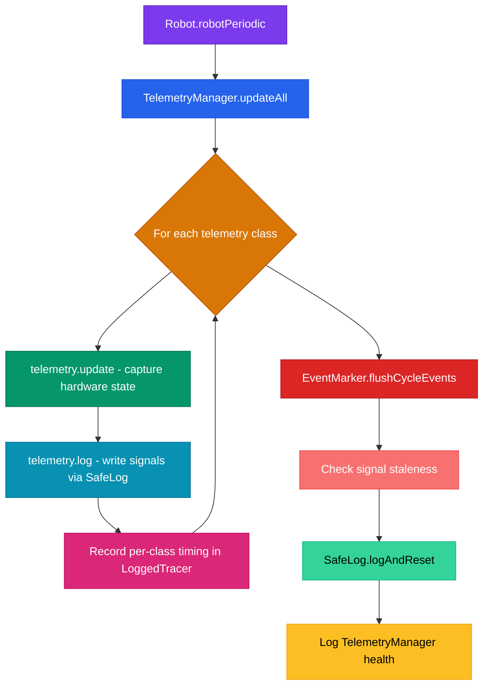

# Telemetry System Deep Dive

## What Telemetry Means for Us

Telemetry is how we see inside the robot while it's running. Every motor current, every velocity reading, every temperature, every jam detection, every vision lock, every scoring condition is captured in real time and logged. If something goes wrong during a match, we don't have to guess. We can pull up the log file, scrub to the exact timestamp, and see exactly what the robot was doing.

We log roughly 500 signals every 20ms cycle. That covers every subsystem on the robot plus derived states like stall detection, shot confidence, and scoring readiness. All of it flows through AdvantageKit's logging framework and can be replayed in AdvantageScope after the match.

## The 21 Telemetry Classes

Every telemetry class implements the `SubsystemTelemetry` interface, which defines three methods: `update()`, `log()`, and `getName()`. TelemetryManager instantiates and orchestrates all of them.

### Subsystem Telemetry (hardware monitoring)

These classes directly monitor physical subsystems on the robot.

| Class | What it tracks |
|-------|---------------|
| `ShooterTelemetry` | Flywheel velocity, spin-up timing, shot detection (velocity dip), fire rate, recovery time, stall detection |
| `IndexerTelemetry` | Ball indexing motor, jam detection, stall monitoring |
| `IntakeTelemetry` | Intake roller motor, jam detection, stall monitoring |
| `IntakeActuatorTelemetry` | Intake deploy/retract actuator motor, temperature, faults |
| `AgitatorTelemetry` | Agitator motor, jam detection, stall monitoring |
| `HangerTelemetry` | Hanger motor, position, temperature |
| `DriveTelemetry` | Swerve module states, odometry pose, heading, speeds |
| `VisionTelemetry` | Camera target lock, pose confidence, tag count, ambiguity |

### Scoring and Shot Telemetry

| Class | What it tracks |
|-------|---------------|
| `ScoringTelemetry` | ReadyToShoot composite (6 conditions), hub shift timing, ready state transitions, lost-reason diagnostics |
| `ShotPredictorTelemetry` | ShootOnTheMove calculations: distance, time of flight, compensated target, drift, computed RPM, heading error |
| `ShotVisualizerTelemetry` | 3D trajectory arc for AdvantageScope visualization (Pose3d array) |

### System and Match Telemetry

| Class | What it tracks |
|-------|---------------|
| `SystemHealthTelemetry` | Loop time, battery voltage, total current draw, brownout risk, PDH channels |
| `MatchTelemetry` | Match time, mode (auto/teleop/disabled), FMS connection, alliance, event name |
| `MatchStatsTelemetry` | Shots per phase (auto/teleop/endgame), cycle timing, efficiency |
| `CANHealthTelemetry` | Per-device CAN connectivity across all motor controllers |
| `NetworkTelemetry` | Network bandwidth usage, warning/critical thresholds |

### Operator Telemetry

| Class | What it tracks |
|-------|---------------|
| `DriverInputTelemetry` | Joystick axes, button states for both driver and copilot controllers |
| `DriverFeedbackTelemetry` | Active haptic pattern, rumble intensity, feedback channel state |
| `LEDTelemetry` | Current LED state, color output |
| `CommandsTelemetry` | Active command scheduler state, running commands |

### Strategy Telemetry

| Class | What it tracks |
|-------|---------------|
| `StrategyTelemetry` | Active alliance role (SHOOTER/FEEDER), feed strategy, zone awareness, role switch events |

## How TelemetryManager Orchestrates Everything

`TelemetryManager` is a singleton. It creates all 21 telemetry instances in its constructor (plus `MatchTelemetry` which is added inline) and stores them in a `telemetryList`. The constructor order matters because some classes depend on others. For example, `ScoringTelemetry` takes `ShooterTelemetry`, `IndexerTelemetry`, and `VisionTelemetry` as constructor arguments so it can read their state.

After construction, `RobotContainer` calls setter methods to inject runtime dependencies:
- `setVision(vision)` gives VisionTelemetry access to the camera system
- `setSwerveSubsystem(swerve)` gives DriveTelemetry and ShotVisualizerTelemetry access to odometry
- `setControllers(driver, operator)` gives DriverInputTelemetry access to the Xbox controllers

## The Update/Log Cycle

Every `robotPeriodic()` call triggers `TelemetryManager.updateAll()`. Here's what happens:

The split between `update()` and `log()` is intentional. `update()` captures all hardware readings and runs derived logic (stall detection, jam detection, etc.). `log()` writes the captured values to the log. This way, if logging fails for one signal, the state is still correct for other classes that depend on it.

Every class is wrapped in `runSafely()`, which catches any `Throwable`. If one telemetry class crashes, the others keep running. The failure count and name get logged so we can debug it later. For the full crash isolation design, see [Safety Architecture](safety-architecture.md).

## SafeLog: Crash Isolation for Every Signal

`SafeLog` wraps every `Logger.recordOutput()` call in a try-catch. If writing one signal throws an exception (bad data type, null value, internal AdvantageKit error), it catches the `Throwable`, increments a failure counter, and moves on. The robot never crashes because of a logging call.

It supports all the types we need: `double`, `boolean`, `int`, `long`, `String`, arrays, `Pose2d`, `Pose3d`, and `SwerveModuleState[]`. There's also `SafeLog.run(Runnable)` for wrapping arbitrary actions (like EventMarker calls) with the same crash isolation.

At the end of each cycle, `SafeLog.logAndReset()` writes the failure count and last failed key, then resets the counters.

## Signal Naming Convention

Signals follow a `Category/SignalName` pattern:

- **Subsystem signals**: `Shooter/VelocityRPM`, `Intake/Stalled`, `Indexer/JamDetected`
- **Scoring signals**: `Scoring/ReadyToShoot`, `Scoring/Conditions/ShooterReady`, `Scoring/TimeSinceReadyMs`
- **Health signals**: `Health/Telemetry/Failures`, `Health/SafeLog/CycleFailures`
- **Device signals**: `Shooter/Device/Connected`, `Shooter/Device/FaultsRaw`
- **Previous state**: `Scoring/Previous/ShooterReady` (for edge detection)
- **Timing**: `LoggedTracer/Tel/ShooterMs` (per-class execution time)

The naming is hierarchical, so in AdvantageScope you can expand `Scoring/` to see all scoring signals, or `Shooter/` to see everything about the flywheel.

## What ~500 Signals Means Practically

For every motor on the robot, we log: velocity, temperature, applied output, output current, bus voltage, device connected, sticky faults raw, and stall state. That's 8+ signals per motor, and we have 7 motors (shooter, indexer, intake, intake actuator, agitator, hanger, plus swerve modules).

On top of that, we log derived states: jam detection with JamProtection state machines on 3 subsystems, ReadyToShoot with all 6 sub-conditions and edge detection, vision confidence with hysteresis thresholds, match phase tracking, hub shift timing, network bandwidth, CAN bus health, shot trajectory visualization, driver feedback state, LED state, and per-class execution timing.

All of these are documented in SIGNALS.md, which is append-only (we never remove entries).

## How to Add a New Signal

1. Add a `SafeLog.put("Category/SignalName", value)` call in the appropriate telemetry class's `log()` method
2. Append the new signal to `SIGNALS.md` (this file is append-only, never remove entries)

That's it. AdvantageKit picks it up automatically on the next deploy.

## Staleness Detection

TelemetryManager also monitors signals that shouldn't stay true forever. For example, if `ShooterStalled` stays true for more than 30 seconds, or `IndexerJam` stays true for more than 60 seconds, it logs a staleness warning under `Health/Staleness/`. This catches cases where a detection flag gets stuck due to a sensor glitch.

## Safe External Access

Other parts of the codebase (commands, driver feedback, fire control) access telemetry values through TelemetryManager's `getSafely()` wrapper methods like `isReadyToShoot()`, `getShooterVelocityRPM()`, `isAnyJamIntervening()`. Each of these wraps the underlying call in a try-catch that returns a safe default value on failure, so a crash in one telemetry class can never propagate to the command scheduler or driver feedback system.

---

**Related:** [Safety Architecture](safety-architecture.md) | [Fire Control Pipeline](fire-control-pipeline.md) | [System Overview](system-overview.md)
