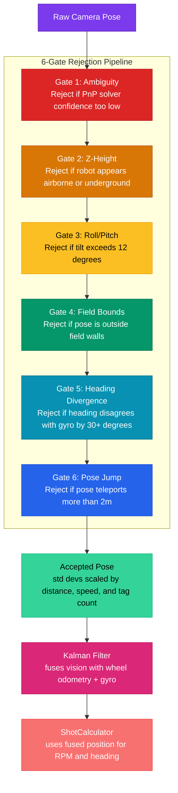

# Vision System & Filtering

## What Vision Does

The robot uses AprilTag-based localization to figure out where it is on the field. Cameras see AprilTags (the black-and-white square markers mounted around the field), and PhotonVision on the coprocessor solves for the robot's 3D position relative to those tags. This pose estimate gets fused with wheel odometry and the gyro through a Kalman filter, giving us a field-relative position that's way more accurate than odometry alone.

Without vision, the robot drifts. Wheel slip, carpet inconsistencies, and minor encoder errors compound over a match. Vision corrects that drift every frame.

The [fire control pipeline](fire-control-pipeline.md) depends on this. ShotCalculator needs to know the robot's position to compute distance to the hub, which determines flywheel RPM and heading. Bad vision data means bad shots.

## Camera Setup

We run 4 cameras configured in `Cameras.java`, each as a PhotonVision camera with its own pose estimator:

| Camera | Name | Position | Orientation | Purpose |
|--------|------|----------|-------------|---------|
| LEFT_CAM | `back-left` | (-0.293, 0.293, 0.229)m | 15 deg down, 135 deg yaw | Rear-left coverage |
| RIGHT_CAM | `back-right` | (-0.293, -0.293, 0.229)m | 15 deg down, -135 deg yaw | Rear-right coverage |
| FRONT_LEFT_CAM | `front-left` | (-0.113, 0.145, 0.483)m | 0 pitch, 45 deg yaw | Front-left coverage |
| FRONT_RIGHT_CAM | `front-right` | (-0.113, -0.145, 0.483)m | 0 pitch, -45 deg yaw | Front-right coverage |

Each camera has independent standard deviation baselines: single-tag (0.3, 0.3, 0.6) and multi-tag (0.1, 0.1, 0.2). Multi-tag gets tighter std devs because seeing multiple tags lets PhotonVision triangulate much more precisely.

The pose strategy is `MULTI_TAG_PNP_ON_COPROCESSOR` with `LOWEST_AMBIGUITY` as the single-tag fallback.

## VisionFilter: 6-Gate Rejection Pipeline

Not every pose estimate is good. Reflections, partial tag occlusion, motion blur, and bad PnP solves all produce garbage poses. VisionFilter is a pure-math rejection pipeline (no WPILib sim dependencies, fully unit-testable) that throws out bad estimates before they can corrupt the Kalman filter.

Every pose runs through these six checks in order. The first failure rejects the pose:

| Gate | Threshold | What it catches |
|------|-----------|----------------|
| **Ambiguity** | > 0.25 (single-tag only) | PnP solver couldn't confidently distinguish between two possible poses. Multi-tag doesn't have this problem. |
| **Z-Height** | abs(z) > 0.5m | Pose says the robot is flying or underground. Clearly wrong. |
| **Roll/Pitch** | abs(roll or pitch) > 12 deg | Pose says the robot is tilted far beyond what's physically possible on flat carpet. |
| **Field Bounds** | Outside field + 0.5m margin | Pose puts the robot outside the field walls. The margin accounts for bumper overhang at the perimeter. |
| **Heading Divergence** | > 30 deg from gyro (single-tag only) | Single-tag heading is unreliable, so if it disagrees with the gyro by more than 30 degrees, we reject it. |
| **Pose Jump** | > 2.0m from current pose | Pose teleports the robot. Skipped during the first 2 seconds of auto (grace period for initial localization). |

## Standard Deviation Scaling

Accepted poses don't all get equal trust. The Kalman filter uses standard deviations to weight how much to trust each measurement, and VisionFilter scales these dynamically:

- **Distance scaling**: Std devs grow with the square of the distance to the tag (`1 + dist^2 / 30`). This matches photogrammetry principles: pixel error grows quadratically with range.
- **Velocity scaling**: Std devs grow with the square of robot speed (`1 + speed^2 * 0.3`, capped at 5x). Motion blur and latency displacement degrade accuracy at high speed.
- **Tag count**: Multi-tag uses the tighter base std devs (0.1, 0.1, 0.2). Single-tag uses the looser ones (0.3, 0.3, 0.6). Zero tags = infinite std devs (no update).

The result: when you're close to a tag, moving slowly, and seeing multiple tags, the filter trusts vision heavily. When you're far away, driving fast, and only see one tag, the filter leans on odometry instead.

## Single-Tag Pose Blending

Single-tag poses are tricky. The translation is usable, but the heading estimate is poor (one tag doesn't give enough geometric constraint). VisionFilter handles this with blending:

- **Heading**: Always uses the fused (gyro-backed) heading. Single-tag heading is set to infinite std dev, so the Kalman filter ignores it.
- **Translation blending**: `computeBlendWeight()` returns a weight based on distance. Close tags (under 3.0m) get blended in using `1 / (1 + dist^2)`. Beyond 3.0m, the weight drops to zero (single-tag translation is too noisy to help).
- **Blended pose**: Interpolates between the current fused position and the single-tag position, then keeps the fused heading.

Multi-tag poses don't need blending. They're used directly with their full std devs.

## Diagnosing Vision Issues

When shots are missing or confidence is low, check these signals:

| Signal | What to look for |
|--------|-----------------|
| `Vision/Camera/{name}/Connected` | Camera dropout. Check USB cables, coprocessor health. |
| `Vision/RejectionReason` | Which gate is rejecting. If AMBIGUITY is frequent, tags might be partially occluded or at extreme angle. |
| `Vision/TagCount` | 0 = no tags visible. Check camera aim, field layout loaded correctly. |
| `Vision/AvgDistanceM` | High distance means loose std devs. Get closer to tags before shooting. |
| `Vision/StdDevX`, `Vision/StdDevY` | If these are huge, the filter doesn't trust vision. Check distance and speed. |
| `Vision/PoseJumpM` | Spikes mean intermittent bad solves getting through. Might need to tighten thresholds. |

Common patterns:
- **Lots of AMBIGUITY rejections**: Camera is seeing tags at steep angles. Reposition or tilt camera.
- **HEADING_DIVERGENCE spikes**: Gyro might be drifting, or single-tag heading is fighting a correct gyro. This is normal and the filter is correctly protecting you.
- **POSE_JUMP at match start**: Expected. The 2-second auto grace period exists for this reason.
- **High std devs during fast driving**: Working as intended. The robot relies more on odometry when moving fast.

