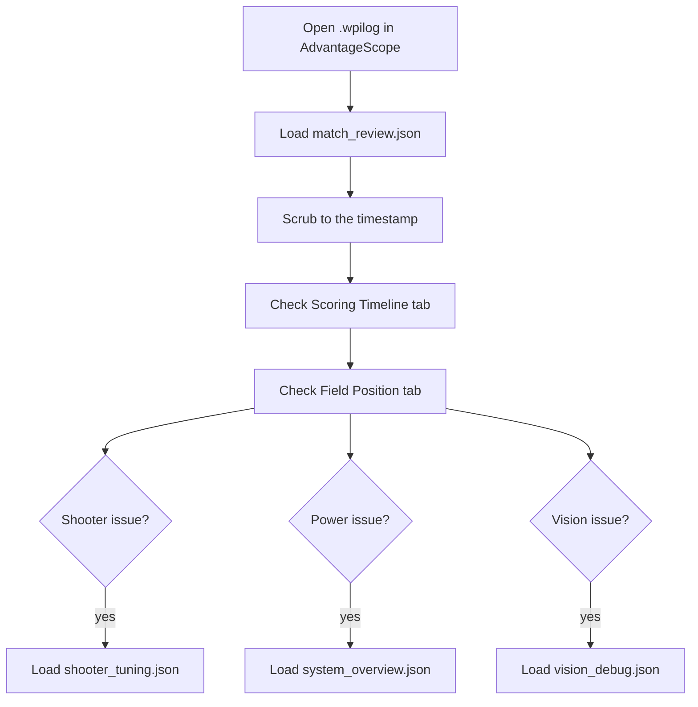

# AdvantageScope Guide

AdvantageScope is a log replay and visualization tool for FRC robots. While Elastic shows you live data during a match, AdvantageScope is where you go after the match to figure out what happened and why. It can also connect live, but its real strength is replaying `.wpilog` files with synchronized timelines, 3D field views, and multi-signal graphs.

**The key difference:** Elastic = live instrument panel during the match. AdvantageScope = detective tool after the match.

We have 11 AdvantageScope layouts stored in `ref/dashboards/advantagescope/`.

## How to Open a Log and Load a Layout

1. Open AdvantageScope
2. **File > Open Log** and select a `.wpilog` file (saved to the roboRIO's USB stick or your computer during sim)
3. **File > Import Layout** and pick a JSON file from `ref/dashboards/advantagescope/`
4. Use the timeline bar at the bottom to scrub through the match

The sidebar on the left lists every signal in the log. You can drag signals directly onto graph tabs or click to expand categories.

---

## Our 11 Layouts

### Match Analysis

**`match_review.json`** - The go-to layout after every match. 6 tabs:
- **Scoring Timeline:** ReadyToShoot, ShotDetected, AtSpeed, VisionLocked, JamDetected, and HubActive as colored stripes. Heading error and shift timing as line graphs. Shows exactly when you could have scored and when you actually did.
- **Field Position:** 2D field view with robot pose. See where the robot went during the match.
- **3D Field:** Full 3D view with robot model and shot trajectories rendered as Fuel game pieces.
- **Cycle Performance:** Spin-up time (last and average) vs. shots per minute. Tells you if the shooter is getting slower over the match.
- **Match Summary:** Battery voltage vs. total shots, active hub shots, hub utilization, peak current, and issue count. The "report card" for the match.
- **Driver Inputs:** Raw joystick visualization.

**`cycle_and_strategy.json`** - Focused on scoring efficiency and alliance strategy performance.

### Debugging

**`mechanism_debug.json`** - For diagnosing weird subsystem behavior. Shows commands, motor outputs, and sensor readings for each mechanism.

**`vision_debug.json`** - Vision pipeline analysis. Camera connectivity, tag detection, pose estimation quality, filter rejection reasons.

**`shooter_tuning.json`** - Deep dive into shooter performance. 14 tabs:
- **Velocity vs Target:** Actual RPM vs. target RPM with velocity error on the right axis. The most important tuning view.
- **At Speed Timeline:** Boolean stripes for AtSpeed, IsSpinningUp, and ReadyToShoot. Shows if the shooter is reaching target reliably.
- **Motor Output & Current:** Applied output vs. current draw. Look for current spikes during shots.
- **Temperature & Voltage:** Motor temp trend and bus voltage. Catches thermal throttling.
- **Shot Detection:** Velocity drops that trigger shot detection, plus total shot count.
- **Spin-Up Time / At Speed % / Fire Rate / Recovery Time:** Individual performance metrics.
- **3D Trajectory / Trajectory Stats:** Visualize predicted shot arcs on the field. Apex height, landing error, point count.
- **Shot Prediction / Drift Compensation:** Fire control internals (computed RPM, heading error, distance, drift X/Y, time of flight).
- **Command & Torque / Torque Detail:** Tracks torque reversals that cause the "clicking" sound. Helps catch orphaned command issues.

### System Health

**`power_and_health.json`** - Electrical system focus. Battery voltage, 3.3V/5V/6V rails, total current, CAN utilization, CAN TX/RX errors, and bandwidth.

**`system_overview.json`** - The broadest view. 12 tabs covering battery, CAN bus health, loop timing, LoggedTracer breakdown, motor temps, match state timeline (enabled/brownout/RSL/gyro/cameras), alerts, post-match summary with health score, top issues table, and diagnostics (ghost commands, overcurrent, torque reversals, active commands per subsystem).

**`pit_triage.json`** - Quick post-match health check in log form. Quick Health (battery + CAN + loop time + brownouts), Subsystem Faults (stalls, jams, disconnects for every device), Match Performance, Swerve Health (per-module temps and connections), Field Replay, Ghost Commands, Active Commands timeline.

### Driving

**`drive_and_auto.json`** - Swerve drive analysis. Module speeds, heading tracking, autonomous path following accuracy.

### Showcasing

**`video_showcase.json`** and **`full_video_showcase.json`** - Presentation layouts for showing off the robot's capabilities. Clean 3D field views with trajectory visualization, good for demos and award presentations.

---

## Key AdvantageScope Features We Use

| Feature | What It Does |
|---------|-------------|
| **LineGraph** | Time-series plots. Left/right axes with independent scales. Discrete stripes for booleans. |
| **Field2d** | Top-down field view showing robot pose over time. |
| **Field3d** | 3D field with robot model, shot trajectories, and game pieces. |
| **Swerve** | Module-by-module visualization (direction arrows, speeds). |
| **Table** | Raw signal values at the current timestamp. Good for exact numbers. |
| **Joysticks** | Visualizes controller inputs. |
| **Statistics** | Statistical summary of selected signals. |

---

## Diagnosing Issues

When someone says "the robot did something weird at about 1:30 left in the match":

1. Open the `.wpilog` in AdvantageScope
2. Load `match_review.json`
3. Scrub the timeline to 1:30 remaining (look at the Match/Time signal or the Scoring Timeline tab)
4. Check the **Scoring Timeline** for any boolean changes around that time (jam detected? vision lost? hub shifted?)
5. Switch to **Field Position** to see where the robot was physically
6. If it is a shooter issue, load `shooter_tuning.json` and check Velocity vs Target at that timestamp
7. If it is a power issue, load `system_overview.json` and check Battery & Power

**Common patterns:**
- Shooter not reaching speed: Check Temperature & Voltage tab. Motor might be thermally throttled.
- Random stopping: Check Ghost Commands in `pit_triage.json`. Orphaned commands can lock subsystems.
- Vision lost: Check `vision_debug.json` for camera disconnects or filter rejections.
- Battery dip: Check total current at that moment in `power_and_health.json`. Shooter spin-up + drive + intake can spike over 150A.

---

## Tips

- **Zoom in** by clicking and dragging on the timeline. Zoom out with the "reset zoom" button or scroll wheel.
- **Lock axes** in LineGraph tabs to keep a consistent scale when comparing across timestamps.
- **Export** screenshots of interesting moments for the engineering notebook.
- **Compare matches** by opening multiple AdvantageScope windows side by side.
- Log files are saved to a USB stick on the roboRIO. Grab them after every match. They are your best debugging tool.

---

**See also:** [Elastic Guide](elastic-guide.md) | [Dashboard Quick Reference](quick-reference.md)

[Back to Documentation Home](../README.md)
