# Community Impact & Open Source

We released three Java files on Chief Delphi. Twelve days later, a World Champion had deleted their own shooting code and replaced it with ours, won Innovation in Control, and judges were quoting our physics engine in their award citation.

## The Numbers That Matter

| | |
|---|---|
| **5** | verified teams running our code with our MIT license in their repos |
| **8** | combined Innovation in Control wins across those teams' careers |
| **3** | awards won in 2026 by teams using our code |
| **3,068** | Chief Delphi views in 12 days |
| **6 days** | from a World Champion downloading our code to winning Innovation in Control |

## Who Is Using It

| Team | Career Highlights | What They Adopted | 2026 With Our Code |
|------|-------------------|-------------------|--------------------|
| **2609 BeaverworX** | 2023 World Champion (Einstein), 4x Innovation in Control | All 3 files | **Won Innovation in Control**, Rank 4, alliance captain |
| **5427 Steel Talons** | 4x FIRST Impact, back-to-back Innovation in Control (2024, 2025) | All 3 files | Won Creativity. Competing April 2 with our code. |
| **7461 Sushi Squad** | Innovation in Control (2023), Excellence in Engineering | ShotCalc + ProjectileSim + ShotLUT | 8-6-0, deep customization |
| **5561 Raider Robotics** | Innovation in Control (2023), 2x Autonomous, District Champion | ShotCalculator | 11-5-0, alliance captain |
| **10584 Ridge Robotics** | Rookie All-Star (2025) | All 3 files | **Rising All-Star**, Rank 6, alliance captain |

The teams that know controls best chose our code. The back-to-back defending Innovation in Control champions (2024 and 2025) adopted our pipeline for their next event.

## The 2609 Story

Team 2609 is a 2023 World Champion. They had a working turret shooter. On March 14, they integrated our fire control pipeline to add velocity compensation, drag-corrected time-of-flight, and distance-based RPM from the Newton solver.

They adapted it for their independent turret (converting our chassis-aim output to turret-relative angles), plugged in their CAD measurements (71-degree launch angle, 3-inch wheels, 0.9 slip factor), added zone-based passing targets, and tuned for 6 days.

On March 20, they competed at North Bay. Rank 4. Alliance captain. Won Innovation in Control.

The judges said their robot had "robust simulation modeling, intelligent spatial navigation, and comprehensive data logging." The simulation modeling is our `ProjectileSimulator` and `FuelPhysicsSim`. The spatial navigation is our `ShotCalculator`. Two of three judge highlights trace directly to our code.

## Who Noticed

The developer behind the command-based framework, SysId, SlewRateLimiter, and other core WPILib tools responded within 27 minutes of our Chief Delphi post:

> "Very cool; one of the more comprehensive implementations I've seen this year. I love your warm start logic and shot quality advisory."

Almost every FRC team uses something he wrote. He also gave us a calibration workflow from industry practice: fit your simulator's fudge factors to match empirical data for your specific shooter, then when the mechanism changes, update the physical parameters instead of remeasuring the whole table.

The creator of YAGSL, the swerve library hundreds of FRC teams depend on, wants to port our solver into his framework. If that happens, our fire control ships to every team using his library.

## Peer Review

Someone from Team 2702 studied our Newton solver math closely enough to find a real bug. The drag compensation factor wasn't being applied to the TOF derivative, so convergence was slightly off when the robot was moving fast. We fixed it the same day.

That's the kind of review most FRC teams never get. The code got better because we shared it.

## The 12-Day Timeline

```mermaid
flowchart LR
    A["Mar 11\nv1.0.0 released"] --> B["Mar 11\nExpert endorsement\n(27 minutes)"]
    B --> C["Mar 12\nBug found + fixed\nsame day (v1.0.1)"]
    C --> D["Mar 14-15\nTeams 2609, 5427,\n7461 adopt"]
    D --> E["Mar 14-19\n7 feature requests\nfrom community"]
    E --> F["Mar 20-22\nTeams compete\n2609 wins award"]
    F --> G["Mar 23\nv1.1.0 ships all\n7 features"]

    style A fill:#7c3aed,stroke:#5b21b6,color:#fff
    style B fill:#059669,stroke:#047857,color:#fff
    style C fill:#dc2626,stroke:#b91c1c,color:#fff
    style D fill:#2563eb,stroke:#1d4ed8,color:#fff
    style E fill:#d97706,stroke:#b45309,color:#fff
    style F fill:#059669,stroke:#047857,color:#fff
    style G fill:#7c3aed,stroke:#5b21b6,color:#fff
```

Release, endorsement, bug fix, adoption, feature requests, competition, iteration. Twelve days.

## What We Released

Three core files, MIT licensed, only needs wpimath and ntcore (already in GradleRIO):

| File | Lines | What It Does |
|------|-------|-------------|
| `ShotCalculator` | 623 | Newton-method shoot-on-the-move solver. Warm start convergence in 1-2 iterations. Drag compensation, second-order pose prediction, 5-component confidence scoring. |
| `ProjectileSimulator` | 375 | RK4 projectile physics with drag (Cd=0.47) and Magnus lift. Generates 91-point shooter LUTs from CAD measurements in ~200ms. |
| `FuelPhysicsSim` | 2,167 | Full-field ball physics: 43 collision elements, spatial hashing, ball sleeping, CCD for fast projectiles, symplectic Euler with sequential impulse solver. |

v1.1.0 added `ShotParameters` and `ShotLUT` for teams with adjustable hoods, plus rear-facing shooter support, backspin, variable-angle LUT generation, unit conversion helpers, and custom distance ranges. All seven were community-requested features.

## What We Learned

Sharing the code forced us to make the API clean, the configuration obvious, and the physics assumptions explicit. Constants that only made sense for our robot had to become configurable parameters with clear documentation.

Five teams with five different robot architectures, five different shooter geometries, and five different competition environments ran our solver and it worked. That's a broader validation than any amount of our own testing could provide.

---

**Related:** [Fire Control Pipeline](../architecture/fire-control-pipeline.md) | [Ball Physics Simulation](fuel-simulation.md) | [Testing & Quality](testing-and-quality.md)
