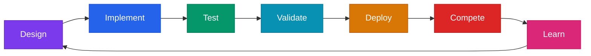

# Our Engineering Process

## Why This Matters

Building a competitive FRC robot isn't just about writing code that works. It's about writing code that works reliably under pressure, on a field, with 2 minutes and 30 seconds to prove it. This document explains how we work, not just what we built.

We wanted a system where bugs get caught before they reach the field, where every feature is tested at multiple levels, and where we learn from both our own matches and other teams' approaches.

## Design Methodology

Every feature follows a structured cycle:

**Design**: We write a design spec before touching code. The spec defines what the feature does, why it exists, what signals it produces, what can go wrong, and how we'll test it. We have 28 design specs covering both robot code and our analytics platform.

**Implement**: Code follows strict patterns. Subsystems handle motors only. Telemetry classes handle all detection logic and logging. SafeLog wraps every log call with crash isolation. This separation means a bug in stall detection can't crash motor control.

**Test**: Multiple layers (more on this in [Testing & Quality](testing-and-quality.md)).

**Validate**: Dashboard review, simulation runs, pit testing on the actual robot.

**Deploy**: To the robot, with pre-match diagnostics that verify every subsystem is connected and healthy.

**Compete**: Match performance is the ultimate test.

**Learn**: Post-match log review identifies what worked and what didn't. Findings feed back into the next design cycle.

## Failure Analysis (FMEA)

Before building a feature, we brainstorm what could go wrong. This is Failure Mode and Effects Analysis:

1. List every failure mode we can think of (sensor drops out, motor stalls, camera loses connection, communication lag)
2. Score each one on three dimensions:
   - **Severity** (1-10): How bad is it if this happens on the field?
   - **Occurrence** (1-10): How likely is it to happen?
   - **Detection** (1-10): How hard is it to notice before it causes problems?
3. Multiply them: **RPN = Severity x Occurrence x Detection**
4. High RPN items get mitigations designed in from the start

We have 34 FMEA entries covering mechanical failures, software bugs, sensor dropouts, and communication issues. The full log is in [FMEA Log](fmea-log.md). Here's an example of how this works in practice:

| Failure | S | O | D | RPN | Mitigation | New RPN |
|---------|---|---|---|-----|-----------|---------|
| Flywheel jam during match | 8 | 3 | 4 | 96 | JamProtection auto-reverse state machine (MONITORING, JAM_CONFIRMING, REVERSING, COOLDOWN) | Much lower: jam is detected in <200ms and cleared automatically |
| Progressive aim sticks on | 6 | 4 | 5 | 120 | 250ms stale timeout auto-clears the haptic pattern | Lower: worst case is 250ms of stale feedback |

The key insight is that FMEA happens at design time, not after something breaks on the field. We'd rather spend 20 minutes thinking about failure modes than lose a qualification match to a preventable bug.

## Iteration Evidence

We don't just build and ship. We measure, find weaknesses, and improve. Some concrete examples:

- **DriverFeedback mutation kill rate**: Started at 40%, meaning our tests only caught 40% of artificial bugs injected into the code. After writing targeted mutation-catching tests, it climbed to 64%. That's 24% more bugs our test suite would catch before they reach the field.
- **Overall PITest kill rate**: Went from 49% to 53% across 10 target classes by adding tests specifically designed to catch mutants that survived.
- **Week-0 root cause analysis**: Our robot won finals at Week-0, but we noticed the shooter clicking intermittently. Post-match log review traced it to orphaned commands holding PID targets through backlash oscillation. Root cause identified, fix deployed in 2 days. That bug would have cost us matches if we hadn't caught it.
- **Deadband ordering fix**: Code review found that our stick input deadband was applied after the response curve instead of before it. With a cubic curve (k=3), this killed 46% of stick travel range. A one-line reorder fixed it.

## Testing Pyramid

We test at four levels:

| Level | What | Scale |
|-------|------|-------|
| **Unit tests** | JUnit tests for individual classes. Does VisionFilter reject a pose 3m outside the field? Does JamProtection transition from MONITORING to REVERSING correctly? | 53 test files, runs in ~10 seconds |
| **Mutation testing** | PITest injects artificial bugs (flip a `>` to `<`, change `true` to `false`) and checks if our tests catch them. If a mutant survives, we have a testing gap. | 10 target classes, 53% kill rate, 75% test strength |
| **Simulation** | Full robot simulation with YAGSL MapleSim physics, PhotonVision simulated cameras, and our custom FuelSim ball physics engine. 10 scenarios test different match situations. | 10 scenarios, ~22ms loop time in sim |
| **Dashboard validation** | 4 Elastic layouts and 11 AdvantageScope layouts for visual verification of signals, state machines, and subsystem behavior | 15 layout files |

The tests run on every build (`./gradlew build` includes test). Mutation testing runs separately (`./gradlew pitest`) because it takes longer. For the full deep dive, see [Testing & Quality](testing-and-quality.md).

## Learning From Other Teams

We analyzed codebases from 33 other FRC teams to find patterns worth adopting and anti-patterns to avoid. This isn't about copying code. It's about learning what problems other teams have solved and deciding which solutions fit our architecture.

We documented everything in a ranked improvements list: what we found, which team had the best implementation, why it matters, estimated effort, and whether we adopted it. Out of 122 catalogued improvements, we adopted the highest-impact ones that fit our timeline: things like deadband ordering fixes, trajectory visualization, and targeted test improvements.

## Custom Code Linter

We built a 108-rule static analysis linter specifically for FRC Java code. It uses tree-sitter for AST parsing (with regex fallback) and catches common mistakes across 6 categories:

- Safety issues (unhandled exceptions in periodic loops, missing null checks)
- Performance problems (allocations in hot loops, redundant sensor reads)
- Style consistency (naming conventions, comment patterns)
- FRC-specific gotchas (missing motor safety, incorrect unit conversions)

The linter runs against our codebase and reports findings by severity tier. It's not a replacement for code review, but it catches the mechanical stuff so code review can focus on logic and design decisions.

## The Takeaway

Our process isn't about doing things because "that's what good teams do." Each layer exists because we've been burned by its absence. Week-0 taught us that clicking shooters need root cause analysis. Mutation testing showed us where our test suite had blind spots. FMEA caught the progressive-aim stale timeout before it ever happened on a field.

The cycle keeps going. Every match, every log review, every test failure makes the system a little more reliable.

---

[Back to Documentation Home](../README.md)
