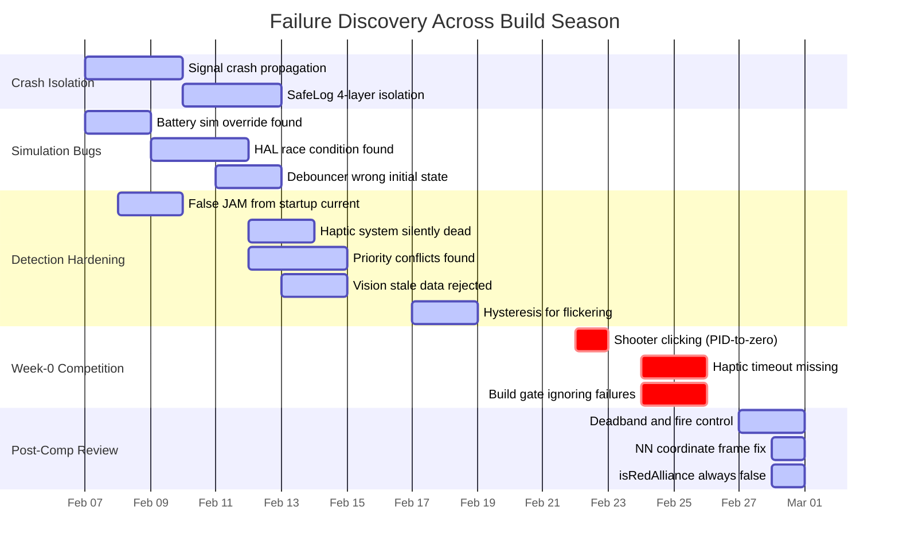

# FMEA Log

**Judge question:** *What went wrong and how did you fix it?*

---

## Real Failures, Real Fixes

We keep a log of everything that breaks. Every sensor glitch, every logic error, every "why is it doing that?" moment gets written down with the root cause and the fix. We started this in early February and honestly we're kind of obsessed with it now. As of March 1 we have 34 entries, and the patterns we found changed how we write code.

## Development Failures (Feb 7 to Feb 17)

| # | Component | What Went Wrong | Found By | Fix | Severity |
|---|-----------|----------------|----------|-----|----------|
| 1 | Telemetry | One bad signal crashed all ~500 signals' logging | Code review | Built 4-layer crash isolation (SafeLog) | Critical |
| 2 | Simulator | YAGSL physics silently overwrote our manual voltage in brownout scenarios | Debugging | Disabled SimulatedBattery before manual voltage control | High |
| 3 | CAN bus | Motor controllers randomly didn't respond after boot (CAN overload) | Hardware testing | Sequential initialization with retry logic | High |
| 4 | JamProtection | False JAM alerts every time a motor starts (startup current spike) | Sim testing | 0.5s startup ignore window in JamProtection state machine | High |
| 5 | Simulator | HAL thread zeroed joystick port, overwriting sim input | Hours of debugging | SimDriveOverride.java bypasses HAL for drive axes | High |
| 6 | SafeLog | Crashed when logging Pose3d arrays (missing overloads) | Runtime crash | Audited all Logger types, added missing overloads | Medium |
| 7 | EventMarker | Event log grew forever during rapid-fire, no size limit | Memory monitoring | Bounded buffer: max 100 events rolling window | Medium |
| 8 | ReadyToShoot | WPILib Debouncer gave wrong initial state (true instead of false) | Unit testing | Replaced with manual time-based debounce | High |
| 9 | PostMatchSummary | Same issue counted multiple times when value oscillates near threshold | Log replay | Per-issue dedup flags, each type logged once per match | Medium |
| 10 | DriverFeedback | Entire haptic system silently dead (controller field was null) | Code review | Added initialize() call and null-state test | Critical |
| 11 | DriverFeedback | Endgame haptic blocked all scoring feedback for 1.6 seconds | Match review | Shortened to 0.5s, cut from 13 patterns to 6 | High |
| 12 | LEDStatusDisplay | Endgame LED state blocked scoring LEDs for 30 seconds | Match review | Removed ENDGAME LED state (arena timer is enough) | High |
| 13 | VisionFilter | Stale camera data accepted after coprocessor restart | Sim testing | Timestamp freshness check, reject poses > 1 second old | High |
| 14 | VisionFilter | Dashboard showed wrong camera's blend weight (loop overwrite) | Debugging | Changed to Math.max() aggregation | Low |
| 15 | AlertManager | Battery warnings during every normal match (threshold too high) | Competition | Context-aware: WARNING only when disabled, CRITICAL always | Medium |
| 16 | ReadyToShoot | Flickered off during rapid-fire from brief RPM dips | Match testing | 200ms hold timer on composite boolean | Medium |
| 17 | PredictiveAlerts | BatteryAtRisk false positives in sim from startup voltage sag | Sim testing | 150-sample window in sim vs 50 on hardware | Low |
| 18 | ChannelCoordinator | Haptic and LED flickering when vision confidence near 50% | Driver feedback | Asymmetric hysteresis: drops at 40%, recovers at 55% | Medium |

## Competition Entries (Week-0, Feb 22)

| # | Component | What Went Wrong | Found By | Fix | Severity |
|---|-----------|----------------|----------|-----|----------|
| 19 | Shooter | Clicking noise after every shot (PID-to-zero through gear backlash) | Pit crew heard it | Duty-cycle coast instead of PID to 0 RPM | High |
| 20 | Indexer | Motor kept running after shot sequence (same PID-to-zero issue) | Match video | Duty-cycle coast in MoveIndexer.end() | High |
| 21 | DriverFeedback | Controller keeps vibrating after driver stops aiming (no timeout) | Competition | Added 250ms auto-clear timeout | High |
| 22 | Telemetry | Dashboard jam/stall alerts freeze after CAN hiccup | Competition | Added missing booleans to setDefaultValues() + staleness detector | High |
| 23 | Build system | Real test failures hidden behind BUILD SUCCESSFUL (ignoreFailures mask) | Post-match analysis | XML-parsing quality gate that only ignores HAL crash | Critical |
| 24 | PITest | Mutation testing can't reach 6/8 classes (HAL JNI conflict) | PITest setup | Under investigation, constructor injection pattern works | Open |

Entries 21-23 led to our Bug Prevention Framework (14 bug families, 12 new lint rules, 6 runtime monitors). Entry 21 uncovered a pattern we call "if it turns on, prove it turns off." We wrote 21 new deactivation tests across our feedback system after that.

## Post-Competition Code Review (Feb 27 to Mar 1)

After Week-0 we went through the whole codebase with fresh eyes. Found a bunch of stuff we missed during the rush to get ready.

| # | Component | What Went Wrong | Found By | Fix | Severity |
|---|-----------|----------------|----------|-----|----------|
| 25 | DriverInputShaper | Deadband after curve killed 46% of stick travel | Code review | Moved deadband before curve | High |
| 26 | HubShiftEngine | initializeTeleop() never called, hub timing was disabled | Code review | One-line fix in Robot.teleopInit() | High |
| 27 | ShootOnTheMove | Distance field stored time-of-flight (seconds vs meters) | Code review | Changed to getSolvedDistance() | Medium |
| 28 | StrategyTelemetry | Logged role-dependent RPM instead of feeder eject RPM | Code review | Added getFeederEjectRPM() method | Medium |
| 29 | RobotContainer | No G407 zone gate on RT trigger, could shoot from wrong zone | Code review | Added isInAllianceZone() gate (4th fire control layer) | Critical |
| 30 | ShootOnTheMove | end() never stops the flywheel (just coasts down slowly) | Code review | Added shooter.move(0) for immediate coast | Medium |
| 31 | AlertManager | False alerts during first 45s (JIT warmup garbage readings) | Code review | Added 45-second warmup suppression | Medium |
| 32 | AlignToTag | Infinite loop from wrong loop variable (i vs j on line 105) | Code review | Fixed loop variable | Critical |
| 33 | NNLiveReceiver | NN gives garbage predictions on red alliance side | Integration testing | Alliance-aware coordinate frame flip | High |
| 34 | Utilities | isRedAlliance() always returning false on both sides | Sim testing | Fixed alliance detection, added both-side tests | High |

Entry 29 (zone gate) became the 4th layer of our fire control pipeline, and entry 33 taught us that ML models only work on inputs that look like their training data.

## Discovery Timeline

## Patterns We Found

After writing everything down, we noticed the same types of bugs kept showing up. These aren't just individual fixes anymore, they're categories we now prevent by design:

1. **Silent failures are the scariest** (entries 1, 2, 10). Three systems were broken with zero error messages. We had no idea until we specifically went looking.

2. **Startup is weird** (entries 4, 17, 31). The first 0.5s of any motor command gives garbage readings. Just ignore it. We extended this from individual motors to the entire alert system with a 45-second warmup gate.

3. **Threshold flickering** (entries 9, 15, 16, 18). Values hovering near a threshold cause rapid toggling. Hysteresis or debounce fixes this every time. We now have a rule: any boolean from a continuous number needs a deadband or debounce.

4. **High priority blocks what matters** (entries 11, 12). Both haptic and LED had the same bug where endgame alerts blocked scoring feedback during the most important part of the match. We cut patterns down so there are fewer conflicts.

5. **Wrap ALL of the library** (entry 6). Our SafeLog wrapper didn't cover every type. We audited every overload and found two more missing types.

6. **Never PID to zero** (entries 19, 20). Using closed-loop PID to stop a motor causes gear clicking from backlash. Just cut power and let it coast. We wrote a lint rule for this.

7. **If it turns on, prove it turns off** (entries 21, 22). We had 274 passing tests and none checked "does the vibration stop?" Now every feedback boolean gets 3 tests: on, off, and never-on-when-it-shouldn't.

8. **ML models need alliance symmetry** (entries 33, 34). Our NN was trained with distance always positive. On red alliance the coordinates flip. Two separate bugs from not testing both alliance sides.

9. **Test both alliance sides, always** (entries 33, 34). We found two bugs that only showed up on red alliance. Most of our testing was on blue (the default). Now we run every sim scenario on both sides.

## Connection to Automated Checking

We built a log-analytic platform with 34 automated health gate rules. After a match, you upload the .wpilog file and it checks for crash signatures, timing issues, sensor dropouts, and scoring consistency. Red/yellow/green report in under 60 seconds.

On top of that, we run mutation testing (PITest) to check if our tests would actually catch a bug if one existed. It makes tiny changes to our code (flipping a > to <, changing true to false) and checks if any test fails. If no test catches the change, that's a gap we need to fill. It found 21 surviving mutants in our jam detection alone. Our regular tests said "all passing" but PITest showed us the holes.

> Every bug on this list made the system better. That's the whole point.

---

**Related:** [Testing & Quality](testing-and-quality.md) | [Engineering Process](engineering-process.md) | [What We Learned](what-we-learned.md)

[Back to Documentation Home](../README.md)
