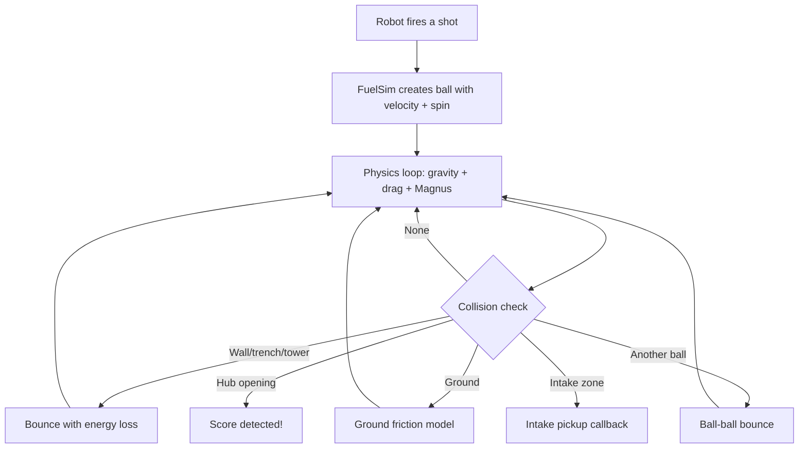

# Ball Physics Simulation (FuelSim)

## What is FuelSim?

FuelSim is a complete physics simulation of balls (fuel cells) flying through the 2026 REBUILT field. It tracks every ball from the moment it leaves the shooter to when it lands, scores, bounces off a wall, or gets picked up by the intake. We built it as a single, self-contained, MIT-licensed file that any FRC team using MapleSim can drop into their project.

## Why We Built It

Our fire control pipeline (ShotCalculator, ShotConfidence) computes physics-based shot parameters, but we had no way to validate those calculations without a physical robot. Can the ball actually reach the hub from this distance? Does the spin we're applying give enough lift? What happens if the ball clips the trench ceiling?

FuelSim answers these questions in simulation. It takes the same physics our fire control uses (drag, Magnus lift, gravity) and runs it in real time during simulated matches. We can watch balls fly through AdvantageScope's 3D field view and verify that our shot solutions actually work.

The default MapleSim projectile physics uses a fudged gravity constant (11 m/s^2 instead of 9.81) and doesn't model air resistance or spin effects at all. FuelSim replaces that with real aerodynamics.

## The Physics

Three forces act on every ball in flight:

**Gravity** pulls the ball down at 9.81 m/s^2. Nothing fancy here.

**Drag force** slows the ball as it flies. It's proportional to the square of the ball's speed, so faster balls experience dramatically more air resistance. The formula uses the standard drag equation with Cd = 0.47 (smooth sphere in the subcritical Reynolds number regime, which matches our shot speeds of 5 to 15 m/s).

**Magnus force** is the fun one. When a ball spins, it generates lift, the same effect that makes a curveball curve in baseball. Our launcher puts backspin on the ball, which creates an upward lift force that extends the ball's range. FuelSim models this as a vertical force proportional to speed squared, with a tunable coefficient (Cm = 0.2).

The simulation runs **Euler integration at 4ms subticks**, which means 50 physics steps per robot loop. This keeps the physics smooth and prevents balls from tunneling through thin obstacles.

## Field Geometry

FuelSim models **43 active collision elements** representing the physical field:

| Element Type | Count | Description |
|-------------|-------|-------------|
| XZ floor segments | 9 | The field floor, including tent-shaped speed bumps (15-degree ramps, 6.5" tall) |
| Trench pillars | 4 | 53" tall support pillars at the trench entrances |
| Trench ceilings | 4 | Overhead structure with 22.25" underpasses for ground-rolling balls |
| Tower poles | 2 | Central tower vertical supports |
| Tower uprights | 4 | 1.5" x 3.5" x 72" structural members |
| Tower rungs | 6 | 1.66" diameter rungs at 27", 45", and 63" heights |
| Tower bracing | 2 | Diagonal braces from 28.4" to 43.4" |
| Outposts | 2 | 71" x 134" x 28.3" elevated structures |
| Outpost corrals | 2 | 35.8" x 37.6" x 8.1" ball collection areas |
| Outpost dividers | 2 | 1.66" diameter separator pipes |
| Hub ramp colliders | 2 | 47" x 217" angled surfaces leading into the hubs |
| Walls and guardrails | 4 | Height-aware: alliance walls at 36.8", guardrails at 20" |

All geometry was cross-referenced from three sources: the game manual (Section 5), YAGSL's Arena2026Rebuilt.java (dyn4j collision bodies), and AdvantageScope's Field3d config. All three derive from FIRST's official CAD, so they agree on dimensions.

## How It All Fits Together

**Hub scoring**: The ball must pass through the hub opening at the correct height and speed. When it does, FuelSim registers a score and disperses the ball so it doesn't interfere with the next shot.

**Ball-ball collision**: When multiple balls are in the air at once, they can collide with each other. FuelSim uses spatial hashing to efficiently find nearby balls without checking every pair (avoiding slow O(n^2) comparisons). Ball-ball bounces use a coefficient of restitution of 0.5 (foam on foam is pretty absorptive).

**Robot collision**: Balls can bounce off the robot's bumper bounding box with a very low coefficient of restitution (0.1), since bumpers are made of foam and absorb most of the impact.

## Integration with the Robot Simulation

SimFuelManager is the glue between FuelSim and the rest of our simulation. It:

- Detects when the robot fires a shot using rising-edge detection from SimDeviceManager
- Creates a new ball in FuelSim with the appropriate launch velocity and spin
- Provides TunableNumbers for ball mass, drag coefficient, and Magnus coefficient so you can tweak physics parameters from the dashboard while the sim is running
- Logs ball counts and positions to NetworkTables via SafeLog (8 signals total: in-flight count, on-ground count, scored count, intaked count, and more)
- Renders all ball positions in AdvantageScope's Field3d view

## Tunable Parameters

All physics constants are adjustable from the dashboard during simulation through TunableNumbers:

- **BallMassKg** (default 0.215): mass of the ball in kilograms
- **DragCoeff** (default 0.47): drag coefficient
- **MagnusCoeff** (default 0.2): Magnus lift coefficient
- **Enabled** (default true): master kill switch for the entire simulation

This means you can experiment with different ball properties in real time. Wondering what happens if the ball is heavier? Slide the mass up and watch the trajectory change.

## MIT Licensed

FuelSim.java is designed to be shareable. It's a single file with an MIT license header, depends only on WPILib and the YAGSL vendordep, and has no references to our team-specific code. Any MapleSim team can drop it in and get drag, Magnus, and field collision physics for their ball simulation. The team-specific wiring (shot detection, SafeLog, TunableNumbers) lives in SimFuelManager, which is separate.

---

**Related:** [Fire Control Pipeline](../architecture/fire-control-pipeline.md) | [Testing & Quality](testing-and-quality.md)

[Back to Documentation Home](../README.md)
