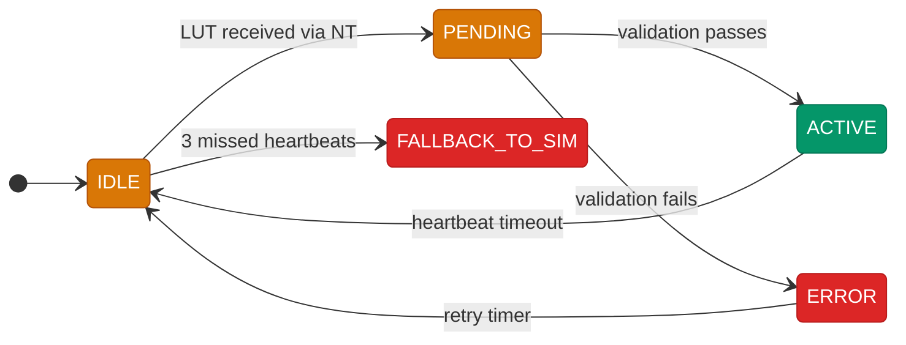

# Neural Network Coprocessor

The neural network runs on an Orange Pi 5 Plus sitting on the robot. It's not a black box. We know exactly what it does because we trained it on data from our own ProjectileSimulator.

## Why a Neural Network

A static lookup table works fine when the robot is fresh: full battery, cool motors, clean wheels. But conditions change during a match. Battery voltage drops from 12.5V to 11.8V. Motor windings heat up and the torque curve shifts. Wheel surface picks up carpet fibers and slip factor changes.

A static LUT ignores all of that. The NN sees it in real time and adjusts.

## Training

We generated 800K simulated trajectories using the RK4 physics model with domain randomization. Each trajectory used slightly different drag, Magnus, launch geometry, and ball mass to simulate the kind of variation you get on a real field. The data was split into 10 training sets, and we trained 10 separate models. The ensemble averages their predictions, which smooths out any one model's weak spots.

Domain randomization is the key. Instead of training on one "perfect" physics model, we trained on thousands of slightly wrong ones. That teaches the network to handle conditions it hasn't seen before, which is exactly what happens at competition when the carpet is different, the balls are more worn, or the battery is two years old.

## What It Takes In

8 values every cycle:

| Input | Why It Matters |
|-------|---------------|
| Target distance X | Where the hub is relative to us |
| Target distance Y | Same, other axis |
| Robot velocity X | For shoot-on-the-move compensation |
| Robot velocity Y | Same, other axis |
| Battery voltage | Lower voltage = less motor torque = different RPM needed |
| RPM ratio (current/target) | How close the flywheel is to speed right now |
| Motor temperature | Hot motors have less torque |
| Wheel slip estimate | Worn wheels grip less |

## What It Puts Out

RPM, hood angle, and time of flight. At 50 Hz, the robot gets fresh shot parameters every 20ms.

## Two Operating Modes

**Mode B (Live Inference)**: The coprocessor runs inference every cycle and publishes shot parameters over NetworkTables 4. The robot reads them directly. This is the highest-fidelity mode because it reacts to conditions in real time.

**Mode A (Cached LUT)**: The coprocessor pre-computes a complete distance-keyed lookup table using the neural network and publishes the whole thing as one NT update. The robot caches it locally. This mode survives brief network hiccups because the entire table is already on the RoboRIO.

## The 5-State Fallback FSM

Mode A uses a state machine to manage receiving and validating the NN-generated LUT:

If the coprocessor loses connection (3 missed heartbeats at 50 Hz = 150ms), the system falls back to the sim-generated LUT automatically. If it comes back and sends 3 consecutive good heartbeats, the system trusts it again.

## 4-Tier Fallback

The robot never depends on a single computation path:

| Tier | Source | When It's Used |
|------|--------|---------------|
| 1 (best) | Mode B Live NN | Coprocessor healthy, real-time adaptation |
| 2 | Mode A NN LUT | Coprocessor healthy but network is spotty |
| 3 | Sim LUT | Coprocessor down, fall back to ProjectileSimulator physics |
| 4 (baseline) | Hand-tuned LUT | Everything else is down, use practice data |

The robot always has shot data. The NN just makes it better.

## Deployment

We exported the trained models to ONNX format so they run efficiently on ARM64 (the Orange Pi's architecture). A Python service runs ONNX Runtime for inference and publishes results over NetworkTables 4. The whole pipeline from sensor input to updated shot parameters is under 5ms.

The Orange Pi runs Ubuntu 24.04 Server with a systemd service that starts automatically on boot. If the service crashes, systemd restarts it. If the whole coprocessor loses power, the robot falls back to Tier 3 (sim LUT) and keeps shooting.

---

**Related:** [Fire Control Pipeline](../architecture/fire-control-pipeline.md) | [Projectile Physics](projectile-physics.md) | [Ball Physics Simulation](fuel-simulation.md) | [Community Impact](community-impact.md)
