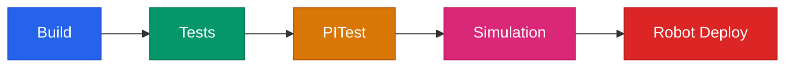

# Testing & Quality Assurance

This is a deep dive into how we test our robot code. If you've never heard of mutation testing, you're in the right place. We'll explain everything from the ground up.

## What is JUnit Testing?

In simple terms: we write small programs that check if our robot code does what we expect. Each test sets up a scenario, runs the code, and checks the result. If anything is wrong, the test fails and tells us exactly what broke.

For example, say we have code that detects whether a motor is stalled. A test for that would:

1. Simulate a motor spinning at 0 RPM with high current draw (that's what a stall looks like)
2. Run the detection logic
3. Check that the code correctly reports "stalled = true"
4. Then simulate the motor spinning normally again
5. Check that "stalled" clears to false

If someone accidentally breaks the stall detection logic later, this test catches it immediately instead of letting the bug ride all the way to competition.

We have hundreds of these tests across 53 test files, and they all run in about 10 seconds.

## Why This Matters More Than Test Count

The number of tests isn't the point. What matters is whether the tests actually catch real bugs. We noticed the copilot's controller kept buzzing after they stopped aiming. When we dug into it, we realized we had 274 passing tests and not a single one checked "does the vibration stop when you let go of the aim button?" Our entire test suite missed it.

That experience changed how we think about testing. Now every test is a bug that can't come back. When we change something, the tests tell us immediately if we broke something. Not at 2am at competition, not when the shooter starts clicking during a qualification match. Right now, in the lab, with time to think.

It also means multiple people can work on the codebase without being terrified of breaking each other's stuff. Change the stall detection threshold? The tests tell you if that broke jam protection. Refactor the fire control pipeline? The tests tell you if ReadyToShoot still works. It's like a safety net that gets stronger every time we add a test.

## What We Test (and What We Don't)

We test the **detection logic** (telemetry), not the motor control (subsystems). Here's why:

- **Subsystems are simple.** They set a motor to a speed. Not much to go wrong there, and the interesting behavior happens in the motor controller firmware, not our code.
- **Telemetry is where the interesting logic lives.** Is the motor stalled? Is there a jam? Is the flywheel at speed? Is the shot ready? Is vision confidence high enough? These decisions have conditions, thresholds, state machines, and edge cases. That's where bugs hide.

This is a deliberate architectural choice. By separating motor control from detection logic, we can test the detection logic in simulation without needing a physical robot.

## Test Base Classes

We have two base classes that handle all the simulation boilerplate so each test file can focus on actual test logic:

**SparkSimTestBase** is for motor-backed subsystems like Shooter, Intake, and Indexer:
- Sets up SparkSim backends so motor encoder values are controllable
- Provides `setMotorVelocity(sim, rpm)` which directly sets the encoder reading. This is deterministic: you set 3000 RPM, you get 3000 RPM. No physics delay, no randomness.
- Never use the `iterate()` method in unit tests. It simulates motor physics with ~112ms of lag and is non-deterministic, which makes tests flaky.

**TelemetryTestBase** is for non-motor telemetry like match state, network health, and driver input:
- Sets up DriverStationSim for simulating robot mode, alliance color, and FMS connection
- Lighter weight since no motor simulation is needed

## Example: Testing Stall Detection

Here's how a stall detection test works conceptually:

1. **Setup**: Create the telemetry object. Set the simulated motor to 0 RPM, 0 current. Run an update cycle. Verify that `stalled` is false (the motor is just sitting there, not stalled).

2. **Trigger the stall**: Set motor velocity to 0 RPM but current to something high (say 30 amps). That's the signature of a stall: the motor is drawing lots of power but not spinning. Wait past the startup ignore window (0.5 seconds). Run an update cycle.

3. **Verify detection**: Check that the telemetry class now reports `stalled = true`.

4. **Clear the stall**: Set motor velocity back to normal (say 3000 RPM). Run an update cycle.

5. **Verify clearing**: Check that `stalled` goes back to false.

This pattern repeats across all our tests. Set up a known state, run the logic, check the result. The magic is that we can simulate any motor condition we want without a physical robot.

## What is Mutation Testing (PITest)?

This is where it gets interesting. Regular tests answer the question "does the code work?" Mutation testing asks a harder question: **"would our tests catch it if the code was WRONG?"**

Here's how it works:

1. PITest takes our source code and makes tiny changes called **mutations**. For example:
   - Flip a `>` to `<` (so "is velocity greater than threshold" becomes "is velocity less than threshold")
   - Change a `+` to a `-`
   - Replace `true` with `false`
   - Remove a method call entirely
   - Change a constant from 0.5 to 0.0

2. For each mutation, PITest runs our full test suite.

3. If a test **fails**, the mutation is **"killed"**. That means our tests caught the artificial bug. Good.

4. If **no test fails**, the mutation **"survived"**. That means we have a gap in our testing. Something in our code could be wrong and we wouldn't know. Bad.

5. The **kill rate** is the percentage of mutations that were caught. Higher is better.

Think of it like this: mutation testing is a stress test for your test suite. It answers the question "if someone made a typo in this code, would any test notice?"

## Our PITest Results

We run mutation testing on 10 target classes. Overall: **53% kill rate, 75% test strength**.

| Class | Kill Rate | Test Strength | What It Tests |
|-------|-----------|---------------|---------------|
| HubShiftEngine | 94% | 97% | Hub timing windows during the match |
| HubScoringUtil | 90% | 90% | Score detection from sensor readings |
| StrategySelector | 85% | 88% | Switching between SHOOTER and FEEDER roles |
| FireAuthorization | 81% | 81% | Whether the robot is allowed to shoot right now |
| DriverFeedback | 64% | 90% | Haptic patterns routed to the right controller |
| JamProtection | 51% | 52% | Jam detection and auto-reverse state machine |
| AlertManager | 35% | 45% | Alert raising for subsystem health issues |
| LEDStatusDisplay | 25% | 84% | Choosing the right LED color for robot state |

The classes with higher kill rates (HubShiftEngine, HubScoringUtil) have the most thorough tests. Classes with lower rates (AlertManager, LEDStatusDisplay) are areas where we could still add more targeted tests.

**Kill rate vs. test strength**: Kill rate is the percentage of all mutations killed. Test strength is the percentage killed out of the ones that were actually *reachable* by our tests (some mutations are in code paths that tests can't trigger due to hardware dependencies). Test strength is usually higher because it filters out the unreachable ones.

## How Mutation Testing Improved Our Code

**DriverFeedback** is the clearest success story. It started at a 40% kill rate, meaning our tests only caught 40% of injected bugs. After analyzing which mutations survived, we wrote targeted tests and pushed it to 64%. That's 24% more bugs our test suite would catch.

Here's a concrete example of the kind of thing mutation testing reveals:

PITest mutated a condition in the endgame warning from `matchTime <= 30.0` to `matchTime < 30.0`. None of our tests failed. Why? Because all our tests used match times that were clearly inside or clearly outside the threshold (like 20s and 45s). None tested the boundary at exactly 30.0 seconds. If the real code had this off-by-one error, a 30.0-second endgame warning would never fire, and we'd never know from our tests alone.

The fix: add a boundary test that sets match time to exactly 30.0 and verifies the endgame warning fires. That single test killed the mutation and would catch any future boundary regression.

This is the real value of mutation testing. It finds the blind spots that you wouldn't think to test for, because the code already "looks right" and passes all your existing tests.

## Running Tests

All commands run from the `robotcode2026-lab/` directory:

```bash
./gradlew test                                          # All tests (~10 seconds)
./gradlew pitest                                        # Mutation testing (~5 minutes, build first)
./gradlew simulateJava                                  # Basic robot simulation
./gradlew simulateJava -DsimScenario=SubsystemSuite     # Full showcase scenario
```

JUnit results land in `build/reports/tests/test/index.html`. PITest results in `build/reports/pitest/index.html`.

## Simulation Scenarios

We have 10 simulation scenarios that test different match situations:

| Scenario | CLI Flag | What It Tests |
|----------|----------|---------------|
| SubsystemSuite | `-DsimScenario=SubsystemSuite` | Full field navigation, intake, shoot cycle. Best overall demo (100s, 14 phases). |
| CompetitionMatch | `-DsimScenario=CompetitionMatch` | Full 169s match with hub shifts, scoring during active windows, hanger climb. |
| RapidFire | `-DsimScenario=RapidFire` | Fast 1.5s shoot cycles to stress shooter and indexer signals (13s). |
| Brownout | `-DsimScenario=Brownout` | Two-stage voltage decline to trigger brownout detection and battery prediction (25s). |
| FaultInjection | `-DsimScenario=FaultInjection` | Walks voltage through all 4 brownout risk levels under motor load, then recovers (60s). |
| ModeTransition | `-DsimScenario=ModeTransition` | Rapid enable/disable cycling to stress mode transitions and command scheduling (30s). |
| FullVideoShowcase | `-DsimScenario=FullVideoShowcase` | Full match with HubArcDrive orbits during active shifts. Designed for video recording (169s). |
| AMDAShowcase | `-DsimScenario=AMDAShowcase` | Exercises all 4 feedback channels: haptic, LED, HUD, dashboard through 13 phases (45s). |
| SignalCoverage | `-DsimScenario=SignalCoverage` | Gap-filler that covers signals other scenarios miss: voltage sweep, all mode transitions, stall cycles (30s). |
| HubShiftPractice | `-DsimScenario=HubShiftPractice` | Full 140s teleop with real-time hub shift haptics for driver training. |

**What you can verify in sim**: telemetry signals updating correctly, haptic feedback timing, state machine transitions, fire control computations, ReadyToShoot composite signal logic.

**What you can't verify in sim**: motor temperatures (SparkSim has no setTemperature), real CAN bus behavior, physical ball handling.

## Common Test Gotchas

**SparkSim: setVelocity vs iterate** \
`setMotorVelocity(sim, rpm)` sets the encoder value directly. Deterministic, instant, use this for tests. `iterate(vel, vbus, dt)` simulates motor physics with ~112ms lag and is non-deterministic. Never mix them on the same SparkSim instance.

**DriverStationSim.notifyNewData()** \
After changing any sim state (velocity, alliance, mode), you must call `DriverStationSim.notifyNewData()` or the robot code won't see the change until the next natural cycle.

**forkEvery = 1** \
Each test class runs in its own JVM process. This isolates CAN IDs so singleton subsystems from one test class don't collide with another. It's slower but prevents flaky failures that are incredibly hard to debug.

**TunableNumber in tests** \
The TunableNumber constructor writes the default value to SmartDashboard. If you're setting a custom value in your test, set it AFTER constructing the object that owns the TunableNumber, or your value gets overwritten by the default.

**Exit 134 crashes** \
These are a known WPILib HAL double-free on Linux. They look scary but they're not a test failure. Check the actual test results, not the process exit code.

## Validation Pipeline

Before any code goes to the robot, it passes through these gates:



| Gate | Command | What It Checks |
|------|---------|----------------|
| Build | `./gradlew build` | Compiles without errors |
| Tests | `./gradlew test` | All tests pass, no regressions |
| PITest | `./gradlew pitest` | Kill rate is stable (not regressing) |
| Simulation | `./gradlew simulateJava -DsimScenario=SignalCoverage` | All signals publish correctly |
| Robot Deploy | Deploy + physical safety check | Hardware responds correctly |

Each gate catches a different category of bug. Build catches syntax errors. Tests catch logic errors. PITest catches test gaps. Simulation catches integration issues. And the robot deploy catches anything that only shows up on real hardware.

---

[Back to Documentation Home](../README.md)
