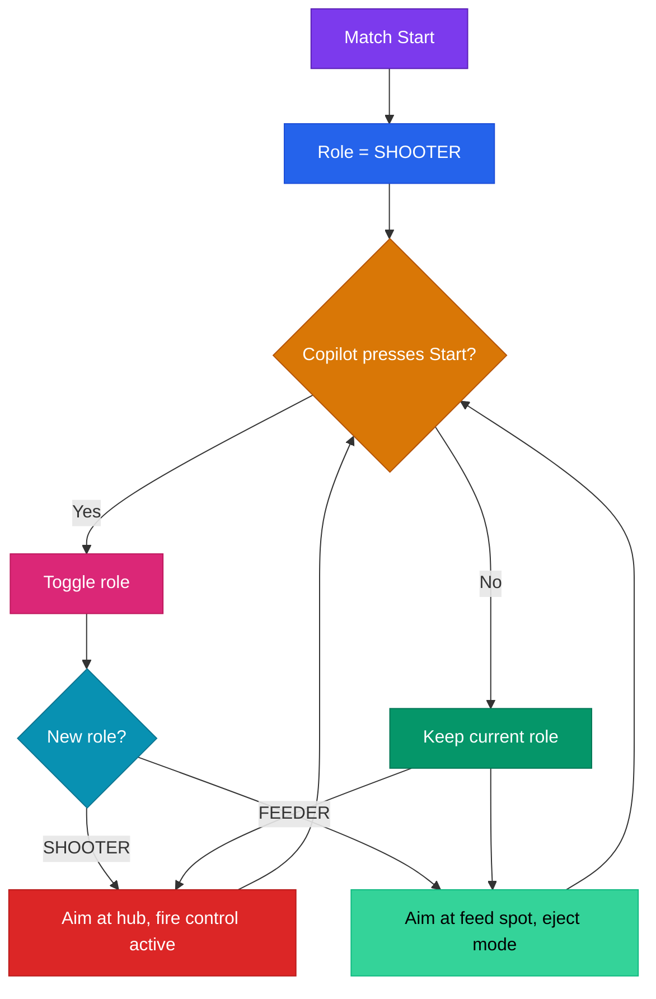

# Alliance Role Strategy

## The Problem

In REBUILT, your alliance has three robots and one hub to score in. Sometimes your robot is the best shooter. Sometimes your alliance partner has a faster cycle time or better accuracy. When that happens, the smartest move is to stop shooting and start feeding balls to them instead.

Most FRC teams hard-code their strategy at the start of a match. We built a system that lets the copilot switch roles mid-match, so we can adapt to whatever our alliance needs.

## Two Roles

The robot operates in one of two roles at any time:

| Role | What the robot does | When to use it |
|------|-------------------|----------------|
| **SHOOTER** | Aims at the hub, uses the full fire control pipeline, ReadyToShoot drives the copilot trigger | Default. Use when we're the primary scorer or one of multiple scorers. |
| **FEEDER** | Collects balls, aims at a feed spot, ejects balls to an alliance partner at tuned RPM | Use when an alliance partner is clearly better at scoring and needs fuel supply. |

The robot defaults to SHOOTER. The copilot presses Start to toggle to FEEDER, and presses Start again to toggle back.

## How StrategySelector Works

StrategySelector is the central class that manages role state. Here's the flow:

Key details:
- The toggle is edge-detected (one press = one switch, holding Start doesn't oscillate)
- The role change is logged to telemetry and visible on the dashboard
- StrategyTelemetry logs 14 signals including current role, active feed strategy, zone state, and cycle metrics

## What Changes Per Role

### SHOOTER mode
- Robot aims at the alliance's active hub
- Full fire control pipeline is engaged: ShotCalculator, ShotConfidence, FireAuthorization
- ReadyToShoot boolean drives the copilot's trigger (progressive aim haptic, "fire now" rumble)
- Zone gate on RT trigger prevents shooting outside the alliance zone (G407 compliance)

### FEEDER mode
- Robot aims at a feed spot instead of the hub
- Different target RPM and heading for ejecting balls to a partner
- The fire control pipeline's zone gate relaxes (feeders don't need to be in the alliance zone to pass balls)
- EjectToFeedSpot command handles the actual ejection

## Feed Strategies

The system supports three feeding approaches, defined in `FeedStrategy`:

| Strategy | How it works | Best for |
|----------|-------------|----------|
| **CORRAL_RELAY** | Collect balls from the corral area, drive to a handoff zone, eject to partner | When partner is nearby and you have a clear relay path |
| **DIRECT_GROUND** | Eject balls onto the ground in front of an alliance partner | Quick and simple, works when partner has a good ground intake |
| **CHUTE_RELAY** | Use the chute/station to pass balls to a partner in a structured handoff | More controlled than ground feeding, less driving than corral relay |

The active feed strategy can be pre-selected based on what the alliance agrees on during strategy discussions.

## Zone Awareness

The robot tracks which zone it's in using field geometry:

- **Alliance zone**: Your side of the field. SHOOTER mode requires being here to fire (G407 rule compliance).
- **Neutral zone**: The middle of the field. Shooting from here is blocked in SHOOTER mode.
- **Opponent zone**: Their side. No shooting allowed here.

The zone check is the 4th layer of the fire control pipeline. It's wired as an AND condition on the copilot's RT trigger binding: `isInAllianceZone(pose) || !isShooter()`. In FEEDER mode, the zone restriction doesn't apply because you're not shooting at the hub.

## Role Switching in Practice

### For coaches: when to call a role switch

- Your alliance partner is scoring consistently and you're missing shots. Switch to FEEDER, supply them with fuel.
- Your partner's shooter broke mid-match. Switch back to SHOOTER.
- During endgame when both hubs are active: SHOOTER mode for everyone, maximize scoring.
- If you're getting defense played on you heavily, consider switching to FEEDER and letting a less-defended partner score.

### For copilots: what changes when you switch

The physical controls stay the same. The same buttons and triggers work in both modes. What changes is the behavior behind them:

- In SHOOTER, the RT trigger fires at the hub. Progressive aim haptic guides your timing.
- In FEEDER, the RT trigger ejects to the feed spot. The aim target changes automatically.
- The role change shows on the dashboard so the drive team can confirm it.

One important thing: switching roles doesn't reset the flywheel or clear any state. It's a clean transition. The robot just redirects where it's aiming and what RPM it targets.

## Telemetry Signals

StrategyTelemetry (the 21st telemetry class) logs 14 signals. The key ones to watch:

| Signal | What it tells you |
|--------|------------------|
| `Strategy/CurrentRole` | SHOOTER or FEEDER |
| `Strategy/FeedStrategy` | Which feed strategy is active |
| `Strategy/InAllianceZone` | Whether the zone gate would allow shooting |
| `Strategy/RoleSwitchCount` | How many times the role was toggled this match (useful for post-match review) |
| `Strategy/FeederEjectRPM` | Target RPM for feeding (different from shooting RPM) |

---

**Related:** [Fire Control Pipeline](../architecture/fire-control-pipeline.md) | [Driver Feedback](driver-feedback.md)
