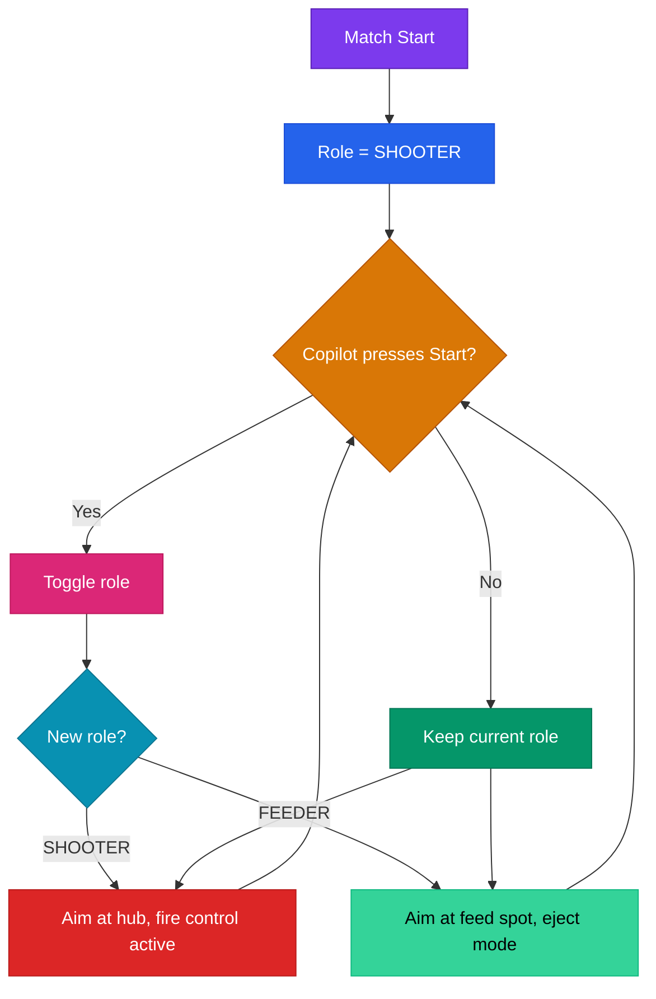

# Alliance Role Strategy

## Why We Added Role Switching

In REBUILT, your alliance has three robots and one hub to score in. Sometimes your robot is the best shooter. Sometimes your alliance partner has a faster cycle time or better accuracy. When that happens, the smartest move is to stop shooting and start feeding balls to them instead.

We did not want to lock that choice in before the match even settled. So we added a way for the copilot to switch roles during the match and adapt to what the alliance actually needs.

## Two Roles

The robot operates in one of two roles at any time:

| Role | What the robot does | When to use it |
|------|-------------------|----------------|
| **SHOOTER** | Aims at the hub, uses the full fire control pipeline, ReadyToShoot drives the copilot trigger | Default. Use when we're the primary scorer or one of multiple scorers. |
| **FEEDER** | Collects balls, aims at a feed spot, ejects balls to an alliance partner at tuned RPM | Use when an alliance partner is clearly better at scoring and needs fuel supply. |

The robot defaults to SHOOTER. The copilot presses Start to toggle to FEEDER, and presses Start again to toggle back.

## How StrategySelector Works

`StrategySelector` is the class that manages role state. Here is the basic flow:

```mermaid
flowchart TD
    START[Match Start] --> DEFAULT[Role = SHOOTER]
    DEFAULT --> TOGGLE{Copilot presses Start?}
    TOGGLE -->|Yes| SWITCH[Toggle role]
    TOGGLE -->|No| KEEP[Keep current role]
    SWITCH --> CHECK{New role?}
    CHECK -->|SHOOTER| AIM_HUB[Aim at hub, fire control active]
    CHECK -->|FEEDER| AIM_FEED[Aim at feed spot, eject mode]
    KEEP --> AIM_HUB
    KEEP --> AIM_FEED
    AIM_HUB --> TOGGLE
    AIM_FEED --> TOGGLE

    style START fill:#7c3aed,stroke:#5b21b6,color:#fff
    style DEFAULT fill:#2563eb,stroke:#1d4ed8,color:#fff
    style TOGGLE fill:#d97706,stroke:#b45309,color:#fff
    style SWITCH fill:#db2777,stroke:#be185d,color:#fff
    style KEEP fill:#059669,stroke:#047857,color:#fff
    style CHECK fill:#0891b2,stroke:#0e7490,color:#fff
    style AIM_HUB fill:#dc2626,stroke:#b91c1c,color:#fff
    style AIM_FEED fill:#34d399,stroke:#10b981,color:#000
```

What matters here:
- The toggle is edge-detected (one press = one switch, holding Start doesn't oscillate)
- The role change is logged to telemetry and visible on the dashboard
- StrategyTelemetry logs 14 signals including current role, active feed strategy, zone state, and cycle metrics

## What Changes Per Role

### SHOOTER mode
- Robot aims at the alliance's active hub
- Full fire control pipeline is engaged: ShotCalculator, ShotConfidence, FireAuthorization
- ReadyToShoot boolean drives the copilot's trigger (progressive aim haptic, "fire now" rumble)
- Zone gate on RT trigger prevents shooting outside the alliance zone (G407 compliance)

### FEEDER mode
- Robot aims at a feed spot instead of the hub
- Different target RPM and heading for ejecting balls to a partner
- The fire control pipeline's zone gate relaxes (feeders don't need to be in the alliance zone to pass balls)
- EjectToFeedSpot command handles the actual ejection

## Feed Strategies

There are two feeding approaches, defined in `FeedStrategy`:

| Strategy | How it works | Best for |
|----------|-------------|----------|
| **CORRAL_RELAY** | Eject into the corral area, human player moves them to the chute | Safer, less driving |
| **DIRECT_HANDOFF** | Eject onto the ground at a spot agreed on before the match | Faster, but needs coordination |

The active feed strategy gets picked based on what the alliance agrees on during strategy discussions.

## Zone Awareness

The robot tracks which zone it's in using field geometry:

- **Alliance zone**: Your side of the field. SHOOTER mode requires being here to fire (G407 rule compliance).
- **Neutral zone**: The middle of the field. Shooting from here is blocked in SHOOTER mode.
- **Opponent zone**: Their side. No shooting allowed here.

The zone check is the 4th layer of the fire control pipeline. It's wired as an AND condition on the copilot's RT trigger binding: `isInAllianceZone(pose) || !isShooter()`. In FEEDER mode, the zone restriction doesn't apply because you're not shooting at the hub.

## Role Switching in Practice

### For coaches: when to call a role switch

- Your alliance partner is scoring consistently and we are not. Switch to FEEDER and keep them supplied.
- Your partner's shooter broke mid-match. Switch back to SHOOTER.
- During endgame when both hubs are active: SHOOTER mode for everyone, maximize scoring.
- If you're getting defense played on you heavily, consider switching to FEEDER and letting a less-defended partner score.

### For copilots: what changes when you switch

The physical controls stay the same. The same buttons and triggers still work. What changes is what the robot does with those inputs:

- In SHOOTER, the RT trigger fires at the hub. Progressive aim haptic guides your timing.
- In FEEDER, the RT trigger ejects to the feed spot. The aim target changes automatically.
- The role change shows on the dashboard so the drive team can confirm it.

One important detail: switching roles does not reset the flywheel or clear state. The robot just changes its target and behavior.

## Telemetry Signals

StrategyTelemetry logs ~14 signals. The key ones to watch:

| Signal | What it tells you |
|--------|------------------|
| `Strategy/CurrentRole` | SHOOTER or FEEDER |
| `Strategy/FeedStrategy` | Which feed strategy is active |
| `Strategy/InAllianceZone` | Whether the zone gate would allow shooting |
| `Strategy/RoleSwitchCount` | How many times the role was toggled this match (useful for post-match review) |
| `Strategy/FeederEjectRPM` | Target RPM for feeding (different from shooting RPM) |

---

**Related:** [Fire Control Pipeline](../architecture/fire-control-pipeline.md) | [Driver Feedback](driver-feedback.md)
