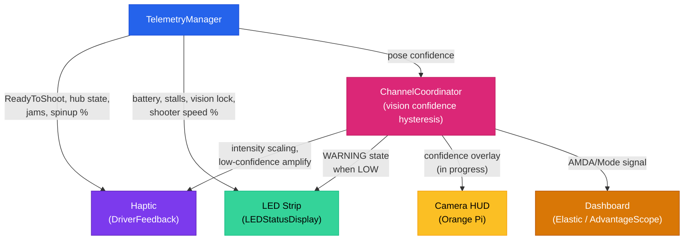
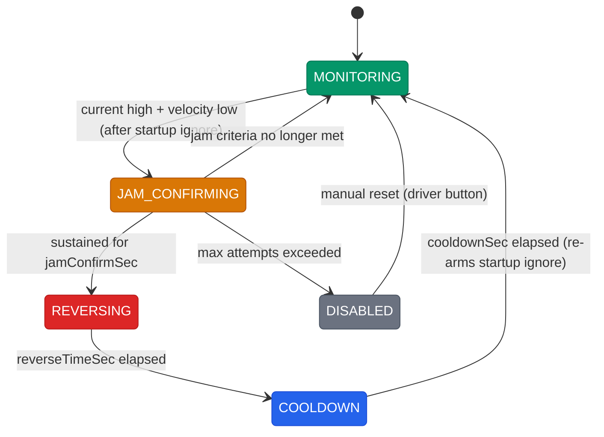

# Driver Feedback & AMDA System

## The Core Idea

During a match, drivers cannot afford to look at a screen. Every second spent checking a dashboard is a second not spent driving. So instead of putting information on a screen and hoping drivers glance at it, our robot pushes real-time assessments directly to the operators through multiple sensory channels: controller vibration in their hands, LED colors in their peripheral vision, camera overlays on the driver station feed, and dashboard widgets as a fallback.

We call this system **AMDA: Adaptive Multi-Modal Driver Awareness**. It coordinates four feedback channels and adapts their behavior based on how confident the robot is in its own perception.

## The Four Channels

| Channel | Medium | Who Feels It | Latency | Best For |
|---------|--------|-------------|---------|----------|
| **Haptic** | Controller rumble motors | Driver and/or copilot (role-routed) | Instant | Time-critical scoring cues, match phase alerts |
| **LED** | Addressable LED strip on robot | Pit crew + field audience + drivers | ~20ms | Robot state at a glance (spinning up, ready, jammed) |
| **Camera HUD** | Overlay on driver station camera | Driver + copilot | ~50ms | Vision lock indicators, zone boundaries (in progress) |
| **Dashboard** | Elastic / AdvantageScope | Pit crew, coach | Variable | Detailed diagnostics, tuning, post-match review |

## ChannelCoordinator: Vision Confidence Hysteresis

`ChannelCoordinator` sits at the center of AMDA. It reads the robot's pose confidence from vision and determines whether the system is in **HIGH** or **LOW** confidence mode. This mode then influences how every channel behaves.

The key design choice is **hysteresis** to prevent rapid flickering between modes:
- Drops to LOW when confidence falls to **40% or below**
- Only recovers to HIGH when confidence reaches **55% or above**

That 15-point gap means the system won't bounce back and forth when confidence hovers near a threshold. In LOW mode, the LED strip shows a warning state, and the haptic spin-up rumble gets amplified (0.7 max intensity vs the normal 0.4) to compensate for degraded vision.

## Haptic Feedback (DriverFeedback)

### Two-Controller Routing

We use two Xbox controllers: port 0 for the driver (movement), port 1 for the copilot (weapons/scoring). Different information goes to different people based on who needs to act on it:

- **COPILOT gets scoring signals**: progressive aim feedback, ready-to-shoot confirmation, hub activation/deactivation, jam alerts. The copilot controls when to fire, so they need to feel the robot's scoring readiness.
- **DRIVER gets awareness signals**: shooter spin-up rumble (left motor only, so they can feel the flywheel winding up without it being confused for a scoring cue).
- **BOTH get match events**: auto result (won/lost), endgame warning, hub shift warning, role switch confirmation.

If the copilot controller is not plugged in, all COPILOT-targeted patterns gracefully fall back to the driver controller. No signals are lost.

### 10 Haptic Patterns

| # | Pattern | Priority | Target | Feel |
|---|---------|----------|--------|------|
| 1 | **Auto Won** | CRITICAL | BOTH | Full buzz (1.0/1.0 for 0.2s) then two right pings (positive, scoring side) |
| 2 | **Auto Lost** | CRITICAL | BOTH | Full buzz (1.0/1.0 for 0.2s) then left thump (warning side, heavier) |
| 3 | **Endgame Warning** | CRITICAL | BOTH | Two quick pulses at 30s remaining |
| 4 | **Ready to Shoot** | HIGH | COPILOT | Gentle right-side tap (0/0.3 for 0.25s) |
| 5 | **Hub Activated** | HIGH | COPILOT | Two right pings, hub is live |
| 6 | **Hub Deactivated** | HIGH | COPILOT | Left thump, hub went offline |
| 7 | **Hub Shift Warning** | MEDIUM | BOTH | Three quick taps when shift is 2.5s away |
| 8 | **Jam Detected** | HIGH | COPILOT | Three strong pulses (0.8 intensity), auto-reverse active |
| 9 | **Progressive Aim** | (continuous) | COPILOT | Intensity scales with aim error (see below) |
| 10 | **Spin-Up Rumble** | (continuous) | DRIVER | Left motor proportional to flywheel speed |

### Priority System

Four levels: LOW, MEDIUM, HIGH, CRITICAL. A pattern can only be interrupted by one of equal or higher priority. This means a CRITICAL endgame warning will override a MEDIUM hub shift alert, but a LOW notification cannot interrupt an active HIGH scoring cue.

### Progressive Aim

This one's different from the rest of the patterns. Instead of a discrete pulse, it provides continuous feedback that scales with how close the turret is to being on target:

1. The aim command calls `setProgressiveAim(errorDeg)` every cycle with the current pointing error in degrees
2. If error > 10 degrees: no rumble (too far off to be useful)
3. If error <= 10 degrees: intensity = (1 - error/10)^2, applied as left=intensity*0.2, right=intensity*0.5
4. The quadratic curve means you barely feel anything at 8 degrees, moderate feedback at 4 degrees, and strong confirmation as you approach zero

The right motor gets 2.5x the left motor intensity. This makes the pattern feel distinct from the spin-up rumble (which is left-only), so the copilot can distinguish "I'm aiming" from "the flywheel is spinning."

**Safety**: progressive aim has a 250ms stale timeout. If the command stops calling `setProgressiveAim()`, the rumble auto-clears. This prevents a stuck rumble if a command ends unexpectedly.

## LED Status Display

### 11 LED States (priority order, highest first)

| State | Color/Pattern | Trigger |
|-------|--------------|---------|
| **CRITICAL_ALERT** | Red/orange rapid flash (20Hz) | Battery below critical voltage or brownout |
| **READY_TO_SHOOT** | Solid blue | All 6 scoring conditions met |
| **AIM_PROGRESS** | Blue pulse, speed varies with error | Progressive aim active, pulse faster = closer to target |
| **SHOOTER_SPINUP** | Blue progress bar (fills left to right) | Flywheel spinning up, bar = % of target speed |
| **FEEDING** | Green pulse | Robot in FEEDER role, actively collecting or ejecting balls |
| **WARNING** | Orange breathing (1.5s cycle) | Jam, stall, low battery, CAN error, or low vision confidence |
| **AUTO_RUNNING** | Rainbow scroll | Autonomous period active |
| **VISION_LOCKED** | Blue breathing (2s cycle) | Vision has a target lock in teleop |
| **MATCH_OVER** | White breathing (3s cycle) | Match timer hit zero (latched) |
| **IDLE** | Solid white | Enabled, nothing special happening |
| **DISABLED** | Dim white | Robot disabled |

### Colorblind-Safe Design

The palette avoids relying on red vs green distinction. Instead, states are differentiated by:
- **Color category**: blue (scoring/good), orange (warning), red+orange flash (critical), white (neutral)
- **Animation pattern**: solid vs breathing vs flashing vs progress bar
- **Brightness variation**: disabled is dim, active states are full brightness

A tunable brightness slider (`LED/brightness`) lets drivers adjust for different venue lighting. Test sliders let pit crew preview any state, but these are locked out when connected to FMS so they cannot interfere during a match.

## Jam Protection (JamProtection)

JamProtection is a reusable state machine that lives on the intake, indexer, and agitator. When a ball gets stuck, the robot automatically detects it and tries to reverse the motor to clear the jam, without the driver doing anything.

### State Machine

### Three-Layer Detection

1. **Startup Ignore (0.5s default)**: When a motor first starts, inrush current is high and velocity is low. That looks exactly like a jam. The startup ignore window suppresses detection for the first 0.5 seconds after each motor start to avoid false triggers.

2. **Sustained Jam Confirmation**: Both conditions must hold simultaneously: current above threshold AND velocity below threshold. If either condition clears during the debounce window, the state machine drops back to MONITORING. This prevents triggering on momentary load spikes.

3. **Reverse and Retry**: Once confirmed, the motor reverses at a configured power (e.g., -0.3) for a set duration, then pauses in COOLDOWN before resuming forward. Each reverse attempt counts toward a limit. After max attempts, the motor goes to DISABLED and stays there until the driver manually resets it (prevents the robot from endlessly reversing if there's a real mechanical obstruction).

### Integration with Haptic Feedback

When any JamProtection instance enters REVERSING (i.e., `isIntervening()` returns true), TelemetryManager reports it, and DriverFeedback fires the JAM_DETECTED pattern: three strong 0.8-intensity pulses routed to the copilot. The telemetry also captures which subsystem triggered the jam, so pit crew can see "Intake" vs "Indexer" vs "Agitator" in the logs.

## Testing

Both DriverFeedback and LEDStatusDisplay have Elastic dashboard sliders for testing each pattern/state individually. These are TunableNumber-based: set the slider to a pattern number to trigger it. All test controls are automatically locked out when FMS is attached so they cannot fire during competition. A combined test dashboard layout is available in the [Elastic Guide](../dashboards/elastic-guide.md).

