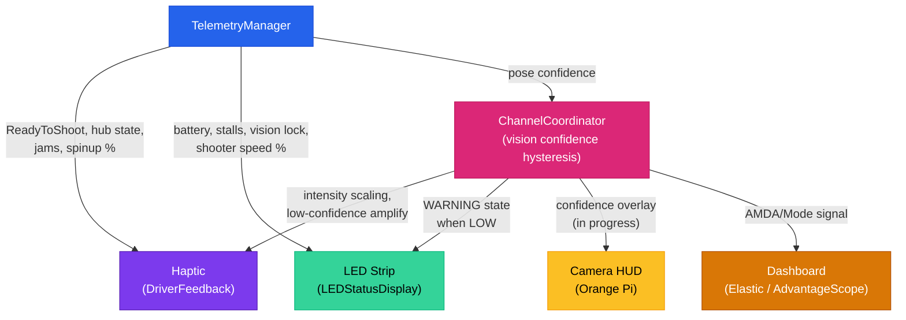
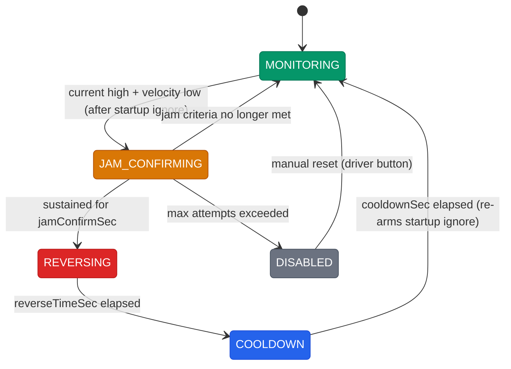

# Driver Feedback & AMDA System

## The Core Idea

During a match, drivers can't be looking at a screen. Every second spent checking a dashboard is a second not spent driving. So instead of putting info on a screen and hoping drivers glance at it, our robot pushes what it knows directly to the operators: controller vibration in their hands, LED colors in their peripheral vision, camera overlays on the driver station feed, and dashboard widgets as a fallback.

We call this **AMDA: Adaptive Multi-Modal Driver Awareness**. It coordinates four feedback channels and changes how they behave based on how confident the robot is in its own vision.

## The Four Channels

| Channel | Medium | Who Feels It | Latency | Best For |
|---------|--------|-------------|---------|----------|
| **Haptic** | Controller rumble motors | Driver and/or copilot (role-routed via HapticTarget) | Instant | Time-critical scoring cues, match phase alerts |
| **LED** | Addressable LED strip on robot | Pit crew + field audience + drivers | ~20ms | Robot state at a glance (spinning up, ready, jammed, feeding) |
| **Camera HUD** | Overlay on driver station camera | Driver + copilot | ~50ms | Vision lock indicators, zone boundaries (in progress) |
| **Dashboard** | Elastic / AdvantageScope | Pit crew, coach | Variable | Detailed diagnostics, tuning, post-match review |

## ChannelCoordinator: Vision Confidence Hysteresis

`ChannelCoordinator` sits at the center of AMDA. It reads the robot's pose confidence from vision and determines whether the system is in **HIGH** or **LOW** confidence mode. That mode changes how every channel behaves.

The key design choice is **hysteresis** to prevent rapid flickering between modes:
- Drops to LOW when confidence falls to **40% or below**
- Only recovers to HIGH when confidence reaches **55% or above**

That 15-point gap means the system won't bounce back and forth when confidence hovers near a threshold. In LOW mode, the LED strip shows a warning state, and the haptic spin-up rumble gets amplified (0.7 max intensity vs the normal 0.4) to compensate for degraded vision.

ChannelCoordinator also has a `reset()` method called at teleopInit so it starts fresh each time teleop begins.

```mermaid
flowchart TB
    CC["ChannelCoordinator<br/>(vision confidence hysteresis)"]

    CC -->|"intensity scaling,<br/>low-confidence amplify"| HAP["Haptic<br/>(DriverFeedback)"]
    CC -->|"WARNING state<br/>when LOW"| LED["LED Strip<br/>(LEDStatusDisplay)"]
    CC -->|"confidence overlay<br/>(in progress)"| HUD["Camera HUD<br/>(Orange Pi)"]
    CC -->|"AMDA/Mode signal"| DASH["Dashboard<br/>(Elastic / AdvantageScope)"]

    TM["TelemetryManager"] -->|"ReadyToShoot, hub state,<br/>jams, spinup %"| HAP
    TM -->|"battery, stalls, vision lock,<br/>shooter speed %"| LED
    TM -->|"pose confidence"| CC

    style CC fill:#db2777,stroke:#be185d,color:#fff
    style HAP fill:#7c3aed,stroke:#5b21b6,color:#fff
    style LED fill:#34d399,stroke:#10b981,color:#000
    style HUD fill:#fbbf24,stroke:#f59e0b,color:#000
    style DASH fill:#d97706,stroke:#b45309,color:#fff
    style TM fill:#2563eb,stroke:#1d4ed8,color:#fff
```

## Haptic Feedback (DriverFeedback)

### Two-Controller Routing

We use two Xbox controllers: port 0 for the driver (movement), port 1 for the copilot (scoring). Different information goes to different people based on who needs to act on it, using the `HapticTarget` enum (DRIVER, COPILOT, BOTH):

- **COPILOT gets scoring signals**: progressive aim feedback, ready-to-shoot confirmation, hub activation/deactivation, jam alerts, pre-spin notification. The copilot controls when to fire, so they need to feel the robot's scoring readiness.
- **DRIVER gets awareness signals**: shooter spin-up rumble (left motor only, so they can feel the flywheel winding up without it being confused for a scoring cue).
- **BOTH get match events**: auto result (won/lost), endgame warning, hub shift warning, role switch confirmation, game data missing.

If the copilot controller isn't physically plugged in (checked via `isConnected()`), all COPILOT-targeted patterns automatically go to the driver controller instead. Nothing gets dropped.

### 11 Haptic Patterns + 5 Hub Countdown Variants + Progressive Aim

| # | Pattern | Priority | Target | Feel |
|---|---------|----------|--------|------|
| 1 | **Auto Won** | CRITICAL | BOTH | Full buzz (1.0/1.0 for 0.2s) then two right pings (positive, scoring side) |
| 2 | **Auto Lost** | CRITICAL | BOTH | Full buzz (1.0/1.0 for 0.2s) then left thump (warning side, heavier) |
| 3 | **Endgame Warning** | CRITICAL | BOTH | Two quick pulses at 30s remaining |
| 4 | **Ready to Shoot** | HIGH | COPILOT | Gentle right-side tap (0/0.3 for 0.25s) |
| 5 | **Hub Activated** | HIGH | COPILOT | Two right pings, hub is live |
| 6 | **Hub Deactivated** | HIGH | COPILOT | Left thump, hub went offline |
| 7 | **Jam Detected** | HIGH | COPILOT | L-R-L alternating pulses |
| 8 | **Role Switched** | HIGH | BOTH | Distinct pattern so both operators know the role changed |
| 9 | **Game Data Missing** | CRITICAL | BOTH | Three strong pulses, repeats every 2s when FMS data is absent |
| 10 | **Pre-Spin Alert** | MEDIUM | DRIVER | Short buzz when the flywheel starts spinning up, so the driver knows to hold steady |
| 11 | **Localization Degraded** | MEDIUM | BOTH | Warning when vision trust drops to LOW |
| -- | **Hub Countdown 5-1** | MEDIUM | BOTH | Graduated countdown at 5, 4, 3, 2, 1 seconds before hub shift (intensity ramps up, 5 separate patterns) |
| -- | **Progressive Aim** | (continuous) | COPILOT | Intensity scales with aim error (see below) |

### Priority System

Four levels: LOW, MEDIUM, HIGH, CRITICAL. A pattern can only be interrupted by one of equal or higher priority. This means a CRITICAL endgame warning will override a MEDIUM hub shift alert, but a LOW notification cannot interrupt an active HIGH scoring cue.

### Progressive Aim

This one's different from the rest. Instead of a discrete pulse, it's a continuous rumble that scales with how close the robot is to being on target:

1. The aim command calls `setProgressiveAim(errorDeg)` every cycle with the current pointing error in degrees
2. If error > 10 degrees: no rumble (too far off to be useful)
3. If error <= 10 degrees: intensity = (1 - error/10)^2, applied as left=intensity*0.2, right=intensity*0.5
4. The quadratic curve means you barely feel anything at 8 degrees, moderate feedback at 4 degrees, and strong confirmation as you approach zero

The right motor gets 2.5x the left motor intensity. That makes the pattern feel different from the spin-up rumble (which is left-only), so the copilot can tell "I am lining up" from "the flywheel is spinning."

**Safety**: progressive aim has a 250ms stale timeout. If the command stops calling `setProgressiveAim()`, the rumble auto-clears. This prevents a stuck rumble if a command ends unexpectedly.

### Copilot Aim Bias

The copilot's right stick X adds up to +/-5 degrees of manual aim offset. If the aim feels consistently off in one direction, the copilot can nudge it on the fly without anyone touching the code. This goes straight into ShotCalculator.

## LED Status Display

### 12 LED States (priority order, highest first)

| State | Color/Pattern | Trigger |
|-------|--------------|---------|
| **CRITICAL_ALERT** | Red/orange dual chase (sliding bands, ~0.5 Hz) | Battery below critical voltage or brownout |
| **READY_TO_SHOOT** | Solid blue | All 8 scoring conditions met |
| **AIM_PROGRESS** | Blue pulse, speed varies with error (phase accumulator prevents brightness jumps) | Progressive aim active, pulse faster = closer to target |
| **SHOOTER_SPINUP** | Blue progress bar (fills left to right, dim blue background) | Flywheel spinning up, bar = % of target speed |
| **HUB_COUNTDOWN** | Progress bar fill showing time to hub shift | Hub shift approaching, bar drains as time runs out |
| **FEEDING** | Blue/green alternating | Robot is in feeder role and actively feeding balls |
| **WARNING** | Orange chase (sliding dots, ~1 Hz) | Jam, stall, low battery, CAN error, or low vision confidence |
| **AUTO_RUNNING** | Rainbow scroll | Autonomous period active |
| **VISION_LOCKED** | Blue breathing (2s cycle) | Vision has a target lock in teleop |
| **MATCH_OVER** | Green breathing (3s cycle) | Match timer hit zero (latched) |
| **IDLE** | Solid green | Enabled, nothing special happening |
| **DISABLED** | Dim green (with pre-match diagnostics) | Robot disabled |

### Pre-Match LED Diagnostics

When the robot is disabled before a match, the LED strip doubles as a diagnostic display. Instead of just showing dim green, the DISABLED state cycles through sub-states:

| Sub-State | Color | What it means |
|-----------|-------|--------------|
| **NO_VISION** | Red | Cameras are down or no multitag lock. Fix before match. |
| **NO_AUTO** | Purple | No autonomous routine selected. Pick one in the dashboard. |
| **ALL_GOOD** | Rainbow sweep | Everything checks out. Ready to go. |

This lets the pit crew spot problems from across the field without opening a dashboard first.

### Colorblind-Safe Design

The palette avoids relying on red vs green distinction. Instead, states are differentiated by:
- **Color category**: blue (scoring/good), orange (warning), red+orange chase (critical), green (neutral/idle)
- **Animation pattern**: solid vs breathing vs chase vs progress bar
- **Brightness variation**: disabled is dim, active states are full brightness
- **Minimum brightness floor (0.15)**: LEDs never go fully dark during animations, so there's always something visible

A tunable brightness slider (`LED/brightness`) lets drivers adjust for different venue lighting. Test sliders let pit crew preview any state, but these are locked out when connected to FMS so they cannot interfere during a match.

## Drive Speed Limiting

When the shooter flywheel is spinning, drive speed drops to 40%. The driver does not have to think about slowing down while the copilot lines up a shot. Once the flywheel stops, full speed comes back. This happens in the command bindings, not in the feedback system itself, but it affects the same operator experience.

## Jam Protection (JamProtection)

JamProtection is a state machine that lives on the intake, indexer, and agitator. When a ball gets stuck, it picks up on the jam and sends the copilot an L-R-L haptic buzz so they know to react. It only detects and reports though, it doesn't touch the motors.

### State Machine

```mermaid
stateDiagram-v2
    [*] --> MONITORING

    MONITORING --> JAM_CONFIRMING : current high + velocity low (after startup ignore)
    JAM_CONFIRMING --> MONITORING : jam criteria no longer met
    JAM_CONFIRMING --> REVERSING : sustained for jamConfirmSec
    JAM_CONFIRMING --> DISABLED : max attempts exceeded
    REVERSING --> COOLDOWN : reverseTimeSec elapsed
    COOLDOWN --> MONITORING : cooldownSec elapsed (re-arms startup ignore)
    DISABLED --> MONITORING : manual reset (driver button)

    classDef green fill:#059669,stroke:#047857,color:#fff
    classDef yellow fill:#d97706,stroke:#b45309,color:#fff
    classDef red fill:#dc2626,stroke:#b91c1c,color:#fff
    classDef blue fill:#2563eb,stroke:#1d4ed8,color:#fff
    classDef gray fill:#6b7280,stroke:#4b5563,color:#fff

    class MONITORING green
    class JAM_CONFIRMING yellow
    class REVERSING red
    class COOLDOWN blue
    class DISABLED gray
```

### Detection Logic

1. **Startup Ignore (0.5s default)**: When a motor first starts, inrush current is high and velocity is low. That looks exactly like a jam. The startup ignore window suppresses detection for the first 0.5 seconds after each motor start to avoid false triggers.

2. **Sustained Jam Confirmation**: Both conditions must hold simultaneously: current above threshold AND velocity below threshold. If either condition clears during the debounce window, the state machine drops back to MONITORING. This prevents triggering on momentary load spikes.

3. **State transitions still run** (REVERSING, COOLDOWN, DISABLED) so telemetry can track what's happening, but the state machine doesn't actually command any motors. The copilot feels the buzz and decides what to do.

### Integration with Haptic Feedback

When any JamProtection instance catches a jam, TelemetryManager picks it up and DriverFeedback fires the JAM_DETECTED pattern on the copilot's controller: three alternating L-R-L pulses at 0.8 intensity. The logs also show which subsystem jammed (Intake, Indexer, or Agitator) so the pit crew can track it down.

## Testing

Both DriverFeedback and LEDStatusDisplay have Elastic dashboard sliders for testing each pattern/state individually. These are TunableNumber-based: set the slider to a pattern number to trigger it. All test controls are automatically locked out when FMS is attached so they cannot fire during competition. A combined test dashboard layout is available in the [Elastic Guide](../dashboards/elastic-guide.md).
