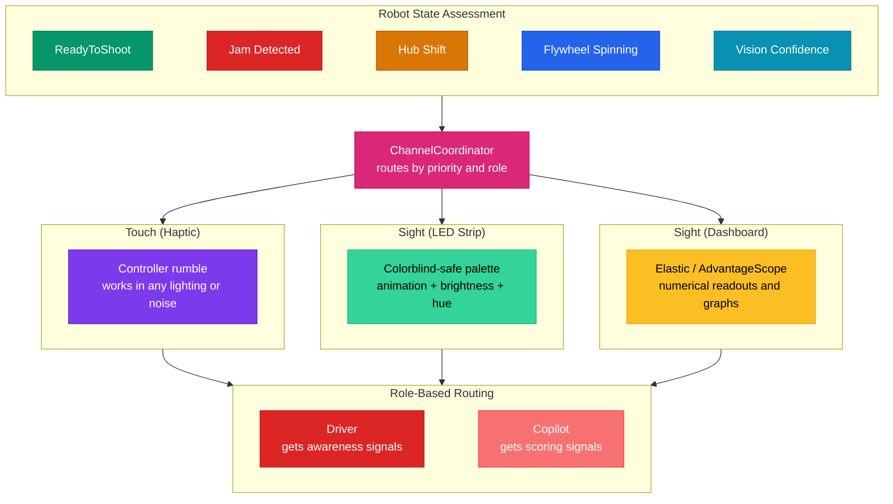

# Universal Design & Accessibility

## Why This Matters

FRC matches are loud, bright, and chaotic. There are hundreds of people cheering, buzzers going off, robots crashing into each other, and flashing lights everywhere. If your feedback system only uses one sense, like a screen the driver has to read, or a sound they have to hear, it's going to fail in that environment. You can't rely on a single channel when the arena is working against you.

We designed our feedback system around the idea that every critical piece of information should reach the operator through at least two independent senses. That way, if one channel is drowned out (you can't hear over the crowd, you can't see because of the lights), the other one still gets through.

## Mace's 7 Universal Design Principles

Ronald Mace's Universal Design framework gives us a clear way to think about making our robot interface work for everyone. Here's how we apply each one:

1. **Equitable Use**: The same feedback system works for any operator, regardless of sensory differences. No special mode needed.
2. **Flexibility in Use**: Operators can rely on whichever channel they perceive best (haptic, LED, or dashboard).
3. **Simple and Intuitive**: Patterns are obvious. Stronger rumble = closer to target. Blue LED = ready. No manual to memorize.
4. **Perceptible Information**: Every signal reaches at least 2 senses (touch + sight), so no information is locked behind a single channel.
5. **Tolerance for Error**: Stale timeouts auto-clear haptic feedback, and FMS lockout prevents accidental tuning during a match. Even if something goes wrong, the system recovers gracefully.
6. **Low Physical Effort**: The copilot doesn't need to press extra buttons or check a screen. The controller tells them what they need to know.
7. **Size and Space for Approach**: We use standard Xbox HID layout, so any controller works, including the Xbox Adaptive Controller.

## Multi-Sensory Redundancy

Every critical robot state reaches the operator through multiple channels. The key idea: if any single channel fails (crowd noise drowns audio, bright lights wash out LEDs), the operator still gets the information through a different sense.

| Information | Touch (Haptic) | Sight (LED) | Sight (Dashboard) |
|-------------|---------------|-------------|-------------------|
| Ready to shoot | Gentle right-side tap on copilot controller | Solid blue strip | Green READY TO SHOOT indicator |
| Jam detected | Three strong 0.8-intensity pulses on copilot | Orange breathing pattern (WARNING state) | JAM indicator turns red |
| Hub shift coming | Three quick taps on both controllers | (dashboard shows countdown) | Shift Timer counts down |
| Flywheel spinning up | Left-motor proportional rumble on driver | Blue progress bar fills left to right | Shooter RPM bar rises |
| Vision confidence low | Spin-up rumble amplified (0.7 vs 0.4) | Orange breathing (WARNING state) | AMDA Mode shows LOW |

If one channel fails or the operator can't perceive it, the info still gets through on the others.

## Colorblind-Safe LED Palette

Our LED palette was specifically chosen to avoid relying on red vs green as a differentiator. About 8% of males have some form of color vision deficiency, and in FRC that's a meaningful percentage of drive teams.

Each LED state is distinguishable through three independent cues:

| State | Color | Animation | Brightness |
|-------|-------|-----------|------------|
| Idle | White | Solid | Full |
| Disabled | White | Solid | Dim |
| Vision locked | Blue | Breathing (2s cycle) | Full |
| Aiming | Blue | Pulsing (speed varies) | Full |
| Ready to shoot | Blue | Solid | Full |
| Shooter spinning up | Blue | Progress bar (fills L to R) | Full |
| Warning (jam/stall/low battery) | Orange | Breathing (1.5s cycle) | Full |
| Critical alert | Red + orange | Rapid alternating flash (20Hz) | Full |
| Match over | White | Breathing (3s cycle) | Full |
| Autonomous | Rainbow | Scrolling | Full |

Even under simulated protanopia (no red cones) or deuteranopia (no green cones), every state is still easy to tell apart because we differentiate by animation pattern and brightness, not just hue.

## Configurable Sensitivity

Not every operator wants the same intensity. Some people find strong vibration distracting, while others need more to feel it through gloves or grip pressure.

- **hapticScale** (TunableNumber, 0.0 to 1.0): Scales all haptic output globally. Set to 0.5 for lighter feedback, 1.0 for full strength.
- **LED brightness** (TunableNumber, 0.0 to 1.0): Adjustable for different venue lighting conditions.
- **FMS lockout**: Both tuning parameters are automatically locked when the robot connects to the Field Management System. This prevents anyone from accidentally changing sensitivity during a real match.

## Progressive Haptic Design

The progressive aim pattern is our most accessibility-focused design. Instead of a binary "on target / off target" signal, the rumble intensity maps smoothly to alignment quality. The closer you are to the target, the stronger the vibration, following a quadratic curve.

It basically feels like a "warmer/colder" game. The copilot does not need to interpret a number or read a screen. They just feel the controller getting more intense as they approach the sweet spot. It works the same way regardless of the operator's visual acuity or ability to read dashboard text mid-match.

## Audio-Free Design

Our entire feedback system works without any audio cues. This was a deliberate choice, not an oversight. FRC arenas regularly exceed 90 dB during matches. Speakers, even loud ones, are unreliable in that environment. By building our system around touch (haptic) and sight (LED + dashboard), the feedback still works even in the loudest venues.

## Accessibility as an Engineering Consequence

We didn't set out to build an accessible system. We set out to minimize attention cost. But when you design for the cheapest channel first, you naturally build redundant paths that work for any driver. Every design choice that made the system faster to use also made it more inclusive.

| Design Choice | Engineering Reason | Accessibility Consequence |
|--------------|-------------------|--------------------------|
| Blue/orange/white LED palette | Maximize contrast under pit lights | Works for red-green colorblind drivers (~8% of males) |
| LED states encoded in rhythm + brightness | Redundancy, not relying on one signal dimension | Colorblind drivers read the same info as anyone |
| Haptic delivers scoring readiness without vision | Lowest attention cost for most critical info | Eyes-free operation for any driver |
| Configurable vibration intensity (TunableNumber) | Different drivers, different preferences | Adjustable for reduced hand sensitivity |
| 4 independent channels for every state | Any channel can fail, system still works | Redundancy = accessibility by default |
| Compatible with Xbox Adaptive Controller | Standard WPILib API, no custom hardware | Works with accessibility peripherals |

## Controller Compatibility

We use the standard Xbox HID rumble protocol for all haptic feedback. This means our system works with any HID-compliant controller, including the Xbox Adaptive Controller. The Adaptive Controller is designed for operators with mobility differences and supports external buttons, switches, joysticks, and mounts. Because our software uses the same HID interface regardless of hardware, an operator on an Adaptive Controller gets the same haptic feedback as someone on a regular Xbox controller.

## Channel-to-Principle Mapping

| Channel | Equitable Use | Flexibility | Perceptible Info | Error Tolerance |
|---------|:---:|:---:|:---:|:---:|
| **Haptic** | Works with any Xbox-compatible controller | Scale intensity per operator | Touch, independent of vision | 250ms stale auto-clear |
| **LED** | Visible to full drive team + audience | Adjustable brightness | Colorblind-safe palette | Priority-based state resolution |
| **Camera HUD** | Same overlay for all operators | (in progress) | Visual overlay on camera feed | Degrades gracefully if camera disconnects |
| **Dashboard** | Standard Elastic/AdvantageScope | Multiple layouts per role | Detailed numerical readouts | FMS lockout on tuning controls |

---

**Related:** [Driver Feedback & AMDA](driver-feedback.md) | [Alliance Strategy](alliance-strategy.md)
