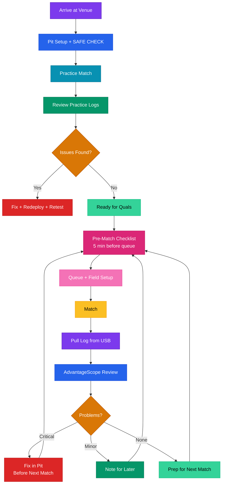

# Competition Day Playbook

This is the document you print out and bring to the venue. It covers what each person on the drive team and pit crew should be doing before, during, and after every match. If you only read one thing on competition day, read your role section and the pre-match checklist.

## Role Guides

### Driver

Your job is movement. The robot handles assessment, the copilot handles shooting decisions, and you handle positioning. Here's what matters to you:

- **Dashboard**: The driver tab shows battery voltage, match time, alliance color, and bandwidth warnings. You shouldn't need to stare at it. Glance between matches.
- **Haptic feedback you'll feel**:
  - Short buzz when the flywheel starts spinning up (awareness, so you know the copilot is getting ready to shoot)
  - Auto result buzz at teleop start: full buzz then right pings = won auto (collect first), full buzz then left thump = lost auto (shoot NOW)
  - Escalating rumble in endgame (time awareness, 30 seconds left)
  - Rumble on hub shift (the hub changed scoring multiplier, reposition if needed)
  - Rumble on role switch confirmation (coach called a strategy change)
- **When to override**: If the robot drives weird (pulling to one side, sluggish response), tell the drive coach immediately. Swerve module faults show up in logs but you'll feel them first.

### Copilot

You are the weapons officer. Your controller gets all the scoring feedback. Learn these patterns:

- **Progressive aim**: The controller vibrates harder as alignment improves. Light rumble = pointed vaguely right. Strong rumble = almost locked. The intensity IS the information. Trust it.
- **ReadyToShoot pulse**: A distinct pulse means all 6 conditions are met (flywheel at speed, indexer clear, vision locked, ball loaded, hub active, confidence above threshold). When you feel this, pull the trigger. That's the whole point.
- **Hub shift warning**: You'll feel a unique pattern when the hub changes state. Reposition to take advantage of the new scoring multiplier.
- **Jam alert**: An L-R-L buzz means something is jammed. Stop feeding balls for a moment and let the jam clear.
- **RPM offset**: Your bumper buttons adjust the flywheel speed +/- 25 RPM per press. If shots are consistently high or low, nudge it. Resets when the robot is disabled.

### Programmer

You're in the pit managing the robot's software state. Here's your workflow:

**Pre-match (5 min before queue)**:
1. Deploy latest code: `./gradlew deploy`
2. Open pit diagnostic dashboard, press SAFE CHECK
3. Verify all `*/Device/Connected` = true (every motor controller responding)
4. Check `SystemHealth/BatteryVoltage` > 12.5V
5. Confirm vision cameras see AprilTags (Vision/HasTarget flickers true when pointed at tags)
6. Verify controller bindings work (quick stick wiggle, watch DriverInput signals)
7. Load competition dashboard on the driver laptop

**Between matches**: Pull the USB log, open in AdvantageScope with `match_review.json` layout, look for anomalies in the timeline. Check battery voltage trend across matches.

### Drive Coach

- **Coach tab** shows: match time, alliance, current strategy role (SHOOTER vs FEEDER), scoring conditions status, and active alerts.
- **Strategy calls**: You decide when to switch roles. If we're scoring well, stay SHOOTER. If our alliance partner is a better shooter, switch to FEEDER and run ball relay. The copilot presses Start to toggle roles.
- **When to call for role switch**: Watch the scoreboard. If shots are missing consistently (bad ShotConfidence) or we're being defense-heavy, FEEDER might score more alliance points through assists.

### Electrical

- Watch `SystemHealth/BatteryVoltage` between matches. If it's trending below 12.3V across matches, swap batteries more aggressively.
- `Power/BatteryAtRisk` is a predictive alert. If it triggers, the battery is degrading faster than expected.
- Motor temperature signals (`*/TemperatureCelsius`) warn at 50C and alert at 65C. If a motor is running hot, it needs a longer cool-down between matches or there's a mechanical binding issue.
- Check all `*/Device/Connected` signals. A false means that motor controller dropped off the CAN bus.

### Mechanical

- `JamProtection/` signals show jam state for intake, indexer, and agitator. If jams are frequent, check for debris or alignment issues.
- `*/Stalled` indicates a motor is drawing current but not moving. Could be a stuck mechanism or broken gear.
- Motor current draw (`*/CurrentAmps`) that's consistently high without motion means something is binding mechanically.
- The pit diagnostic dashboard has a hardware health section. Use it between matches to spot trends before they become failures.

## Pre-Match Checklist (5 Minutes Before Queue)

```
[ ] Battery voltage > 12.5V
[ ] Deploy latest code (./gradlew deploy)
[ ] Run SAFE CHECK on pit diagnostic dashboard
[ ] All */Device/Connected = true
[ ] Vision cameras responding (Vision/HasTarget)
[ ] Load competition dashboard on driver laptop
[ ] Controllers plugged into correct ports (driver=0, copilot=1)
[ ] Verify controller sticks respond (watch DriverInput/ signals)
[ ] Check no active alerts on Alerts/ signals
```

## Between-Match Log Review

1. Pull log file from robot USB (`/U/logs/*.wpilog`)
2. Open in AdvantageScope, load `match_review.json` layout
3. Check: battery voltage curve, motor temperatures, loop time spikes
4. Look for: jam events, vision dropouts, missed shots (ReadyToShoot true but no score)
5. Note anything unusual for the drive team debrief

## Match Day Flow



## Emergency: Something Broke Right Before a Match

1. **Motor not responding**: Check CAN wiring, power cycle the robot. If one motor is dead, the robot can still drive and potentially score.
2. **Vision cameras down**: You can still shoot manually without vision lock. The copilot won't get progressive aim feedback, but the RPM table still works by distance.
3. **Controller not connecting**: Swap USB ports, try a backup controller, worst case run single-controller mode (driver only, copilot feedback routes to driver automatically).
4. **Code won't deploy**: Use the last working code already on the robot. It persists across power cycles.
5. **Battery low at queue**: Swap immediately. Keep a charged backup at the field cart.

---

**Related:** [Troubleshooting](troubleshooting.md) | [Tuning Reference](tuning-reference.md) | [Alliance Strategy](../feedback/alliance-strategy.md)
