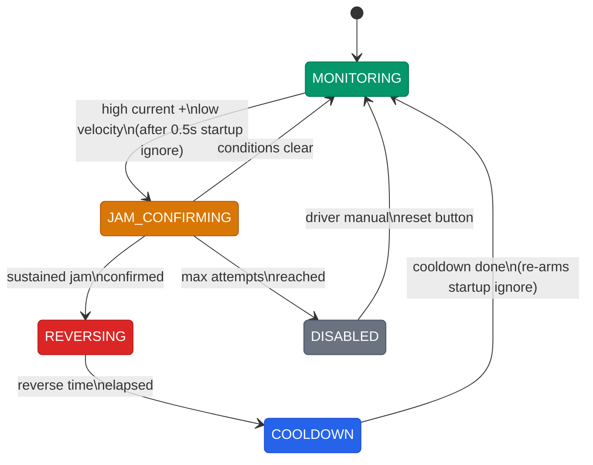

# Troubleshooting Guide

When something goes wrong, find your symptom in the table below. The "How to Diagnose" column tells you exactly which signals to check. Most issues are visible in the Elastic pit diagnostic dashboard or in AdvantageScope logs.

## Common Issues

| Symptom | Likely Cause | How to Diagnose | Fix |
|---------|-------------|----------------|-----|
| Robot won't shoot | One of the 6 ReadyToShoot conditions is false | Check `Scoring/Conditions/` signals: ShooterReady, IndexerClear, VisionLocked, HasBall, HubActive, ShotConfident. Whichever is false is your problem. | Fix the false condition (see specific entries below) |
| Shots missing the hub | Bad shot parameters or inconsistent flywheel | Check `ShotConfidence/` score and components. Check `Shooter/AtSpeedPercent` stability. Check `Vision/LockedOnTarget` during the shot. | If confidence is low, distance or angle is bad. Reposition. If RPM is unstable, check battery and PID. Use copilot RPM offset if consistently off. |
| Controller not vibrating | Feedback not routed or FMS-locked | Check `DriverFeedback/` signals in the dashboard. Verify controller ports (driver=0, copilot=1). If testing with `DriverFeedback/TestPattern`, make sure FMS is not attached (TunableNumbers lock). | Reconnect controller to correct port. In pit testing, ensure FMS is disconnected. |
| Progressive aim not working | Vision not locking or confidence too low | Check `Vision/LockedOnTarget` and `AMDA/VisionConfidence`. Progressive aim needs vision lock. If confidence is LOW (below 40%), intensity is reduced. | Point at AprilTags. Check camera connection. Clean camera lens. |
| Vision not locking on target | Camera issue or VisionFilter rejecting poses | Check `Vision/HasTarget` (camera sees something) vs `Vision/LockedOnTarget` (passed all gates). Check `Vision/Rejection/` counters to see which gate is rejecting. | Ambiguity: too far or bad angle. Z-height: camera transform wrong. PoseJump: robot moving too fast. Heading: gyro disagreement. |
| Motor overheating | Sustained high load or mechanical binding | Check `*/TemperatureCelsius` (warns at 50C, danger at 65C). Check `*/CurrentAmps` for sustained high draw. Check `*/Stalled` flag. | Let motor cool. If binding, check mechanical alignment. If stalled, check for debris or broken gears. |
| Intake keeps jamming | Balls getting stuck, JamProtection cycling | Check `JamProtection/State` (should cycle MONITORING > JAM_CONFIRMING > REVERSING > COOLDOWN). Check `JamProtection/JamCount`. If jams are frequent, it's mechanical. | Clear debris. Check roller alignment and gap. If auto-reverse works but jams keep recurring, the problem is physical. |
| Battery brownout mid-match | Battery can't handle current spikes | Check `SystemHealth/BatteryVoltage` for dips below 7V. Check `Power/BatteryAtRisk` (predictive). Check total current draw across all motors. | Swap to a fresher battery. Reduce simultaneous motor usage. Check battery internal resistance. |
| CAN bus errors | Motor controller dropped off the bus | Check `*/Device/Connected` for each subsystem. A false means that device isn't responding. Check `*/Device/FaultsRaw` for error codes. Check `SystemHealth/CANUtilization`. | Reseat CAN connectors. Check for broken wires. Verify CAN termination resistor. Power cycle the robot. |
| Robot drives sideways or spins | Swerve module fault or gyro issue | Check `Drive/` signals for module states. Check `Drive/Gyro/Connected`. Look for one module reporting different values than the others. | If gyro disconnected, heading control fails. Reboot. If one module is off, check that module's motor and encoder. |
| Dashboard shows stale data | NetworkTables connection lost | Check Elastic connection status. Check `Network/` signals. Verify robot IP (10.59.62.2) or localhost for sim. | Restart Elastic. Check WiFi/ethernet. Verify robot is powered and code is running. |
| Loop time spikes (>20ms) | Something expensive in the periodic loop | Check `SystemHealth/LoopTimeMs` in the log. Look for spikes correlating with specific events. | If consistent, find the expensive call. If spikes only at mode transitions, that's normal (one-time init work). |
| ReadyToShoot flickers rapidly | Marginal condition bouncing | Check which condition is toggling. Usually it's ShooterReady (RPM near tolerance boundary) or VisionLocked (target at edge of frame). | Increase shooter tolerance slightly or wait for a more stable lock before shooting. |

## JamProtection State Machine

When a jam is detected, the robot automatically reverses the motor to try to clear it. Here's the state flow:

If a jam won't clear after multiple auto-reverse attempts, the motor goes to DISABLED. The driver has to press a button to reset it. This prevents the robot from endlessly reversing if something is physically stuck.

## Emergency Procedures (Right Before a Match)

**"Nothing works, we queue in 2 minutes":**
1. Power cycle the robot (off, wait 5 seconds, on)
2. Wait for code to boot (RSL blinks)
3. Quick SAFE CHECK on pit dashboard
4. If that passes, you're probably fine. Go queue.

**"One subsystem died":**
- The crash isolation means everything else still works. If the shooter motor died, you can't shoot but you can still play defense or feed. If intake died, you can still shoot balls already loaded. Tell the drive coach so they can adjust strategy.

**"Code won't deploy":**
- The last deployed code persists on the roboRIO across power cycles. If you can't deploy new code, the old code still runs. Only redeploy if you absolutely need the fix.

**"Wrong dashboard loaded":**
- Elastic: File > Open Layout > pick `rebuilt_driver_competition.json`
- Takes 5 seconds. Do it in the queue line if needed.

## Signal Quick Reference

These are the most important signals to check when diagnosing issues:

| Category | Key Signals |
|----------|------------|
| Scoring | `Scoring/ReadyToShoot`, `Scoring/Conditions/*` (6 conditions) |
| Shooter | `Shooter/VelocityRPM`, `Shooter/AtSpeed`, `Shooter/TemperatureCelsius` |
| Vision | `Vision/LockedOnTarget`, `Vision/ConsecutiveFrames`, `Vision/Rejection/*` |
| Power | `SystemHealth/BatteryVoltage`, `Power/BatteryAtRisk`, `*/CurrentAmps` |
| Health | `*/Device/Connected`, `*/Device/FaultsRaw`, `*/Stalled` |
| Jams | `JamProtection/State`, `JamProtection/JamCount` |
| Network | `Network/BandwidthPercent`, `Network/BandwidthWarning` |
| Feedback | `DriverFeedback/*`, `AMDA/VisionConfidence`, `LED/CurrentState` |

---

**Related:** [Competition Playbook](competition-playbook.md) | [Tuning Reference](tuning-reference.md) | [FMEA Log](../engineering/fmea-log.md)

[Back to Documentation Home](../README.md)
